# Generic UI Elements

Framework-independent UI element terminology. Each element is classified by its primary purpose. “Device-dependent” means that the element inherently requires a particular hardware or host-platform capability, not merely that its layout adapts to a device.

## Input elements

Collect data from users or allow users to trigger actions and change values.

| Name | Description — how the user interfaces with it | Viewable? | Device-dependent? | Example image |
|---|---|:---:|:---:|---|
| Button | Initiates an action when clicked, tapped, or activated by keyboard or assistive technology. | Yes | No |  |
| Icon button | Initiates an action represented primarily by an icon. | Yes | No | 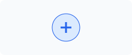 |
| Text field | Accepts a single line of typed, pasted, dictated, or programmatically entered text. | Yes | No | 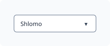 |
| Text area | Accepts multiple lines of text and may support scrolling or resizing. | Yes | No | 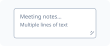 |
| Password field | Accepts concealed text, usually for authentication, with an optional reveal action. | Yes | No | 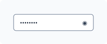 |
| Checkbox | Controls an independent Boolean choice. The user checks or clears it. | Yes | No |  |
| Radio button | Selects one value from a mutually exclusive group. | Yes | No | 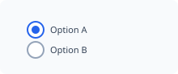 |
| Switch / Toggle | Changes an option immediately between two states, commonly on and off. | Yes | No |  |
| Dropdown | Lets the user choose one value from a list that opens on demand; it is also commonly called a select or drop-down list. | Yes | No | 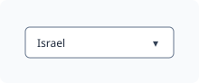 |
| List box | Displays choices persistently and supports selection of one or more items. | Yes | No | 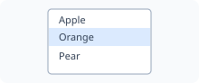 |
| Combo box | Combines editable text with a selectable list of values or suggestions. | Yes | No | 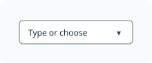 |
| Date picker | Accepts or selects a date, commonly through a calendar presentation. | Yes | No | 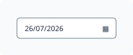 |
| Time picker | Accepts or selects a time, with presentation influenced by locale and platform. | Yes | No | 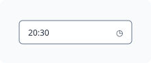 |
| Wheel picker | Lets the user select a value by scrolling one or more rotating columns and aligning the desired item with a selection indicator. | Yes | No | 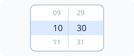 |
| Color picker | Selects a color through swatches, sliders, or numeric values. | Yes | No | 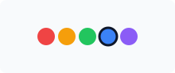 |
| File picker | Selects files through operating-system or storage-provider facilities. | Yes | Yes | 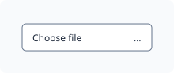 |
| Slider | Selects a value or range by moving one or more handles along a track. | Yes | No | 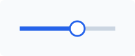 |
| Spin box / Stepper input | Selects a numeric value by typing or using increment and decrement actions. | Yes | No | 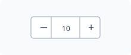 |
| Rating control | Selects an ordinal rating, commonly through stars or similar repeated marks. | Yes | No |  |
| Drag handle | Provides a grab target for moving or reordering an object. | Yes | No | 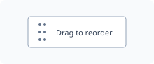 |
| Resize handle | Provides a drag target for resizing an object or region. | Yes | No | 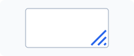 |
| Canvas / Drawing area | Accepts free-form drawing or graphical manipulation through pointer, touch, stylus, or keyboard. | Yes | No | 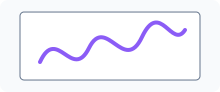 |
| Microphone input | Captures audio after the user starts recording and grants permission. | Sometimes | Yes |  |
| Biometric prompt | Requests fingerprint, face, or another biometric method supported by the device. | Yes | Yes |  |

## Output elements

Present information, results, feedback, progress, or system status to users.

| Name | Description — how the user interfaces with it | Viewable? | Device-dependent? | Example image |
|---|---|:---:|:---:|---|
| Status bar | A region displaying state such as readiness, connectivity, or zoom. It is generally read-only. | Yes | No | 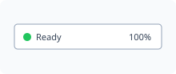 |
| Label | Identifies or describes another UI object. The user normally reads it. | Yes | No | 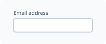 |
| Text | Presents readable information without accepting input. | Yes | No |  |
| Image | Presents visual information. The user may view, select, zoom, drag, or open it. | Yes | No | 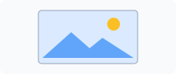 |
| Icon | A compact graphic that represents an object, action, status, or concept. The user interprets it visually; it is not inherently interactive. | Yes | No |  |
| Avatar | Visually represents a person, organization, or agent and may be selectable. | Yes | No |  |
| Tag | Displays a keyword, classification, or attribute attached to content; it may also support selection or removal. | Yes | No | 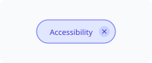 |
| Badge | Displays a compact status, category, or count associated with another object. | Yes | No | 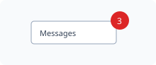 |
| Tooltip | Shows brief explanatory information when an object is hovered, focused, or touched. | Yes | No |  |
| Alert | Presents important information requiring attention and possibly acknowledgment. | Yes | No | 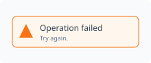 |
| Toast / Snackbar | Briefly reports an event or result without normally blocking other interaction. | Yes | No |  |
| Progress bar | Shows the known completion proportion of an operation; generally read-only. | Yes | No | 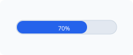 |
| Loader / Spinner | Shows that an operation is active when its exact progress is unknown. | Yes | No |  |
| Separator / Divider | Visually separates groups of content or controls and normally has no direct interaction. | Yes | No | 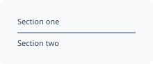 |
| Table / Data grid | Displays structured data in rows and columns. The user may sort, filter, select, resize, or edit. | Yes | No | 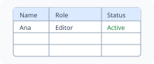 |
| List | Presents a sequence of similar items that can be read, selected, opened, reordered, or acted upon. | Yes | No | 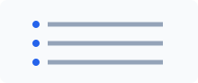 |
| Media player | Presents audio or video with playback, seeking, volume, caption, and fullscreen operations. | Yes | No |  |
| Camera preview | Displays a live camera image and supports capture or camera-related actions. | Yes | Yes | 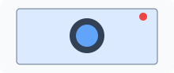 |
| Notification | Reports an event outside or alongside the main application view and may offer actions. | Yes | Yes | 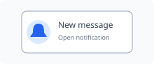 |

## Navigational elements

Help users move between product areas, views, locations, or sections of content.

| Name | Description — how the user interfaces with it | Viewable? | Device-dependent? | Example image |
|---|---|:---:|:---:|---|
| Navigation bar | Provides access to primary application destinations. The user selects a destination. | Yes | No |  |
| Hamburger Menu | A compact menu trigger, usually shown as three horizontal lines. The user activates it to reveal navigation or commands. | Yes | No |  |
| Tab | Selects one of several related content panels within the same context. | Yes | No | 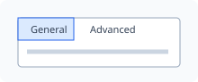 |
| Tab Bar | A persistent row or column of tabs used to switch among peer views or primary destinations. | Yes | No | 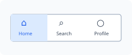 |
| Menu | Presents commands or destinations. The user opens it and selects an item. | Yes | No | 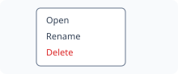 |
| Dropdown Menu | A menu that opens below or beside its trigger and presents commands or navigation choices. | Yes | No | 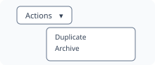 |
| Context menu | Presents actions relevant to an object or location, commonly after right-click or long-press. | Yes | No | 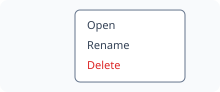 |
| Breadcrumb | Shows the current position in a hierarchy. The user can select an ancestor to navigate upward. | Yes | No | 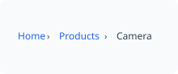 |
| Link | Navigates to another location or resource when activated. | Yes | No |  |
| Search field | Accepts a query and may display suggestions or filters. | Yes | No | 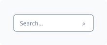 |
| Scrollbar | Indicates position in overflowed content and permits scrolling by dragging or selecting its track. | Yes | No |  |
| Tree view | Presents hierarchical data. The user expands, collapses, and selects nodes. | Yes | No | 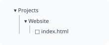 |
| Pagination control | Moves between discrete pages of content. | Yes | No | 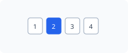 |
| Carousel | Shows one or several items in a constrained viewport. The user moves or swipes between items. | Yes | No | 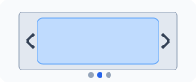 |
| Map | Displays spatial information. The user pans, zooms, selects markers, or requests directions. | Yes | No | 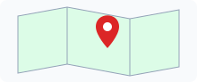 |

## Container elements

Group, structure, and organize related content or other UI elements.

| Name | Description — how the user interfaces with it | Viewable? | Device-dependent? | Example image |
|---|---|:---:|:---:|---|
| Window | A top-level application or document area. The user moves, resizes, minimizes, maximizes, or closes it. | Yes | No | 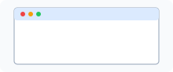 |
| Screen / View | A complete application page or state. The user navigates to it and interacts with its contents. | Yes | No |  |
| Panel | A bounded region grouping related content or controls. The user works with the items within it. | Yes | No | 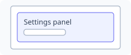 |
| Container | A layout object that holds and arranges child objects. It may have no direct interaction or visible boundary. | Sometimes | No | 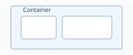 |
| Card | A bounded unit of related information and actions. The user reads, selects, opens, or acts on it. | Yes | No | 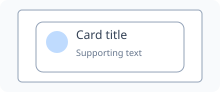 |
| Form | Groups related fields and actions for entering, reviewing, validating, and submitting data. | Yes | No | 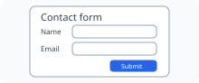 |
| Toolbar | A row or column of frequently used actions. The user activates its buttons or menus. | Yes | No | 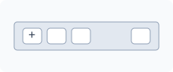 |
| Sidebar | A vertical region beside the main content that groups navigation, tools, filters, or supporting information. | Yes | No | 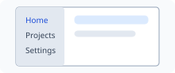 |
| Accordion | Organizes content into expandable sections. The user expands or collapses each heading. | Yes | No | 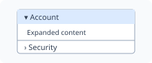 |
| Popover | Shows contextual, potentially interactive content anchored to another object. | Yes | No | 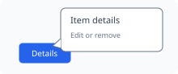 |
| Dialog | Temporarily requests information, confirmation, or a decision. | Yes | No |  |
| Modal overlay | Blocks interaction with the underlying view until the foreground task is completed or dismissed. | Yes | No |  |

## Layout and structural UI elements/objects

Concrete structural entities that organize, divide, position, or provide spatial context for other UI elements. They may be directly visible, visible only through their effect on child elements, or entirely implicit.

| Name | Description — how the user interfaces with it | Viewable? | Device-dependent? | Example image |
|---|---|:---:|:---:|---|
| Grid | Organizes child elements along intersecting rows and columns. Users normally interact with the arranged content rather than with the grid itself. | Sometimes | No |  |
| Pane | A distinct content area within a window or view. Users work with the content in the pane and may scroll, focus, resize, or switch it. | Usually | No |  |
| Rail | A narrow structural strip along an edge, commonly holding navigation, controls, status, or alignment references. Users interact with any controls placed on it. | Sometimes | No |  |
| Stack | Arranges child elements sequentially on one axis, either vertically or horizontally. Users interact with the stacked children rather than the stack itself. | Sometimes | No |  |
| Scaffold | Defines the top-level structure of a screen, including stable regions such as header, body, navigation, and action areas. Users experience its organization but rarely operate the scaffold directly. | Sometimes | No |  |
| Region | A semantically or functionally distinct area of an interface, such as a header, main content area, complementary area, or footer. Users navigate to or interact with its contents. | Sometimes | No |  |
| Splitter | A movable boundary between adjacent panes. Users drag it to redistribute the available space. | Yes | No |  |

# UI layout mechanisms/definitions

Framework-independent rules and relationships that determine how UI elements are positioned, sized, spaced, grouped, and adapted. These are layout concepts rather than UI elements; their example images illustrate their visible effects.

## Layout rules and relationships

Relationships and algorithms that transform available space and structural constraints into an arrangement of UI elements.

| Name | Description — how the user interfaces with it | Viewable? | Device-dependent? | Example image |
|---|---|:---:|:---:|---|
| Containment | Defines which UI object owns, bounds, clips, or provides layout context for another object. Users experience the resulting grouping and boundary. | Through its effect | No |  |
| Flow | Determines the sequential direction and placement of elements as space is consumed, such as horizontal, vertical, or document flow. | Through its effect | No |  |
| Alignment | Positions elements relative to a shared edge, center line, baseline, track, or alignment subject. | Through its effect | No |  |
| Anchoring | Keeps an element attached to a specified edge, corner, point, or related object when its layout context changes. | Through its effect | No |  |
| Sizing | Determines element dimensions through fixed, intrinsic, proportional, minimum, maximum, or available-space constraints. | Through its effect | No |  |
| Spacing | Defines internal padding, external margins, gaps, and distribution of empty space between elements. | Through its effect | No |  |
| Wrapping | Moves items onto additional rows or columns when they do not fit on the current line or track. | Through its effect | No |  |
| Responsive reflow | Rearranges, resizes, reveals, hides, or reprioritizes elements when available space or presentation conditions change. | Through its effect | No |  |

# UI presentation and style definitions

Framework-independent rules that determine the visual presentation of UI elements without defining the elements themselves or where they are laid out. These definitions control how an interface communicates identity, hierarchy, emphasis, state, and change. Their example images illustrate the visible effect of each rule.

## Visual appearance and presentation rules

Visual properties and coordinated systems that determine how UI elements look and how their appearance changes.

| Name | Description — how it affects the user’s experience | Viewable? | Device-dependent? | Example image |
|---|---|:---:|:---:|---|
| Color | Defines foreground, background, border, accent, and semantic colors. Users rely on the resulting contrast, emphasis, grouping, and meaning. | Through its effect | No |  |
| Typography | Defines font family, size, weight, line height, letter spacing, and text treatment. It affects readability, hierarchy, tone, and density. | Through its effect | No |  |
| Shape | Defines geometry, corner treatment, outlines, clipping, and silhouettes. It helps users distinguish roles, grouping, and affordances. | Through its effect | No |  |
| Border | Defines a boundary’s width, pattern, radius, and color. It separates, groups, emphasizes, or indicates the state of an element. | Through its effect | No |  |
| Shadow / Elevation | Uses shadows or tonal layering to communicate depth, overlap, prominence, or separation from a background. | Through its effect | No |  |
| Opacity | Defines the transparency of an element or layer. It can communicate de-emphasis, disabled state, layering, or gradual appearance. | Through its effect | No |  |
| Iconography | Defines the visual language of icons, including stroke, fill, size, optical weight, metaphor, and consistency. Users interpret actions and concepts through that language. | Through its effect | No |  |
| Spacing tokens | Defines a named, reusable scale of spacing values. The tokens produce consistent padding, margins, and gaps, while the resulting spacing remains a layout effect. | Through its effect | No |  |
| Visual states | Defines appearance changes for states such as hover, focus, pressed, selected, disabled, validation error, or success. It visually communicates the interaction state defined elsewhere in this taxonomy. | Through its effect | No |  |
| Theme | Defines a coordinated set of color, typography, shape, elevation, and related presentation values. Switching themes changes the visual system without changing the UI’s structure. | Through its effect | No |  |
| Animation / Transition | Defines how visual properties change over time between states or arrangements. It communicates continuity, causality, feedback, and spatial relationships. | Through its effect | Sometimes |  |
| Visibility | Defines whether and how an element is visually presented, including visible, hidden, collapsed, revealed, or visually concealed states. | Through its effect | No |  |

# UI interaction definitions

Framework-independent definitions for the states, areas, gestures, and events through which users interact with UI elements. These are interaction concepts rather than UI elements.

## Interaction states

Visual or behavioral conditions that communicate an element’s current availability, focus, activation, or selection.

| Name | Description — how the user interfaces with it | Viewable? | Device-dependent? | Example image |
|---|---|:---:|:---:|---|
| Hover state | A temporary visual or behavioral state shown when a pointing device is positioned over an interactive element. | Yes | Yes |  |
| Focus state | Identifies the element currently prepared to receive keyboard, switch-device, or assistive-technology input. | Yes | No |  |
| Active / Pressed state | Indicates that an element is currently being activated, such as while a pointer button or key is held down. | Yes | No |  |
| Selected state | Indicates that an item, option, text range, or object is currently chosen. | Yes | No |  |
| Disabled state | Indicates that an element is currently unavailable and cannot be activated or edited. | Yes | No |  |

## Interaction areas and constraints

Hit regions and usability rules that determine where and how reliably an interactive element can be targeted.

| Name | Description — how the user interfaces with it | Viewable? | Device-dependent? | Example image |
|---|---|:---:|:---:|---|
| Touch target | The screen area that responds to touch for an interactive element. The user activates it by touching anywhere within that area. | Sometimes | Yes |  |
| Pointer hit area | The region in which pointer input is interpreted as targeting a particular element, including any invisible interaction padding. | Sometimes | Yes |  |
| Minimum target size | A usability and accessibility constraint defining the smallest acceptable interactive area for reliable activation. | No | Yes | Not applicable |
| Target spacing | A usability constraint defining sufficient separation between adjacent targets to reduce accidental activation. | Sometimes | Yes |  |

## Gestures

Meaningful movements or contact patterns performed by users and interpreted as higher-level interactions.

| Name | Description — how the user interfaces with it | Viewable? | Device-dependent? | Example image |
|---|---|:---:|:---:|---|
| Tap | A brief touch and release on a target, normally used to activate or select it. | No | Yes | Not applicable |
| Double-tap | Two taps in quick succession, commonly used for zooming or invoking a secondary action. | No | Yes | Not applicable |
| Long-press | Touching and holding a target beyond a defined duration, often used to reveal contextual actions or begin selection. | No | Yes | Not applicable |
| Swipe | A quick directional touch movement used to navigate, reveal actions, dismiss content, or move between items. | No | Yes | Not applicable |
| Pinch | A two-touch gesture in which the distance between contact points changes, normally used to zoom. | No | Yes | Not applicable |
| Rotate | A two-touch turning gesture used to rotate an object or view. | No | Yes | Not applicable |
| Drag and drop | A compound interaction in which the user presses an object, moves it, and releases it over a valid destination. | Yes | No |  |

## Input events

Lower-level occurrences generated by pointer, touch, keyboard, focus, or value changes and used to implement interactions.

| Name | Description — how the user interfaces with it | Viewable? | Device-dependent? | Example image |
|---|---|:---:|:---:|---|
| Pointer / mouse button press | Occurs when a pointer button is pressed. Left, right, middle, or auxiliary buttons may have different meanings. | No | Yes | Not applicable |
| Pointer / mouse button release | Occurs when a pressed pointer button is released and may complete a click, selection, or drag operation. | No | Yes | Not applicable |
| Click | A higher-level activation produced by pressing and releasing a pointer button on a target. | No | Yes | Not applicable |
| Pointer move | Occurs when a mouse, pen, or other pointer changes position, with or without a button being pressed. | No | Yes | Not applicable |
| Pointer enter / leave | Occurs when a pointer crosses into or out of an element’s hit area and commonly controls hover behavior. | No | Yes | Not applicable |
| Wheel / scroll event | Occurs when a mouse wheel, trackpad, or equivalent control requests scrolling or another continuous adjustment. | No | Yes | Not applicable |
| Touch start / move / end | Low-level events produced when touch contacts begin, move across the surface, or end. | No | Yes | Not applicable |
| Key down | Occurs when a standard, modifier, navigation, function, or other keyboard key is pressed. | No | Yes | Not applicable |
| Key up | Occurs when a previously pressed keyboard key is released. | No | Yes | Not applicable |
| Modifier-key combination | Combines Ctrl, Alt, Shift, or Meta with another key or pointer action to alter its meaning. | No | Yes | Not applicable |
| Standard character-key input | Produces letters, numbers, punctuation, or other text characters according to the active keyboard layout. | No | Yes | Not applicable |
| Special-key input | Uses non-character keys such as Enter, Escape, Tab, arrows, Home, End, Delete, or function keys. | No | Yes | Not applicable |
| Focus event | Occurs when an element gains or loses input focus. | No | No | Not applicable |
| Input event | Occurs while the user changes the value of an editable element, commonly after each edit. | No | No | Not applicable |
| Change event | Occurs when an element’s value or selection is committed or otherwise considered changed. | No | No | Not applicable |

_The examples are rendered SVG illustrations, not text or Unicode stand-ins. A visible example is intentionally omitted when the interaction definition itself has no visual representation._
