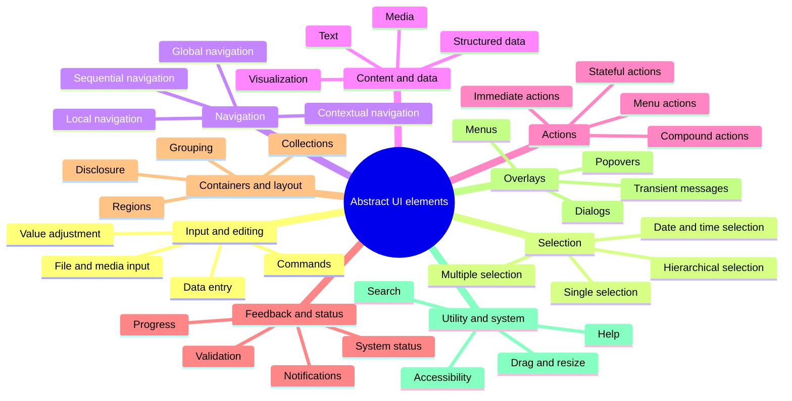

# Taxonomy of Abstract UI Element Types

An **abstract UI element type** describes an element by its purpose and behavior, independent of framework, platform, visual style, or implementation technology.

Canonical OpenUI vocabulary, aliases, and detailed term definitions live in
[`spec/README.md` § Glossary](../spec/README.md#glossary). This taxonomy groups
and compares terms by primary purpose; it should link to the glossary rather
than introduce conflicting definitions.

There is no universally standardized “complete” taxonomy. The following model aims to cover the element types used across web, desktop, mobile, touch, TV, embedded, voice-assisted, and mixed-interface applications.

## 1. Input and Editing Elements

Elements that allow users to enter, modify, upload, or manipulate information.

| Abstract type             | Purpose                                                      | Typical concrete elements                    |
| ------------------------- | ------------------------------------------------------------ | -------------------------------------------- |
| Text Input                | Enter short, unformatted text                                | Text field, search field, URL field          |
| Structured Text Input     | Enter text constrained to a format                           | Email, telephone, IP address, mask input     |
| Numeric Input             | Enter a number                                               | Number field, stepper, spin box              |
| Password Input            | Enter concealed sensitive text                               | Password field, PIN field                    |
| Multiline Text Input      | Enter longer textual content                                 | Text area, expanding editor                  |
| Rich-Text Input           | Enter formatted content                                      | Rich-text editor, Markdown editor            |
| Code Input                | Enter or edit source code                                    | Code editor, query editor                    |
| Autocomplete Input        | Enter text with suggestions                                  | Combobox, typeahead                          |
| Tokenized Input           | Enter multiple discrete values                               | Chip input, recipient field, tag editor      |
| Boolean Input             | Set a binary value                                           | Checkbox, switch, toggle                     |
| Range Input               | Choose a value within a range                                | Slider, range slider                         |
| Incremental Input         | Increase or decrease a value                                 | Stepper, spinner                             |
| Direct Manipulation Input | Change a value by manipulating its representation            | Drag handle, resize handle, rotation control |
| Drawing Input             | Provide freehand or geometric input                          | Canvas, signature pad, sketch area           |
| Color Input               | Select or enter a color                                      | Color picker, palette, eyedropper            |
| File Input                | Select files from storage                                    | File picker, upload field, drop zone         |
| Capture Input             | Capture information from a device                            | Camera capture, microphone recorder, scanner |
| Voice Input               | Enter content through speech                                 | Dictation button, voice prompt               |
| Form                      | Group related inputs into a submission or editing unit       | Registration form, settings form             |
| Form Field                | Combine an input with its label, help, state, and validation | Labeled field, field wrapper                 |
| Input Group               | Combine related inputs or input accessories                  | Address group, field with unit selector      |

## 2. Selection Elements

Elements used to choose one or more options from a known or discoverable set.

| Abstract type             | Purpose                                 | Typical concrete elements            |
| ------------------------- | --------------------------------------- | ------------------------------------ |
| Binary Selection          | Choose between two states               | Checkbox, switch                     |
| Exclusive Selection       | Select exactly one option               | Radio group, segmented control       |
| Optional Single Selection | Select zero or one option               | Dropdown, select, listbox            |
| Multiple Selection        | Select zero or more options             | Checkbox group, multi-select         |
| Segmented Selection       | Select from a small visible set         | Segmented button, choice chips       |
| List Selection            | Select entries from a list              | Listbox, selectable list             |
| Grid Selection            | Select cells or items in two dimensions | Data grid, image picker              |
| Hierarchical Selection    | Select from nested options              | Tree view, cascading selector        |
| Transfer Selection        | Move selected items between sets        | Transfer list, dual listbox          |
| Ordered Selection         | Select and arrange items                | Reorderable list, ranking control    |
| Date Selection            | Select a calendar date                  | Date picker, calendar                |
| Time Selection            | Select a time                           | Time picker, clock picker            |
| Date-Time Selection       | Select a combined date and time         | Date-time picker                     |
| Duration Selection        | Select a length of time                 | Duration field, interval picker      |
| Range Selection           | Select start and end values             | Date-range picker, dual-thumb slider |
| Wheel Selection           | Select values by rotating columns       | Wheel picker, scroll picker          |
| Rating Selection          | Choose an ordinal evaluation            | Star rating, reaction scale          |
| Spatial Selection         | Select a location or region             | Map picker, crop region              |

## 3. Action and Command Elements

Elements through which users request operations.

| Abstract type       | Purpose                                         | Typical concrete elements          |
| ------------------- | ----------------------------------------------- | ---------------------------------- |
| Primary Action      | Invoke the main action in a context             | Primary button                     |
| Secondary Action    | Invoke a supporting action                      | Secondary button                   |
| Tertiary Action     | Invoke a lower-emphasis action                  | Text button, link button           |
| Icon Action         | Invoke an action using a compact symbol         | Icon button                        |
| Destructive Action  | Perform a potentially damaging operation        | Delete button                      |
| Stateful Action     | Invoke and represent a persistent state         | Toggle button, favorite button     |
| Repeating Action    | Repeat while activated                          | Press-and-hold control             |
| Split Action        | Offer a default action and related alternatives | Split button                       |
| Compound Action     | Present several related actions as one unit     | Button group, toolbar              |
| Floating Action     | Expose a prominent contextual action            | Floating action button             |
| Menu Action         | Invoke an action from a menu                    | Menu item, dropdown-menu item      |
| Contextual Action   | Act on a selected or focused object             | Context menu command, row action   |
| Submission Action   | Commit entered data                             | Submit, save, apply                |
| Cancellation Action | Abandon or reverse an operation                 | Cancel, dismiss                    |
| Undoable Action     | Reverse a recent operation                      | Undo, redo                         |
| Shortcut Action     | Invoke a command through an alternate input     | Keyboard shortcut, gesture command |

## 4. Navigation Elements

Elements that move users between locations, views, sections, records, or states.

| Abstract type           | Purpose                                          | Typical concrete elements          |
| ----------------------- | ------------------------------------------------ | ---------------------------------- |
| Navigation Link         | Move to another destination                      | Hyperlink, navigation item         |
| Global Navigation       | Navigate among major application areas           | Navigation bar, app bar            |
| Local Navigation        | Navigate within the current area                 | Sidebar, local menu                |
| Responsive Navigation   | Provide navigation adapted to limited space      | Hamburger menu, navigation drawer  |
| Tab Navigation          | Switch between peer views                        | Tabs, tab bar                      |
| Hierarchical Navigation | Move through nested structures                   | Tree navigation, nested menu       |
| Path Navigation         | Show and navigate the current hierarchy          | Breadcrumbs                        |
| Sequential Navigation   | Move forward or backward through ordered content | Previous/next controls             |
| Step Navigation         | Move through a multi-stage process               | Stepper, wizard navigation         |
| Pagination              | Navigate among discrete result pages             | Paginator                          |
| Continuous Navigation   | Move through an unbounded collection             | Infinite scroll, load-more control |
| Record Navigation       | Move between individual records                  | First, previous, next, last        |
| Index Navigation        | Jump to a named or alphabetic section            | Index, A–Z rail                    |
| Anchor Navigation       | Jump within the current document or view         | Table of contents, anchor links    |
| History Navigation      | Move through previously visited states           | Back, forward                      |
| Spatial Navigation      | Move focus based on direction                    | D-pad navigation, focus grid       |
| View Switcher           | Change the presentation of the same content      | List/grid switcher                 |
| Destination Launcher    | Open a destination, tool, or application         | App launcher, shortcut tile        |

## 5. Content and Data-Presentation Elements

Elements that communicate information without primarily accepting input.

| Abstract type     | Purpose                                               | Typical concrete elements         |
| ----------------- | ----------------------------------------------------- | --------------------------------- |
| Text Content      | Present textual information                           | Paragraph, heading, caption       |
| Label             | Identify another element or value                     | Field label, item label           |
| Value Display     | Present a discrete value                              | Read-only field, metric           |
| Icon              | Communicate identity, state, or meaning symbolically  | Functional icon, status icon      |
| Image             | Present raster or vector visual content               | Photo, illustration               |
| Avatar            | Represent a person, entity, or agent                  | User avatar, organization mark    |
| Badge             | Display a compact status or count                     | Notification badge, status badge  |
| Tag               | Display classification or metadata                    | Tag, chip, label                  |
| Key–Value Display | Present named attributes                              | Description list, property panel  |
| List              | Present an ordered or unordered collection            | List, feed                        |
| Table             | Present aligned data records                          | Table, matrix                     |
| Data Grid         | Present structured interactive tabular data           | Sortable grid, spreadsheet        |
| Card              | Present a bounded collection representing one subject | Product card, summary card        |
| Tile              | Present a compact selectable destination or item      | Dashboard tile                    |
| Tree              | Present hierarchical data                             | File tree, outline                |
| Timeline          | Present events in chronological order                 | Activity timeline                 |
| Calendar View     | Present information organized by date                 | Month view, agenda                |
| Code Display      | Present source or machine-readable text               | Code block, diff viewer           |
| Quote Display     | Present attributed or emphasized text                 | Blockquote, testimonial           |
| Divider           | Express separation between regions                    | Separator, rule                   |
| Placeholder       | Reserve or describe absent content                    | Skeleton, empty slot              |
| Empty State       | Explain that content is unavailable or nonexistent    | No-results state                  |
| Thumbnail         | Provide a small preview                               | Image thumbnail, document preview |
| Preview           | Present a representation before opening or committing | File preview, print preview       |

## 6. Media Elements

Elements used to display or control time-based or immersive content.

| Abstract type     | Purpose                                             | Typical concrete elements         |
| ----------------- | --------------------------------------------------- | --------------------------------- |
| Image Viewer      | Display and inspect images                          | Lightbox, zoomable viewer         |
| Gallery           | Present a navigable media collection                | Image gallery, carousel           |
| Audio Player      | Play and control audio                              | Podcast player                    |
| Video Player      | Play and control video                              | Embedded video player             |
| Media Controller  | Control playback independently of the media surface | Playbar, transport controls       |
| Timeline Scrubber | Navigate through time-based content                 | Seek bar                          |
| Volume Controller | Adjust sound level                                  | Volume slider, mute control       |
| Caption Display   | Present synchronized text                           | Subtitles, closed captions        |
| Transcript        | Present a textual media representation              | Audio transcript                  |
| Live Media View   | Present real-time media                             | Live stream, camera monitor       |
| Immersive View    | Present panoramic or spatial content                | 360° viewer, AR view, VR viewport |

## 7. Data-Visualization Elements

Elements that encode values, relationships, or spatial information visually.

| Abstract type            | Purpose                                        | Typical concrete elements       |
| ------------------------ | ---------------------------------------------- | ------------------------------- |
| Indicator                | Show a value using a compact visual encoding   | Sparkline, signal meter         |
| Gauge                    | Show a value relative to a range               | Dial, meter                     |
| Progress Visualization   | Show completion quantitatively                 | Progress bar, progress ring     |
| Comparison Chart         | Compare categorical values                     | Bar chart, dot plot             |
| Trend Chart              | Show change over an ordered dimension          | Line chart, area chart          |
| Composition Chart        | Show parts of a whole                          | Pie chart, stacked chart        |
| Distribution Chart       | Show frequency or spread                       | Histogram, box plot             |
| Relationship Chart       | Show correlation or association                | Scatter plot, bubble chart      |
| Hierarchy Visualization  | Show nested quantitative relationships         | Treemap, sunburst               |
| Network Visualization    | Show nodes and relationships                   | Graph, dependency diagram       |
| Flow Visualization       | Show movement between stages                   | Sankey diagram                  |
| Temporal Visualization   | Show events or intervals over time             | Timeline, Gantt chart           |
| Geographic Visualization | Show spatially located data                    | Map, choropleth                 |
| Diagram                  | Explain structure, process, or relationships   | Flowchart, architecture diagram |
| Legend                   | Explain visual encodings                       | Chart legend                    |
| Annotation               | Add explanatory information to a visualization | Marker, callout, reference line |

## 8. Feedback, Status, and Messaging Elements

Elements that communicate system state, results, validation, or changes.

| Abstract type          | Purpose                                              | Typical concrete elements               |
| ---------------------- | ---------------------------------------------------- | --------------------------------------- |
| Status Indicator       | Communicate a persistent state                       | Online dot, health indicator            |
| Loading Indicator      | Indicate activity with unknown duration              | Spinner, loader                         |
| Determinate Progress   | Show measurable completion                           | Progress bar                            |
| Indeterminate Progress | Show ongoing activity without a known endpoint       | Indeterminate bar                       |
| Skeleton               | Represent the structure of loading content           | Skeleton screen                         |
| Inline Message         | Communicate information near relevant content        | Hint, inline alert                      |
| Validation Message     | Explain valid or invalid input                       | Field error, success indicator          |
| Global Alert           | Communicate significant application-wide information | Alert banner                            |
| Notification           | Communicate an event asynchronously                  | Notification item                       |
| Toast                  | Present brief, non-blocking feedback                 | Snackbar, toast                         |
| Confirmation           | Confirm that an action succeeded                     | Success message                         |
| Warning                | Communicate risk or a potentially undesirable state  | Warning banner                          |
| Error                  | Communicate failure                                  | Error panel                             |
| Blocking Message       | Require acknowledgment or action                     | Blocking error dialog                   |
| Status Summary         | Aggregate several statuses                           | Validation summary, system-health panel |
| Counter                | Communicate a changing quantity                      | Unread count, character count           |
| Connectivity Indicator | Communicate connection state                         | Offline indicator, sync status          |

## 9. Container, Grouping, and Layout Elements

Elements that organize other elements or establish visual and semantic regions.

| Abstract type          | Purpose                                            | Typical concrete elements        |
| ---------------------- | -------------------------------------------------- | -------------------------------- |
| Generic Container      | Group related content without specialized behavior | Panel, box                       |
| Semantic Region        | Define a meaningful application area               | Header, main, footer             |
| Section                | Group related content under a common subject       | Content section                  |
| Field Group            | Group related form controls                        | Fieldset                         |
| Action Group           | Group related commands                             | Toolbar, button group            |
| List Container         | Organize repeated items                            | List, collection                 |
| Grid Container         | Arrange content in rows and columns                | Layout grid                      |
| Stack                  | Arrange elements along one axis                    | Vertical stack, horizontal stack |
| Split Layout           | Divide space into resizable or fixed regions       | Split pane                       |
| Sidebar Region         | Present supplementary or navigational content      | Sidebar                          |
| Drawer                 | Hold content that enters from an edge              | Navigation drawer                |
| Scroll Container       | Provide a constrained scrollable region            | Scroll panel                     |
| Viewport               | Define the visible portion of larger content       | Canvas viewport                  |
| Responsive Container   | Adapt contents to available space                  | Adaptive panel                   |
| Aspect-Ratio Container | Preserve a media or content proportion             | Video wrapper                    |
| Safe-Area Container    | Avoid platform-reserved display regions            | Mobile safe-area wrapper         |
| Portal Region          | Render content outside its logical hierarchy       | Overlay host, portal outlet      |

## 10. Disclosure and Collection-Presentation Elements

Elements that control whether grouped content is visible or how a collection is traversed.

| Abstract type          | Purpose                                             | Typical concrete elements  |
| ---------------------- | --------------------------------------------------- | -------------------------- |
| Disclosure Control     | Show or hide associated content                     | Expander, details control  |
| Accordion              | Manage several expandable sections                  | Accordion                  |
| Collapsible Panel      | Reveal or conceal a content region                  | Expansion panel            |
| Tabbed Container       | Show one peer content panel at a time               | Tab panel                  |
| Carousel               | Traverse a sequence within a bounded viewport       | Image carousel             |
| Tree Disclosure        | Expand or collapse hierarchical branches            | Tree node                  |
| Truncation Control     | Reveal content omitted for compactness              | “Show more”                |
| Virtualized Collection | Present part of a large collection efficiently      | Virtual list, virtual grid |
| Filtered Collection    | Present items matching criteria                     | Filterable list            |
| Grouped Collection     | Divide items into named groups                      | Sectioned list             |
| Master–Detail View     | Coordinate collection selection with detail content | Inbox layout               |

## 11. Overlay and Transient Elements

Elements displayed above the normal content layer.

| Abstract type    | Purpose                                                          | Typical concrete elements |
| ---------------- | ---------------------------------------------------------------- | ------------------------- |
| Modal Dialog     | Require interaction before returning to the underlying interface | Confirmation dialog       |
| Non-Modal Dialog | Present a movable or persistent auxiliary window                 | Tool dialog               |
| Alert Dialog     | Require acknowledgment of an urgent message                      | Critical warning          |
| Sheet            | Present a task or choices from an edge                           | Bottom sheet, side sheet  |
| Popover          | Present contextual interactive content                           | Settings popover          |
| Tooltip          | Provide brief explanatory text                                   | Hover tooltip             |
| Menu             | Present a temporary list of commands or choices                  | Dropdown menu             |
| Context Menu     | Present actions relevant to a target                             | Right-click menu          |
| Dropdown Panel   | Present selectable or interactive content below an anchor        | Select panel              |
| Lightbox         | Focus attention on media                                         | Image lightbox            |
| Inspector        | Present contextual properties or details                         | Object inspector          |
| Coach Mark       | Explain an interface element in context                          | Product-tour callout      |
| Scrim            | Visually separate an overlay from underlying content             | Modal backdrop            |

## 12. Search, Filtering, Sorting, and Query Elements

Elements used to locate, narrow, arrange, or formulate information.

| Abstract type      | Purpose                                      | Typical concrete elements    |
| ------------------ | -------------------------------------------- | ---------------------------- |
| Search Input       | Enter a free-text query                      | Search box                   |
| Search Suggestions | Propose queries or destinations              | Autocomplete suggestions     |
| Search Scope       | Constrain where a search applies             | Scope selector               |
| Filter Control     | Include or exclude content by criteria       | Filter dropdown, filter chip |
| Faceted Filter     | Filter by multiple data dimensions           | Facet panel                  |
| Active Filter      | Represent an applied constraint              | Filter tag                   |
| Sort Control       | Set ordering criteria                        | Sort dropdown                |
| Group Control      | Set collection grouping                      | Group-by selector            |
| Query Builder      | Construct compound logical criteria          | Rule builder                 |
| Saved Query        | Store and reapply query criteria             | Saved search                 |
| Results Summary    | Explain result quantity and applied criteria | Result count                 |
| Search Result      | Represent one matching item                  | Result card, result row      |

## 13. Help, Guidance, and Onboarding Elements

Elements that explain the interface or help users complete tasks.

| Abstract type        | Purpose                                             | Typical concrete elements |
| -------------------- | --------------------------------------------------- | ------------------------- |
| Helper Text          | Explain expected input or behavior                  | Field hint                |
| Tooltip Help         | Provide brief contextual assistance                 | Informational tooltip     |
| Contextual Help      | Provide assistance relevant to the current location | Help panel                |
| Example              | Demonstrate an acceptable value or action           | Input example             |
| Instruction          | Explain how to perform a task                       | Instruction block         |
| Walkthrough          | Guide users through a sequence                      | Product tour              |
| Coach Mark           | Draw attention to a particular control              | Feature callout           |
| Onboarding Checklist | Track introductory tasks                            | Getting-started checklist |
| Documentation Link   | Lead to extended help                               | “Learn more” link         |
| Glossary Definition  | Explain terminology                                 | Definition popover        |

## 14. Identity, Account, and Permission Elements

Elements representing users, roles, access, and authentication state.

| Abstract type           | Purpose                                     | Typical concrete elements |
| ----------------------- | ------------------------------------------- | ------------------------- |
| Identity Representation | Represent a person or account               | Avatar, profile chip      |
| Account Selector        | Switch among identities or tenants          | Account switcher          |
| Authentication Input    | Collect authentication credentials          | Login form, OTP input     |
| Permission Request      | Ask for access to protected capabilities    | Permission prompt         |
| Role Indicator          | Communicate an assigned role                | Administrator badge       |
| Presence Indicator      | Show availability or activity               | Online status             |
| Participant List        | Present users involved in a context         | Member list               |
| Attribution             | Identify the creator or modifier of content | Byline, audit identity    |

## 15. Accessibility and Alternative-Interaction Elements

These may be visible controls or semantic properties attached to other elements.

| Abstract type         | Purpose                                                | Typical concrete elements       |
| --------------------- | ------------------------------------------------------ | ------------------------------- |
| Focus Indicator       | Show the current keyboard or spatial-navigation target | Focus ring                      |
| Skip Control          | Bypass repetitive interface regions                    | Skip-to-content link            |
| Accessibility Label   | Provide a nonvisual accessible name                    | ARIA label, semantic label      |
| Description           | Provide additional assistive context                   | Accessible description          |
| Live Region           | Announce dynamic changes                               | Status announcement             |
| Landmark              | Expose page regions to assistive technology            | Navigation, main, complementary |
| Keyboard Alternative  | Provide keyboard access to an operation                | Shortcut, access key            |
| Gesture Alternative   | Provide a non-gesture method for the same operation    | Visible previous/next buttons   |
| Caption or Transcript | Provide a text alternative to media                    | Closed captions, transcript     |
| Error Association     | Connect an invalid input with its explanation          | Described field error           |

## Classification Rules

Many concrete components belong to more than one abstract category. Classification should therefore be based on the element’s **primary purpose in its current context**.

Examples:

| Concrete element | Primary type                  | Possible secondary roles           |
| ---------------- | ----------------------------- | ---------------------------------- |
| Dropdown         | Single selection              | Disclosure, overlay                |
| Dropdown Menu    | Menu action container         | Overlay, navigation                |
| Tab Bar          | Tab navigation                | Selection, container               |
| Sidebar          | Layout region                 | Navigation, supplementary content  |
| Tag              | Metadata display              | Filter, selection                  |
| Badge            | Compact status display        | Counter, notification              |
| Icon             | Symbolic content              | Action when placed inside a button |
| Loader           | Indeterminate progress        | System status                      |
| Hamburger Menu   | Responsive navigation trigger | Action, disclosure                 |
| Wheel Picker     | Single or compound selection  | Date/time or value input           |
| Carousel         | Collection presentation       | Sequential navigation              |
| Data Grid        | Structured data display       | Editing, selection, navigation     |
| Form             | Input grouping and submission | Validation, workflow               |

Hover states, touch targets, gestures, mouse events, and keyboard events are **not abstract UI element types**. They belong to a companion taxonomy of **UI interaction definitions**:

1. Interaction states
2. Interaction target properties
3. Interaction gestures
4. Input events and commands
