# Generic UI Taxonomy

Framework-independent UI taxonomy. Each entry is classified by its primary
purpose. The canonical vocabulary, aliases, and detailed term definitions live in
[`spec/scopes/scope.md` § Glossary](scopes/scope.md#glossary); this document
classifies and illustrates those terms rather than redefining them. The
spec-object coverage map is maintained in `spec/scopes/taxonomy_mapping.md`.
“Device-dependent” means that the element inherently requires a particular
hardware or host-platform capability, not merely that its layout adapts to a
device.

## Input elements

Collect data from users or allow users to trigger actions and change values.

### Command activation

| Name             | Description — how the user interfaces with it                                                                            | Viewable? | Device-dependent? | Example image                                          |
| ---------------- | ------------------------------------------------------------------------------------------------------------------------ | :-------: | :---------------: | ------------------------------------------------------ |
| Button           | Initiates an action when clicked, tapped, or activated by keyboard or assistive technology.                              |    Yes    |        No         |                    |
| Icon button      | Initiates an action represented primarily by an icon.                                                                    |    Yes    |        No         |          |
| Tool button      | Runs a command from a toolbar or another bar. It is usually shown as an icon and may open a menu of related commands.    |    Yes    |        No         | None yet                                               |
| Hamburger button | A compact menu trigger, usually shown as three horizontal lines. The user activates it to reveal navigation or commands. |    Yes    |        No         | 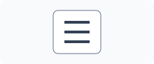 |
| Toggle button    | A button that keeps a pressed or released state. The user activates it to switch the state.                              |    Yes    |        No         | None yet                                               |

### Text and shortcut entry

| Name                    | Description — how the user interfaces with it                                                                           | Viewable? | Device-dependent? | Example image                                        |
| ----------------------- | ----------------------------------------------------------------------------------------------------------------------- | :-------: | :---------------: | ---------------------------------------------------- |
| Text field              | Accepts a single line of typed, pasted, dictated, or programmatically entered text.                                     |    Yes    |        No         |          |
| Text area               | Accepts multiple lines of text and may support scrolling or resizing.                                                   |    Yes    |        No         | 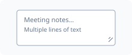           |
| Password field          | Accepts concealed text, usually for authentication, with an optional reveal action.                                     |    Yes    |        No         |  |
| Rich text editor        | Edits text with formatting such as bold, lists and links, usually with a formatting toolbar.                            |    Yes    |        No         | None yet                                             |
| Keyboard shortcut field | Records the key combination the user presses, for example to assign a keyboard shortcut.                                |    Yes    |        Yes        | None yet                                             |
| Metadata-driven field   | Shows a value and picks its editor, such as a text, number or date input, from the data type and metadata of the value. |    Yes    |        No         | None yet                                             |

### Value and resource selection

| Name                        | Description — how the user interfaces with it                                                                                              | Viewable? | Device-dependent? | Example image                                            |
| --------------------------- | ------------------------------------------------------------------------------------------------------------------------------------------ | :-------: | :---------------: | -------------------------------------------------------- |
| Checkbox                    | Controls an independent Boolean choice. The user checks or clears it.                                                                      |    Yes    |        No         |                  |
| Radio button                | Selects one value from a mutually exclusive group.                                                                                         |    Yes    |        No         |          |
| Switch                      | Changes an option immediately between two states, commonly on and off.                                                                     |    Yes    |        No         |               |
| Dropdown                    | Lets the user choose one value from a list that opens on demand; it is also commonly called a select or drop-down list.                    |    Yes    |        No         |                  |
| List box                    | Displays choices persistently and supports selection of one or more items.                                                                 |    Yes    |        No         |                  |
| Combo box                   | Combines editable text with a selectable list of values or suggestions.                                                                    |    Yes    |        No         | 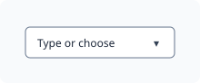               |
| Suggestion-backed combo box | Accepts typed text and offers matching suggestions from a data source while the user types. The user picks a suggestion or keeps the text. |    Yes    |        No         | None yet                                                 |
| Multi-select combo box      | Combines text entry with a list from which the user picks several values, usually shown as tokens in the field.                            |    Yes    |        No         | None yet                                                 |
| Selection mode              | States whether a choice control or a collection allows one selection or several, independent of how it is presented.                       | Sometimes |        No         | None yet                                                 |
| Font-family selector        | Lets the user choose a font family from a list that shows each family's name, often in that font.                                          |    Yes    |        No         | None yet                                                 |
| Slider                      | Selects a value or range by moving one or more handles along a track.                                                                      |    Yes    |        No         |                      |
| Range slider                | Selects a lower and an upper value by moving two handles along one track.                                                                  |    Yes    |        No         | None yet                                                 |
| Rotary value control        | Selects a value by turning a circular dial with the pointer, the keyboard or the wheel.                                                    |    Yes    |        No         | None yet                                                 |
| Spin box                    | Selects a numeric value by typing or using increment and decrement actions.                                                                |    Yes    |        No         |    |
| Step input                  | Accepts a number that the user types or changes one step at a time with increment and decrement buttons.                                   |    Yes    |        No         |  |
| Rating control              | Selects an ordinal rating, commonly through stars or similar repeated marks.                                                               |    Yes    |        No         |      |
| Wheel picker                | Lets the user select a value by scrolling one or more rotating columns and aligning the desired item with a selection indicator.           |    Yes    |        No         |          |
| Color picker                | Selects a color through swatches, sliders, or numeric values.                                                                              |    Yes    |        No         | 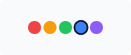         |
| File picker                 | Selects files through operating-system or storage-provider facilities.                                                                     |    Yes    |        Yes        | 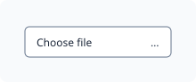           |
| Font picker                 | Opens a picker to choose a font, including its family, style and size, often with a preview.                                               |    Yes    |        No         | None yet                                                 |
| Folder picker               | Selects a folder through operating-system or storage-provider facilities.                                                                  |    Yes    |        Yes        | None yet                                                 |
| Token collection            | Shows chosen values as compact items (tokens) next to an entry field. The user adds values by typing and removes them one by one.          |    Yes    |        No         | None yet                                                 |
| Editable chip collection    | A set of chips connected to an input field. The user adds chips by typing and edits or removes existing ones.                              |    Yes    |        No         | None yet                                                 |
| File upload                 | Lets the user choose one or more files and sends them to a server, showing the progress and result for each file.                          |    Yes    |        Yes        | None yet                                                 |

### Temporal entry

| Name                | Description — how the user interfaces with it                                   | Viewable? | Device-dependent? | Example image                                  |
| ------------------- | ------------------------------------------------------------------------------- | :-------: | :---------------: | ---------------------------------------------- |
| Date picker         | Accepts or selects a date, commonly through a calendar presentation.            |    Yes    |        No         | 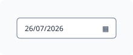 |
| Time picker         | Accepts or selects a time, with presentation influenced by locale and platform. |    Yes    |        No         |  |
| Date field          | Accepts a date typed into a field, with an optional calendar.                   |    Yes    |        No         | None yet                                       |
| Time field          | Accepts a time typed into a field, formatted for the locale.                    |    Yes    |        No         | None yet                                       |
| Date and time field | Accepts a date and a time together in one field.                                |    Yes    |        No         | None yet                                       |

### Drawing and capture

| Name             | Description — how the user interfaces with it                                                              | Viewable? | Device-dependent? | Example image                                            |
| ---------------- | ---------------------------------------------------------------------------------------------------------- | :-------: | :---------------: | -------------------------------------------------------- |
| Canvas           | A drawing surface that the application paints on and the user may draw on with a pointer, touch or stylus. |    Yes    |        No         | 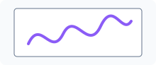        |
| Drawing area     | Accepts free-form drawing or graphical manipulation through pointer, touch, stylus, or keyboard.           |    Yes    |        No         |   |
| Microphone input | Captures audio after the user starts recording and grants permission.                                      | Sometimes |        Yes        |  |

### Manipulation handles

| Name          | Description — how the user interfaces with it              | Viewable? | Device-dependent? | Example image                                      |
| ------------- | ---------------------------------------------------------- | :-------: | :---------------: | -------------------------------------------------- |
| Drag handle   | Provides a grab target for moving or reordering an object. |    Yes    |        No         | 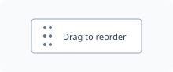     |
| Resize handle | Provides a drag target for resizing an object or region.   |    Yes    |        No         | 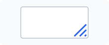 |

## Output elements

Present information, results, feedback, progress, or system status to users.

### Document and numeric display

| Name              | Description — how the user interfaces with it                                                                                               | Viewable? | Device-dependent? | Example image                                      |
| ----------------- | ------------------------------------------------------------------------------------------------------------------------------------------- | :-------: | :---------------: | -------------------------------------------------- |
| Label             | Identifies or describes another UI object. The user normally reads it.                                                                      |    Yes    |        No         |                  |
| Text              | Presents readable information without accepting input.                                                                                      |    Yes    |        No         |                    |
| Image             | Presents visual information. The user may view, select, zoom, drag, or open it.                                                             |    Yes    |        No         |                  |
| Icon              | A compact graphic that represents an object, action, status, or concept. The user interprets it visually; it is not inherently interactive. |    Yes    |        No         |                    |
| Avatar            | Visually represents a person, organization, or agent and may be selectable.                                                                 |    Yes    |        No         |                |
| Separator         | Visually separates groups of content or controls and normally has no direct interaction.                                                    |    Yes    |        No         | 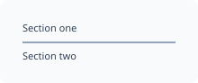 |
| Divider           | A visible line between groups of content or controls. It normally has no direct interaction.                                                |    Yes    |        No         |    |
| Calculated output | Shows the result of a calculation or user action, such as a computed total, and updates when its inputs change.                             |    Yes    |        No         | None yet                                           |
| Highlighted text  | Text marked as relevant in the current context, such as search matches, shown with a highlight.                                             |    Yes    |        No         | None yet                                           |

### Graphics presentation

| Name                    | Description — how the user interfaces with it                                           | Viewable? | Device-dependent? | Example image |
| ----------------------- | --------------------------------------------------------------------------------------- | :-------: | :---------------: | ------------- |
| Geometric shape         | Draws a geometric shape such as an ellipse, rectangle, line, polygon or path.           |    Yes    |        No         | None yet      |
| Custom graphics surface | A region whose content the application renders itself, for example with a graphics API. |    Yes    |        No         | None yet      |
| Graphics viewport       | Shows a scene of graphic items. The user pans, zooms and selects items or regions.      |    Yes    |        No         | None yet      |

### Collections and data presentation

| Name              | Description — how the user interfaces with it                                                                                           | Viewable? | Device-dependent? | Example image                                    |
| ----------------- | --------------------------------------------------------------------------------------------------------------------------------------- | :-------: | :---------------: | ------------------------------------------------ |
| List              | Presents a sequence of similar items that can be read, selected, opened, reordered, or acted upon.                                      |    Yes    |        No         | 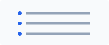                 |
| Table             | Displays structured data in rows and columns with header cells. The user may sort, filter, select or page through it.                   |    Yes    |        No         | 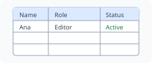     |
| Data grid         | Displays data in rows and columns as an interactive grid. The user moves between cells, selects them and may edit them.                 |    Yes    |        No         |  |
| Description list  | Shows a list of terms, each with one or more descriptions, such as labels and their values.                                             |    Yes    |        No         | None yet                                         |
| Icon collection   | Shows items as icons with labels arranged in a grid, as in a file browser.                                                              |    Yes    |        No         | None yet                                         |
| Planning calendar | Shows appointments or intervals for several people or resources along a time axis. The user moves the time range and selects intervals. |    Yes    |        No         | None yet                                         |
| Tree              | Shows items in a hierarchy. The user expands and collapses items to see their children.                                                 |    Yes    |        No         | None yet                                         |
| Tree grid         | A data grid whose rows can be expanded to show child rows.                                                                              |    Yes    |        No         | None yet                                         |
| Chart             | Draws data as a chart, such as bars, lines or a pie. The user may read values and hover over or select data points.                     |    Yes    |        No         | None yet                                         |
| Geographic map    | Displays spatial information. The user pans, zooms, selects markers, or requests directions.                                            |    Yes    |        No         | 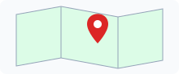        |

### Media playback

| Name           | Description — how the user interfaces with it                                               | Viewable? | Device-dependent? | Example image                                        |
| -------------- | ------------------------------------------------------------------------------------------- | :-------: | :---------------: | ---------------------------------------------------- |
| Media player   | Presents audio or video with playback, seeking, volume, caption, and fullscreen operations. |    Yes    |        No         |      |
| Camera preview | Displays a live camera image and supports capture or camera-related actions.                |    Yes    |        Yes        | 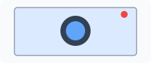 |
| Captions       | Shows the speech and important sounds of audio or video as synchronized text.               |    Yes    |        No         | None yet                                             |

### Feedback and assistance

| Name                | Description — how the user interfaces with it                                                                                                                                                  | Viewable? | Device-dependent? | Example image                                                        |
| ------------------- | ---------------------------------------------------------------------------------------------------------------------------------------------------------------------------------------------- | :-------: | :---------------: | -------------------------------------------------------------------- |
| Status bar          | A region displaying state such as readiness, connectivity, or zoom. It is generally read-only.                                                                                                 |    Yes    |        No         | 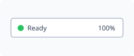                         |
| Tag                 | Displays a keyword, classification, or attribute attached to content; it may also support selection or removal.                                                                                |    Yes    |        No         | 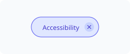                                       |
| Badge               | Displays a compact status, category, or count associated with another object.                                                                                                                  |    Yes    |        No         | 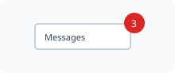                                   |
| Progress bar        | Shows the known completion proportion of an operation; generally read-only.                                                                                                                    |    Yes    |        No         |                      |
| Loader              | Shows that an operation is active when its exact progress is unknown.                                                                                                                          |    Yes    |        No         |                          |
| Spinner             | A rotating indicator that shows an operation is active without a known end.                                                                                                                    |    Yes    |        No         |                         |
| Meter               | Shows a measurement within a known range, such as disk usage, and may mark low, high and optimum values.                                                                                       |    Yes    |        No         | None yet                                                             |
| Progress mode       | States whether progress is determinate (the amount done is known) or indeterminate (active without a known end).                                                                               | Sometimes |        No         | None yet                                                             |
| Tooltip             | Shows brief explanatory information when an object is hovered, focused, or touched.                                                                                                            |    Yes    |        No         |                                |
| Alert               | Presents important information requiring attention and possibly acknowledgment.                                                                                                                |    Yes    |        No         |                                    |
| Toast               | Briefly reports an event or result without normally blocking other interaction.                                                                                                                |    Yes    |        No         |                           |
| Snackbar            | A brief message at the edge of the screen that may offer one action, such as undo.                                                                                                             |    Yes    |        No         |                        |
| Notification        | Reports an event outside or alongside the main application view and may offer actions.                                                                                                         |    Yes    |        Yes        |                      |
| Narration           | Presents text, interface state, or visual information as spoken audio. The user listens to it and may use associated controls to start, pause, stop, or configure the narration.               |    No     |        Yes        | 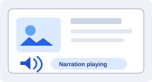         |
| Audio description   | A spoken description of the important visual content of a video. The user listens to it.                                                                                                       |    No     |        Yes        |  |
| Contextual help     | Shows help for a specific element when the user asks for it, for example in a help mode.                                                                                                       |    Yes    |        No         | None yet                                                             |
| Startup screen      | Shows an image or branding while the application loads, then disappears.                                                                                                                       |    Yes    |        No         | None yet                                                             |
| Illustrated message | A message with an illustration that stands in for content in an empty state or a success state. It shows an illustration, a title, a description and optional extra content, such as a button. |    Yes    |        No         | None yet                                                             |

## Navigational elements

Help users move between product areas, views, locations, or sections of content.

### Command menus

| Name         | Description — how the user interfaces with it                                                       | Viewable? | Device-dependent? | Example image                                    |
| ------------ | --------------------------------------------------------------------------------------------------- | :-------: | :---------------: | ------------------------------------------------ |
| Menu         | Presents commands or destinations. The user opens it and selects an item.                           |    Yes    |        No         |                  |
| Menu button  | A menu that opens below or beside its trigger and presents commands or navigation choices.          |    Yes    |        No         |  |
| Context menu | Presents actions relevant to an object or location, commonly after right-click or long-press.       |    Yes    |        No         | 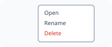 |
| Menubar      | A bar of menu titles, usually at the top of a window. The user opens each menu and picks a command. |    Yes    |        No         | None yet                                         |
| Menu item    | One command or choice inside a menu. The user activates it.                                         |    Yes    |        No         | None yet                                         |

### Hierarchy browsing

| Name           | Description — how the user interfaces with it                                                              | Viewable? | Device-dependent? | Example image                                |
| -------------- | ---------------------------------------------------------------------------------------------------------- | :-------: | :---------------: | -------------------------------------------- |
| Tree view      | Presents hierarchical data. The user expands, collapses, and selects nodes.                                |    Yes    |        No         |    |
| Breadcrumb     | Shows the current position in a hierarchy. The user can select an ancestor to navigate upward.             |    Yes    |        No         |  |
| Column browser | Shows a hierarchy as side-by-side columns. Selecting an item in one column shows its children in the next. |    Yes    |        No         | None yet                                     |

### Content selection and position

| Name               | Description — how the user interfaces with it                                                      | Viewable? | Device-dependent? | Example image                                                |
| ------------------ | -------------------------------------------------------------------------------------------------- | :-------: | :---------------: | ------------------------------------------------------------ |
| Tab                | Selects one of several related content panels within the same context.                             |    Yes    |        No         | 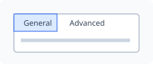                               |
| Tab Bar            | A persistent row or column of tabs used to switch among peer views or primary destinations.        |    Yes    |        No         |                        |
| Scrollbar          | Indicates position in overflowed content and permits scrolling by dragging or selecting its track. |    Yes    |        No         |                    |
| Pagination control | Moves between discrete pages of content.                                                           |    Yes    |        No         | 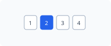 |
| Carousel           | Shows one or several items in a constrained viewport. The user moves or swipes between items.      |    Yes    |        No         | 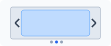                     |

### Application navigation

| Name              | Description — how the user interfaces with it                                                                                                                     | Viewable? | Device-dependent? | Example image                                              |
| ----------------- | ----------------------------------------------------------------------------------------------------------------------------------------------------------------- | :-------: | :---------------: | ---------------------------------------------------------- |
| Navigation bar    | Provides access to primary application destinations. The user selects a destination.                                                                              |    Yes    |        No         | 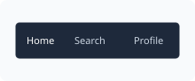       |
| Navigation Drawer | An edge-attached panel containing navigation destinations. The user opens it, selects a destination, and may dismiss it; it may also remain persistently visible. |    Yes    |        No         | 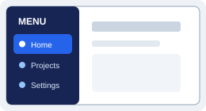 |
| Navigation Rail   | A narrow, usually persistent vertical strip containing primary destinations. The user selects an icon or labeled destination to switch views.                     |    Yes    |        No         | 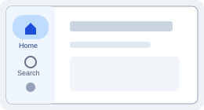     |
| Link              | Navigates to another location or resource when activated.                                                                                                         |    Yes    |        No         |                            |
| Navigation item   | One destination in the application's navigation. The user selects it to go there.                                                                                 |    Yes    |        No         | None yet                                                   |
| Navigation group  | Groups related navigation items under a label and may expand or collapse.                                                                                         |    Yes    |        No         | None yet                                                   |
| Route             | Maps an address to the page or view shown for it. The user reaches it through links, navigation or the address bar.                                               |    No     |        No         | None yet                                                   |
| Routing           | Decides which page or view is shown for the current address and handles moving between them.                                                                      |    No     |        No         | None yet                                                   |

### Search, filtering and sorting

| Name                  | Description — how the user interfaces with it                                                                    | Viewable? | Device-dependent? | Example image                                    |
| --------------------- | ---------------------------------------------------------------------------------------------------------------- | :-------: | :---------------: | ------------------------------------------------ |
| Search field          | Accepts a query and may display suggestions or filters.                                                          |    Yes    |        No         |  |
| Filter bar            | A bar of filter fields that narrow the content of a referenced table, list or chart.                             |    Yes    |        No         | None yet                                         |
| Value help            | Opens a list or dialog that helps the user find and choose a valid value for a field.                            |    Yes    |        No         | None yet                                         |
| Personalization panel | Lets the user choose which columns a referenced table or chart shows and how it is sorted, grouped and filtered. |    Yes    |        No         | None yet                                         |

## Container elements

Group, structure, and organize related content or other UI elements.

### Grouping surfaces

| Name            | Description — how the user interfaces with it                                                                                                                                        | Viewable? | Device-dependent? | Example image                              |
| --------------- | ------------------------------------------------------------------------------------------------------------------------------------------------------------------------------------ | :-------: | :---------------: | ------------------------------------------ |
| Panel           | A bounded region grouping related content or controls. The user works with the items within it.                                                                                      |    Yes    |        No         | 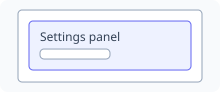         |
| Container       | A layout object that holds and arranges child objects. It may have no direct interaction or visible boundary.                                                                        | Sometimes |        No         | 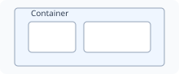 |
| Card            | A bounded unit of related information and actions. The user reads, selects, opens, or acts on it.                                                                                    |    Yes    |        No         | 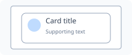           |
| Tile            | A compact card, usually of fixed size, that shows a summary and opens more detail when selected.                                                                                     |    Yes    |        No         | None yet                                   |
| Labelled group  | A group of related controls with a visible title.                                                                                                                                    |    Yes    |        No         | None yet                                   |
| Checkable group | A labelled group whose title has a checkbox. Clearing it disables the controls inside.                                                                                               |    Yes    |        No         | None yet                                   |
| Accordion       | Organizes content into expandable sections. The user expands or collapses each heading.                                                                                              |    Yes    |        No         | 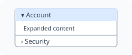 |
| Disclosure      | A summary line the user activates to show or hide more content.                                                                                                                      |    Yes    |        No         | None yet                                   |
| Hero banner     | A full-width banner at the top of a page that greets the user and gives quick access to key information or actions. The banner itself is not interactive; controls placed in it are. |    Yes    |        No         | None yet                                   |

### Workspace surfaces

| Name                        | Description — how the user interfaces with it                                                                     | Viewable? | Device-dependent? | Example image                           |
| --------------------------- | ----------------------------------------------------------------------------------------------------------------- | :-------: | :---------------: | --------------------------------------- |
| Window                      | A top-level application or document area. The user moves, resizes, minimizes, maximizes, or closes it.            |    Yes    |        No         |     |
| View                        | A complete application page or state. The user navigates to it and interacts with its contents.                   |    Yes    |        No         | 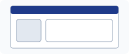 |
| Toolbar                     | A row or column of frequently used actions. The user activates its buttons or menus.                              |    Yes    |        No         |   |
| Main window                 | An application's primary window. It frames a central area with menus, toolbars, dockable panels and a status bar. |    Yes    |        No         | None yet                                |
| Dockable panel              | A panel the user can move, dock to an edge of the main window or float as its own window.                         |    Yes    |        No         | None yet                                |
| Multiple-document workspace | An area that holds several document windows, which the user can arrange, tile or cascade.                         |    Yes    |        No         | None yet                                |
| Shell bar                   | The top bar of an application, with its logo and title, search, notifications and a user menu.                    |    Yes    |        No         | None yet                                |
| Object page                 | A page that shows one business object, with a header of key facts and sections the user reaches by anchors.       |    Yes    |        No         | None yet                                |
| Report                      | A read-only view that presents data for reading, printing or export.                                              |    Yes    |        No         | None yet                                |
| Dashboard                   | A page that brings together summary widgets such as charts, key figures and lists.                                |    Yes    |        No         | None yet                                |
| Shell page                  | A page that frames the application's content with shared regions such as a header, navigation and footer.         |    Yes    |        No         | None yet                                |
| Empty page                  | A page with no content, used as a starting point or a placeholder.                                                |    Yes    |        No         | None yet                                |
| Tool action                 | One command in a tool bar row. The user activates it.                                                             |    Yes    |        No         | None yet                                |
| Tool bar row                | One row of tool actions inside a tool bar.                                                                        |    Yes    |        No         | None yet                                |

### Overlays and sheets

| Name         | Description — how the user interfaces with it                                                                                                                                                                                                        | Viewable? | Device-dependent? | Example image                                    |
| ------------ | ---------------------------------------------------------------------------------------------------------------------------------------------------------------------------------------------------------------------------------------------------- | :-------: | :---------------: | ------------------------------------------------ |
| Popover      | Shows contextual, potentially interactive content anchored to another object.                                                                                                                                                                        |    Yes    |        No         | 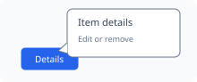           |
| Sidebar      | A vertical region beside the main content that groups navigation, tools, filters, or supporting information.                                                                                                                                         |    Yes    |        No         |            |
| Sheet        | A surface that temporarily or persistently presents supplementary content, controls, or a focused task over or alongside the main view. The user interacts with its contents and may dismiss it when it is temporary.                                |    Yes    |        No         | 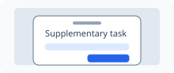               |
| Side Sheet   | A sheet attached to the inline-start or inline-end edge of a view. Its physical side may change with the interface direction. The user uses it for contextual details, filters, editing, navigation, or related actions, and may open or dismiss it. |    Yes    |        No         | 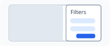     |
| Bottom Sheet | A sheet attached to the bottom edge of a view. The user opens, expands, collapses, drags, or dismisses it to access contextual actions or content.                                                                                                   |    Yes    |        No         | 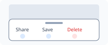 |

### Forms

| Name       | Description — how the user interfaces with it                                               | Viewable? | Device-dependent? | Example image                    |
| ---------- | ------------------------------------------------------------------------------------------- | :-------: | :---------------: | -------------------------------- |
| Form       | Groups related fields and actions for entering, reviewing, validating, and submitting data. |    Yes    |        No         | 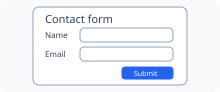 |
| Form field | One labelled input in a form, with its help text and validation message.                    |    Yes    |        No         | None yet                         |
| Form group | A titled group of related form fields.                                                      |    Yes    |        No         | None yet                         |

### Focused tasks and guided sequences

| Name             | Description — how the user interfaces with it                                                            | Viewable? | Device-dependent? | Example image                        |
| ---------------- | -------------------------------------------------------------------------------------------------------- | :-------: | :---------------: | ------------------------------------ |
| Dialog           | Temporarily requests information, confirmation, or a decision.                                           |    Yes    |        No         |  |
| Progress dialog  | A dialog that shows the progress of a long operation and may let the user cancel it.                     |    Yes    |        No         | None yet                             |
| Workflow stepper | Shows the steps of a task and which one is current. The user moves between steps.                        |    Yes    |        No         | None yet                             |
| Wizard           | Guides the user through a task one page at a time, with next and back actions and a final finish action. |    Yes    |        No         | None yet                             |

## Layout and structural elements

Concrete structural entities that organize, divide, align, or position other UI elements. They may be visible, partly visible, or identifiable only through their effect on the layout.

| Name                   | Description — how the user interfaces with it                                                                                                                                                                                   | Viewable?  | Device-dependent? | Example image                            |
| ---------------------- | ------------------------------------------------------------------------------------------------------------------------------------------------------------------------------------------------------------------------------- | :--------: | :---------------: | ---------------------------------------- |
| Grid                   | A row-and-column structure used to align and size content. Users interact with the elements arranged by it rather than necessarily with the grid itself.                                                                        | Sometimes  |        No         |   |
| Pane                   | A distinct content region within a window or view. The user may interact with, scroll, resize, or switch the content inside it.                                                                                                 |    Yes     |        No         | 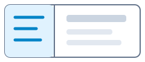         |
| Rail                   | A narrow structural track along an edge used to align persistent controls, navigation, or supporting content. Direction-sensitive rails should be assigned to logical start or end edges rather than fixed left or right edges. | Sometimes  |        No         | 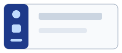         |
| Stack                  | A structure that arranges child elements sequentially along a horizontal or vertical axis.                                                                                                                                      | Sometimes  |        No         |        |
| Scaffold               | A top-level structural template defining the major regions of a screen, such as header, body, navigation, and footer.                                                                                                           | Usually no |        No         | 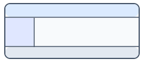 |
| Region                 | A semantically or visually distinct area assigned a purpose within a view.                                                                                                                                                      | Sometimes  |        No         | 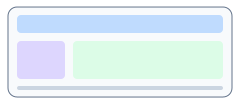     |
| Splitter               | A movable divider between adjacent panes. The user drags it to redistribute their available space.                                                                                                                              |    Yes     |        No         |  |
| Bar                    | An edge-attached strip that arranges items along one axis. Toolbars, navigation bars, tab bars and status bars are bars with a specific purpose.                                                                                | Sometimes  |        No         | None yet                                 |
| Page stack             | Holds several pages and shows one at a time; another control chooses which.                                                                                                                                                     | Sometimes  |        No         | None yet                                 |
| Scroll container       | A region whose content can be larger than the region. The user scrolls to see the rest.                                                                                                                                         | Sometimes  |        No         | None yet                                 |
| Splitter handle        | The part of a splitter that the user drags to resize the panes on either side.                                                                                                                                                  |    Yes     |        No         | None yet                                 |
| Flexible column layout | Shows one, two or three columns, such as a list, its detail and further detail, and adapts the number of columns to the space available.                                                                                        | Sometimes  |        No         | None yet                                 |

## Layout mechanisms and definitions

Framework-independent rules that determine how UI elements and structural objects are positioned, sized, aligned, grouped, and adapted to available space.

### Layout rules and relationships

Rules and relationships that determine how structural objects and UI elements occupy and respond to space. The definitions themselves are abstract; their effects are viewable.

| Name                | Description — how the user experiences its effect                                                                                                                                                                       | Viewable? | Device-dependent? | Example image                                             |
| ------------------- | ----------------------------------------------------------------------------------------------------------------------------------------------------------------------------------------------------------------------- | :-------: | :---------------: | --------------------------------------------------------- |
| Containment         | Establishes which object owns, bounds, clips, scrolls, or positions another object.                                                                                                                                     |    No     |        No         | 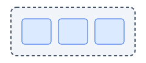             |
| Flow                | Determines the order and direction in which elements are placed as space is consumed. Direction-sensitive flow follows the writing mode and logical inline or block axis unless the content has an intrinsic direction. |    No     |        No         | 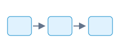                           |
| Alignment           | Positions elements relative to an axis, edge, centerline, baseline, or one another. Direction-adaptive interfaces use logical start and end alignment rather than assuming left and right.                              |    No     |        No         | 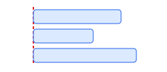                 |
| Anchoring           | Keeps an element positioned relative to a container edge, point, or another element as dimensions change. Direction-sensitive anchoring uses logical inline-start or inline-end edges.                                  |    No     |        No         | 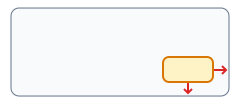                 |
| Sizing              | Determines fixed, intrinsic, minimum, maximum, proportional, or available-space dimensions.                                                                                                                             |    No     |        No         | 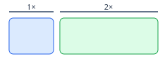                       |
| Spacing             | Determines gaps, margins, padding, and spatial rhythm between or within elements.                                                                                                                                       |    No     |        No         | 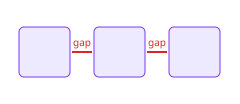                     |
| Wrapping            | Moves overflowing items onto additional lines, rows, or columns when insufficient space remains.                                                                                                                        |    No     |        No         | 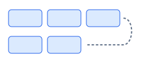                   |
| Responsive Reflow   | Rearranges, replaces, hides, or resizes elements when available space or presentation conditions change.                                                                                                                |    No     |        No         | 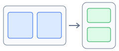 |
| Breakpoint          | A viewport, container, orientation, resolution, or capability threshold at which selected layout or presentation rules change.                                                                                          |    No     |        No         |         |
| Layered arrangement | Places child elements on top of each other along the depth axis, all visible at once.                                                                                                                                   |    No     |        No         | None yet                                                  |

## Presentation and style definitions

Framework-independent rules that determine how UI elements look, sound, and visually change without defining the elements themselves.

### Visual appearance and presentation rules

Visual and auditory systems applied consistently to communicate hierarchy, identity, meaning, state, and change. Each illustration shows the effect produced by the definition.

| Name           | Description — how the user experiences its effect                                                                                                                                                                                                                    | Viewable? | Device-dependent? | Example image                                            |
| -------------- | -------------------------------------------------------------------------------------------------------------------------------------------------------------------------------------------------------------------------------------------------------------------- | :-------: | :---------------: | -------------------------------------------------------- |
| Color          | Defines foreground, background, border, accent, and semantic colors that communicate hierarchy, identity, status, and affordance.                                                                                                                                    |    Yes    |        No         | 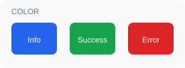                  |
| Typography     | Defines font family, size, weight, style, line height, letter spacing, and text hierarchy.                                                                                                                                                                           |    Yes    |        No         | 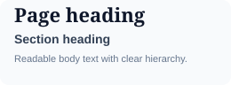        |
| Shape          | Defines geometry such as corner treatment, outlines, clipping paths, and silhouettes.                                                                                                                                                                                |    Yes    |        No         | 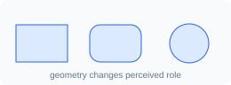                  |
| Border         | Defines a boundary’s width, color, pattern, position, and radius.                                                                                                                                                                                                    |    Yes    |        No         |                 |
| Shadow         | A shadow cast by an element that shows its depth.                                                                                                                                                                                                                    |    Yes    |        No         |      |
| Elevation      | The depth of an element above its surface, shown by a shadow or a tonal change.                                                                                                                                                                                      |    Yes    |        No         |   |
| Opacity        | Controls the transparency of an element or layer.                                                                                                                                                                                                                    |    Yes    |        No         |               |
| Iconography    | Defines the visual language applied to icon elements, including stroke or fill, weight, size, optical alignment, color, stylistic consistency, and direction-aware mirroring. Directional icons may mirror in RTL; culturally fixed or non-directional icons do not. |    Yes    |        No         |      |
| Spacing tokens | Defines a reusable scale of spacing values used for consistent gaps, margins, and padding. Conceptually, the values support both presentation rhythm and layout.                                                                                                     |    Yes    |        No         |  |
| Visual states  | Defines appearance changes that communicate hover, focus, pressed, selected, disabled, validation, and error states.                                                                                                                                                 |    Yes    |        No         |    |
| Theme          | Coordinates color, typography, shape, iconography, elevation, and other presentation values into a coherent visual system.                                                                                                                                           |    Yes    |        No         |                   |
| Motion         | Defines animation and transition choreography, properties, duration, delay, direction, and easing used to communicate state changes, causality, continuity, and spatial relationships. Directional motion follows semantic navigation and may reverse in RTL.        |    Yes    |        No         |   |
| Visibility     | Determines whether an element is shown, hidden, visually suppressed, clipped, or revealed under specified conditions.                                                                                                                                                |    Yes    |        No         |         |
| Backdrop       | A layer behind an overlay that dims or hides the content beneath it.                                                                                                                                                                                                 |    Yes    |        No         | None yet                                                 |
| Blur           | Blurs an element or the content behind it.                                                                                                                                                                                                                           |    Yes    |        No         | None yet                                                 |
| Color tint     | Tints an element with a color.                                                                                                                                                                                                                                       |    Yes    |        No         | None yet                                                 |
| Focus outline  | The ring or outline that shows which element has focus.                                                                                                                                                                                                              |    Yes    |        No         | None yet                                                 |

## Internationalization and localization definitions

Framework-independent rules and resources that adapt an interface to the user’s language, writing system, locale, and cultural conventions. Internationalization makes this adaptation possible; localization supplies and applies the language- and locale-specific result.

### Language, locale, and writing-system rules

Definitions governing language coverage, translation, writing direction, bidirectional content, culturally appropriate formatting, and localized input. The illustrations show the visible effect of each definition; the rule itself may be abstract.

| Name                                     | Description — how the user experiences its effect                                                                                                                                                                                                                  | Viewable? | Device-dependent? | Example image                                                                       |
| ---------------------------------------- | ------------------------------------------------------------------------------------------------------------------------------------------------------------------------------------------------------------------------------------------------------------------ | :-------: | :---------------: | ----------------------------------------------------------------------------------- |
| Language support                         | Defines the languages and scripts whose text, input, fonts, grammar, and interface behavior the application can correctly support. It is broader than providing translated strings.                                                                                | Sometimes |        No         |                         |
| Internationalization (i18n)              | Structures software, content, and resources so the interface can be adapted to multiple languages, writing systems, locales, and cultural conventions without redesigning the product.                                                                             |    No     |        No         |                 |
| Localization (l10n)                      | Produces a locale-specific interface by translating and culturally adapting text, terminology, images, formats, content, and behavior.                                                                                                                             |    Yes    |        No         |                                 |
| Locale                                   | Identifies the language and applicable regional conventions, such as `en-US`, `en-GB`, or `he-IL`, used to select localized resources and behavior. A locale is context, not merely a language code.                                                               | Sometimes |        No         |                                             |
| Translation                              | Provides language-specific UI labels, instructions, validation messages, notifications, help, and other textual content while preserving meaning and purpose.                                                                                                      |    Yes    |        No         |                                   |
| Pluralization and grammatical variation  | Selects text according to language-specific plural categories and grammatical factors such as gender, case, definiteness, or the referenced entity.                                                                                                                |    Yes    |        No         |                               |
| Text direction and writing mode          | Determines the logical inline and block directions in which text and interface content flow, including LTR, RTL, and vertical writing modes. Direction belongs to content or a text run; it must not be inferred solely from the language of the surrounding page. |    Yes    |        No         |                             |
| RTL layout adaptation                    | Adapts directional layout relationships for a right-to-left interface: reading order, logical start/end alignment, navigation placement, panels, lists, and directional motion. It does not blindly reverse every visual object.                                   |    Yes    |        No         |                          |
| Bidirectional text                       | Resolves and isolates mixed-direction content, such as Hebrew or Arabic containing Latin names, URLs, email addresses, codes, or numbers, so each run is ordered and displayed correctly.                                                                          |    Yes    |        No         |                     |
| Directional mirroring                    | Mirrors direction-sensitive layout and imagery when their meaning depends on start/end or forward/back. Media controls, clocks, mathematical symbols, brand marks, and other intrinsically directed or culturally fixed graphics normally remain unchanged.        |    Yes    |        No         |                           |
| Date, time, and calendar formatting      | Presents dates, times, day/month order, calendars, time zones, and hour cycles according to locale. Directional layout must not reverse the semantic order produced by the formatter.                                                                              |    Yes    |        No         |                        |
| Number, percentage, and digit formatting | Applies locale-specific decimal marks, grouping separators, signs, percentages, numbering systems, and digit shapes while preserving the internal direction and meaning of numeric values.                                                                         |    Yes    |        No         |                                  |
| Currency and measurement formatting      | Presents currency symbols, symbol placement, values, spacing, and measurement units according to locale and product policy, such as kilometres/miles or Celsius/Fahrenheit.                                                                                        |    Yes    |        No         |  |
| Locale-aware sorting and search          | Compares, orders, filters, and searches text according to locale-specific collation, normalization, case, accents, and script rules rather than raw character-code order.                                                                                          | Sometimes |        No         |                              |
| Font, glyph, and text-metrics support    | Ensures selected fonts contain the required scripts and symbols and provide suitable shaping, fallback, line height, emphasis, and metrics without clipping or layout breakage.                                                                                    |    Yes    |        No         |                         |
| Localized input and validation           | Supports appropriate keyboards, input methods, character composition, cursor movement, selection, names, addresses, telephone numbers, and validation rules for the active locale and script.                                                                      |    Yes    |     Sometimes     |                           |

#### RTL alignment notes

- Use logical layout terms and properties—inline-start, inline-end, block-start, and block-end—in direction-adaptive specifications. Reserve left and right for cases that are intentionally physical.
- Derive visual order from the writing mode and semantic reading order; do not reverse source or DOM order merely to obtain an RTL appearance.
- Align natural-language text to its logical start by default. Preserve deliberate alignment for tabular numbers, diagrams, code, and other content with intrinsic presentation rules.
- Keep mixed-direction values isolated so embedded URLs, email addresses, phone numbers, version identifiers, and Latin product names do not reorder surrounding text.
- Mirror only direction-sensitive meaning. “Back,” “forward,” disclosure, and start/end placement commonly adapt; play, pause, clocks, mathematical notation, logos, and other fixed symbols normally do not.
- Adapt keyboard navigation, focus traversal, swipe semantics, transitions, and spatial animations to semantic direction instead of assuming that left always means previous and right always means next.
- Localize text before measuring or truncating it. Allow expansion, script-specific line height, font fallback, and wrapping without clipping or overlapping adjacent elements.

## Interaction definitions

Framework-independent definitions for the states, areas, gestures, and events through which users interact with UI elements. These are interaction concepts rather than UI elements.

### Interaction states

Visual or behavioral conditions that communicate an element’s current availability, focus, activation, or selection.

| Name           | Description — how the user interfaces with it                                                                  | Viewable? | Device-dependent? | Example image                                             |
| -------------- | -------------------------------------------------------------------------------------------------------------- | :-------: | :---------------: | --------------------------------------------------------- |
| Hover state    | A temporary visual or behavioral state shown when a pointing device is positioned over an interactive element. |    Yes    |        Yes        |             |
| Focus state    | Identifies the element currently prepared to receive keyboard, switch-device, or assistive-technology input.   |    Yes    |        No         |             |
| Active state   | Indicates that an element is being activated, such as while a pointer button is held down on it.               |    Yes    |        No         |   |
| Pressed state  | Indicates that a toggle element stays pressed, such as a pressed toggle button.                                |    Yes    |        No         |  |
| Selected state | Indicates that an item, option, text range, or object is currently chosen.                                     |    Yes    |        No         |       |
| Disabled state | Indicates that an element is currently unavailable and cannot be activated or edited.                          |    Yes    |        No         |       |

### Interaction areas and constraints

Hit regions and usability rules that determine where and how reliably an interactive element can be targeted.

| Name                | Description — how the user interfaces with it                                                                                    | Viewable? | Device-dependent? | Example image                                            |
| ------------------- | -------------------------------------------------------------------------------------------------------------------------------- | :-------: | :---------------: | -------------------------------------------------------- |
| Touch target        | The screen area that responds to touch for an interactive element. The user activates it by touching anywhere within that area.  | Sometimes |        Yes        |          |
| Pointer hit area    | The region in which pointer input is interpreted as targeting a particular element, including any invisible interaction padding. | Sometimes |        Yes        |  |
| Minimum target size | A usability and accessibility constraint defining the smallest acceptable interactive area for reliable activation.              |    No     |        Yes        | Not applicable                                           |
| Target spacing      | A usability constraint defining sufficient separation between adjacent targets to reduce accidental activation.                  | Sometimes |        Yes        |      |

### Gestures

Meaningful movements or contact patterns performed by users and interpreted as higher-level interactions.

| Name            | Description — how the user interfaces with it                                                                                                                                                                                 | Viewable? | Device-dependent? | Example image  |
| --------------- | ----------------------------------------------------------------------------------------------------------------------------------------------------------------------------------------------------------------------------- | :-------: | :---------------: | -------------- |
| Tap             | A brief touch and release on a target, normally used to activate or select it.                                                                                                                                                |    No     |        Yes        | Not applicable |
| Double-tap      | Two taps in quick succession, commonly used for zooming or invoking a secondary action.                                                                                                                                       |    No     |        Yes        | Not applicable |
| Long-press      | Touching and holding a target beyond a defined duration, often used to reveal contextual actions or begin selection.                                                                                                          |    No     |        Yes        | Not applicable |
| Swipe           | A quick directional touch movement used to navigate, reveal actions, dismiss content, or move between items. Its semantic result—such as previous, next, reveal, or dismiss—may map to a different physical direction in RTL. |    No     |        Yes        | Not applicable |
| Pinch           | A two-touch gesture in which the distance between contact points changes, normally used to zoom.                                                                                                                              |    No     |        Yes        | Not applicable |
| Rotate          | A two-touch turning gesture used to rotate an object or view.                                                                                                                                                                 |    No     |        Yes        | Not applicable |
| Pull to refresh | Reloading content by pulling it down. On touch devices it appears once the user pulls far enough; without touch it is always visible and requests a refresh when activated.                                                   | Sometimes |     Sometimes     | None yet       |

### Input events

Lower-level occurrences generated by pointer, touch, keyboard, focus, or value changes and used to implement interactions.

_The examples are rendered SVG illustrations, not text or Unicode stand-ins. A visible example is intentionally omitted when the interaction definition itself has no visual representation._

| Name                           | Description — how the user interfaces with it                                                                                                                                                                         | Viewable? | Device-dependent? | Example image  |
| ------------------------------ | --------------------------------------------------------------------------------------------------------------------------------------------------------------------------------------------------------------------- | :-------: | :---------------: | -------------- |
| Pointer / mouse button press   | Occurs when a pointer button is pressed. Left, right, middle, or auxiliary buttons may have different meanings.                                                                                                       |    No     |        Yes        | Not applicable |
| Pointer / mouse button release | Occurs when a pressed pointer button is released and may complete a click, selection, or drag operation.                                                                                                              |    No     |        Yes        | Not applicable |
| Click                          | A higher-level activation produced by pressing and releasing a pointer button on a target.                                                                                                                            |    No     |        Yes        | Not applicable |
| Pointer move                   | Occurs when a mouse, pen, or other pointer changes position, with or without a button being pressed.                                                                                                                  |    No     |        Yes        | Not applicable |
| Pointer enter / leave          | Occurs when a pointer crosses into or out of an element’s hit area and commonly controls hover behavior.                                                                                                              |    No     |        Yes        | Not applicable |
| Wheel / scroll event           | Occurs when a mouse wheel, trackpad, or equivalent control requests scrolling or another continuous adjustment.                                                                                                       |    No     |        Yes        | Not applicable |
| Touch start / move / end       | Low-level events produced when touch contacts begin, move across the surface, or end.                                                                                                                                 |    No     |        Yes        | Not applicable |
| Key down                       | Occurs when a standard, modifier, navigation, function, or other keyboard key is pressed.                                                                                                                             |    No     |        Yes        | Not applicable |
| Key up                         | Occurs when a previously pressed keyboard key is released.                                                                                                                                                            |    No     |        Yes        | Not applicable |
| Modifier-key combination       | Combines Ctrl, Alt, Shift, or Meta with another key or pointer action to alter its meaning.                                                                                                                           |    No     |        Yes        | Not applicable |
| Standard character-key input   | Produces letters, numbers, punctuation, or other text characters according to the active keyboard layout.                                                                                                             |    No     |        Yes        | Not applicable |
| Special-key input              | Uses non-character keys such as Enter, Escape, Tab, arrows, Home, End, Delete, or function keys. Directional-key behavior should follow component semantics, writing direction, and established platform conventions. |    No     |        Yes        | Not applicable |
| Focus event                    | Occurs when an element gains or loses input focus.                                                                                                                                                                    |    No     |        No         | Not applicable |
| Input event                    | Occurs while the user changes the value of an editable element, commonly after each edit.                                                                                                                             |    No     |        No         | Not applicable |
| Change event                   | Occurs when an element’s value or selection is committed or otherwise considered changed.                                                                                                                             |    No     |        No         | Not applicable |

## Behaviors

Reusable behaviors that act on an existing element without being a visible element themselves.

| Name                             | Description — how the user interfaces with it                                                                                 | Viewable? | Device-dependent? | Example image                                      |
| -------------------------------- | ----------------------------------------------------------------------------------------------------------------------------- | :-------: | :---------------: | -------------------------------------------------- |
| Drag and drop                    | A compound interaction in which the user presses an object, moves it, and releases it over a valid destination.               |    Yes    |        No         |  |
| Collapsible                      | Lets the user collapse an element to hide its content and expand it again.                                                    | Sometimes |        No         | None yet                                           |
| Modal overlay                    | Blocks interaction with the underlying view until the foreground task is completed or dismissed.                              |    Yes    |        No         |  |
| Modal interaction                | Another name for Modal overlay: interaction outside the foreground task is blocked until it is completed or dismissed.        | Sometimes |        No         | None yet                                           |
| Input assistance                 | Helps or checks what the user enters in an input control, for example by suggesting completions or validating the value.      | Sometimes |        No         | None yet                                           |
| Text completion                  | Offers suggestions while the user types; the user accepts one to complete the text or keeps typing.                           | Sometimes |        No         | None yet                                           |
| Constraint validation            | Checks a value, such as an e-mail address or a phone number, against declared rules and reports the result.                   | Sometimes |        No         | None yet                                           |
| Viewport and focus control       | Moves the visible part of a viewport, locks background scrolling or moves focus, on an element the control references.        | Sometimes |        No         | None yet                                           |
| Viewport scrolling               | Moves the visible part of a referenced viewport, with optional momentum, or brings an element into view without moving focus. | Sometimes |        No         | None yet                                           |
| Scroll lock                      | Stops the page background from scrolling while a feature such as a modal dialog asks for it, then restores the position.      |    No     |        No         | None yet                                           |
| Focus management                 | Moves focus to a chosen element and restores it afterwards, outside the modal case that Modal overlay covers.                 | Sometimes |        No         | None yet                                           |
| Exclusive selection coordination | Makes the options of a group mutually exclusive, so that selecting one clears the others.                                     |    No     |        No         | None yet                                           |

_The examples are rendered SVG illustrations, not text or Unicode stand-ins. A visible example is intentionally omitted when the interaction definition itself has no visual representation. "None yet" marks an entry whose illustration is not drawn yet._
