# Generic UI Taxonomy — consolidated review draft

Review copy: existing rows are preserved verbatim apart from relocated links. Proposed additions are grouped below the existing material in each main section. Component and behavior additions are synchronized; descriptions and capability labels are candidate interpretations supported by the [Qt crosswalk](TAXONOMY_MAPPING.md), not approved canonical definitions. See [merge review](TAXONOMY_MERGE_REVIEW.md).

Framework-independent UI taxonomy. Each entry is classified by its primary
purpose. The canonical vocabulary, aliases, and detailed term definitions live in
[`spec/README.md` § Glossary](../../../README.md#glossary); this document
classifies and illustrates those terms rather than redefining them. The
spec-object coverage map is maintained in `spec/scopes/taxonomy_mapping.md`.
“Device-dependent” means that the element inherently requires a particular
hardware or host-platform capability, not merely that its layout adapts to a
device.

## Input elements

Collect data from users or allow users to trigger actions and change values.

| Name                     | Description — how the user interfaces with it                                                                                    | Viewable? | Device-dependent? | Example image                                                          |
| ------------------------ | -------------------------------------------------------------------------------------------------------------------------------- | :-------: | :---------------: | ---------------------------------------------------------------------- |
| Button                   | Initiates an action when clicked, tapped, or activated by keyboard or assistive technology.                                      |    Yes    |        No         |                                    |
| Icon button              | Initiates an action represented primarily by an icon.                                                                            |    Yes    |        No         |                          |
| Text field               | Accepts a single line of typed, pasted, dictated, or programmatically entered text.                                              |    Yes    |        No         |                            |
| Text area                | Accepts multiple lines of text and may support scrolling or resizing.                                                            |    Yes    |        No         |                              |
| Password field           | Accepts concealed text, usually for authentication, with an optional reveal action.                                              |    Yes    |        No         |                    |
| Checkbox                 | Controls an independent Boolean choice. The user checks or clears it.                                                            |    Yes    |        No         |                                |
| Radio button             | Selects one value from a mutually exclusive group.                                                                               |    Yes    |        No         |                        |
| Switch / Toggle          | Changes an option immediately between two states, commonly on and off.                                                           |    Yes    |        No         |                    |
| Dropdown                 | Lets the user choose one value from a list that opens on demand; it is also commonly called a select or drop-down list.          |    Yes    |        No         |                                |
| List box                 | Displays choices persistently and supports selection of one or more items.                                                       |    Yes    |        No         |                                |
| Combo box                | Combines editable text with a selectable list of values or suggestions.                                                          |    Yes    |        No         |                              |
| Date picker              | Accepts or selects a date, commonly through a calendar presentation.                                                             |    Yes    |        No         |                          |
| Time picker              | Accepts or selects a time, with presentation influenced by locale and platform.                                                  |    Yes    |        No         |                          |
| Wheel picker             | Lets the user select a value by scrolling one or more rotating columns and aligning the desired item with a selection indicator. |    Yes    |        No         |                        |
| Color picker             | Selects a color through swatches, sliders, or numeric values.                                                                    |    Yes    |        No         |                        |
| File picker              | Selects files through operating-system or storage-provider facilities.                                                           |    Yes    |        Yes        |                          |
| Slider                   | Selects a value or range by moving one or more handles along a track.                                                            |    Yes    |        No         |                                    |
| Spin box / Stepper input | Selects a numeric value by typing or using increment and decrement actions.                                                      |    Yes    |        No         |  |
| Rating control           | Selects an ordinal rating, commonly through stars or similar repeated marks.                                                     |    Yes    |        No         |                    |
| Drag handle              | Provides a grab target for moving or reordering an object.                                                                       |    Yes    |        No         |                          |
| Resize handle            | Provides a drag target for resizing an object or region.                                                                         |    Yes    |        No         |                      |
| Canvas / Drawing area    | Accepts free-form drawing or graphical manipulation through pointer, touch, stylus, or keyboard.                                 |    Yes    |        No         |        |
| Microphone input         | Captures audio after the user starts recording and grants permission.                                                            | Sometimes |        Yes        |                |
| Biometric prompt         | Requests fingerprint, face, or another biometric method supported by the device.                                                 |    Yes    |        Yes        |                |

### Command activation — proposed additions

| Name | Description — how the user interfaces with it or experiences its effect | Viewable? | Device-dependent? | Example image |
|---|---|---|---|---|
| Tool button | Activates a compact command; an optional menu offers related choices. | Yes | No | Not supplied; [reference description](categories/commands/action-buttons.md#qtoolbutton). |
| Explanatory command choice | Presents a command with explanatory text to help the user choose an action. | Yes | No | Not supplied; [reference description](categories/commands/action-buttons.md#qcommandlinkbutton). |

### Text and shortcut entry — proposed additions

| Name | Description — how the user interfaces with it or experiences its effect | Viewable? | Device-dependent? | Example image |
|---|---|---|---|---|
| Rich text editor | Edits formatted paragraphs, lists, tables and images; formatting controls may be supplied separately. | Yes | No | Not supplied; [reference description](categories/input-and-selection/text-and-shortcuts.md#qtextedit). |
| Keyboard shortcut field | Records pressed key combinations and shows the resulting shortcut; capture does not activate or register it. | Yes | Yes — keyboard capability | Not supplied; [reference description](categories/input-and-selection/text-and-shortcuts.md#qkeysequenceedit). |

### Value and resource selection — proposed additions

| Name | Description — how the user interfaces with it or experiences its effect | Viewable? | Device-dependent? | Example image |
|---|---|---|---|---|
| Font-family selector | Chooses a family from the fonts available to the application. | Yes | No — font availability varies | Not supplied; [reference description](categories/input-and-selection/choices.md#qfontcombobox). |
| Rotary value control | Adjusts a bounded value through a circular control, using pointer or keyboard interaction. | Yes | No | Not supplied; [reference description](categories/input-and-selection/numeric-values.md#qdial). |
| Font picker | Chooses font family, style and size, usually with a preview; it may be hosted in a dialog. | Yes | No — font availability varies | Not supplied; [reference description](categories/windows-and-dialogs/value-and-resource-pickers.md#qfontdialog). |
| Folder picker | Chooses a directory from a supported filesystem or storage provider. | Yes | Yes — storage-provider capability | Not supplied; [reference description](categories/windows-and-dialogs/value-and-resource-pickers.md#qfiledialog). |

### Temporal entry — proposed additions

| Name | Description — how the user interfaces with it or experiences its effect | Viewable? | Device-dependent? | Example image |
|---|---|---|---|---|
| Date field | Edits date sections directly, optionally with a calendar popup. | Yes | No | Not supplied; [reference description](categories/input-and-selection/dates-and-times.md#qdateedit). |
| Time field | Edits a time through displayed sections without requiring a calendar date. | Yes | No | Not supplied; [reference description](categories/input-and-selection/dates-and-times.md#qtimeedit). |
| Combined date/time field | Edits date and time sections in one control, with locale-sensitive presentation. | Yes | No | Not supplied; [reference description](categories/input-and-selection/dates-and-times.md#qdatetimeedit). |

## Output elements

Present information, results, feedback, progress, or system status to users.

| Name                          | Description — how the user interfaces with it                                                                                                                                    | Viewable? | Device-dependent? | Example image                                                                    |
| ----------------------------- | -------------------------------------------------------------------------------------------------------------------------------------------------------------------------------- | :-------: | :---------------: | -------------------------------------------------------------------------------- |
| Status bar                    | A region displaying state such as readiness, connectivity, or zoom. It is generally read-only.                                                                                   |    Yes    |        No         |                                      |
| Label                         | Identifies or describes another UI object. The user normally reads it.                                                                                                           |    Yes    |        No         |                                                |
| Text                          | Presents readable information without accepting input.                                                                                                                           |    Yes    |        No         |                                                  |
| Image                         | Presents visual information. The user may view, select, zoom, drag, or open it.                                                                                                  |    Yes    |        No         |                                                |
| Icon                          | A compact graphic that represents an object, action, status, or concept. The user interprets it visually; it is not inherently interactive.                                      |    Yes    |        No         |                                                  |
| Avatar                        | Visually represents a person, organization, or agent and may be selectable.                                                                                                      |    Yes    |        No         |                                              |
| Tag                           | Displays a keyword, classification, or attribute attached to content; it may also support selection or removal.                                                                  |    Yes    |        No         |                                                    |
| Badge                         | Displays a compact status, category, or count associated with another object.                                                                                                    |    Yes    |        No         |                                                |
| Tooltip                       | Shows brief explanatory information when an object is hovered, focused, or touched.                                                                                              |    Yes    |        No         |                                            |
| Alert                         | Presents important information requiring attention and possibly acknowledgment.                                                                                                  |    Yes    |        No         |                                                |
| Toast / Snackbar              | Briefly reports an event or result without normally blocking other interaction.                                                                                                  |    Yes    |        No         |                            |
| Progress bar                  | Shows the known completion proportion of an operation; generally read-only.                                                                                                      |    Yes    |        No         |                                  |
| Loader / Spinner              | Shows that an operation is active when its exact progress is unknown.                                                                                                            |    Yes    |        No         |                            |
| Separator / Divider           | Visually separates groups of content or controls and normally has no direct interaction.                                                                                         |    Yes    |        No         |                      |
| Table / Data grid             | Displays structured data in rows and columns. The user may sort, filter, select, resize, or edit.                                                                                |    Yes    |        No         |                          |
| List                          | Presents a sequence of similar items that can be read, selected, opened, reordered, or acted upon.                                                                               |    Yes    |        No         |                                                  |
| Media player                  | Presents audio or video with playback, seeking, volume, caption, and fullscreen operations.                                                                                      |    Yes    |        No         |                                  |
| Camera preview                | Displays a live camera image and supports capture or camera-related actions.                                                                                                     |    Yes    |        Yes        |                              |
| Notification                  | Reports an event outside or alongside the main application view and may offer actions.                                                                                           |    Yes    |        Yes        |                                  |
| Narration / Audio Description | Presents text, interface state, or visual information as spoken audio. The user listens to it and may use associated controls to start, pause, stop, or configure the narration. |    No     |        Yes        | 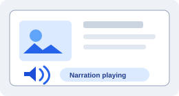 |

### Document and numeric display — proposed additions

| Name | Description — how the user interfaces with it or experiences its effect | Viewable? | Device-dependent? | Example image |
|---|---|---|---|---|
| Linked document viewer | Reads formatted content and follows links; local document history need not be application routing. | Yes | No | Not supplied; [reference description](categories/content-and-data/text-images-and-numbers.md#qtextbrowser). |
| Segmented number display | Displays values using segmented digit shapes without providing value-entry controls. | Yes | No | Not supplied; [reference description](categories/content-and-data/text-images-and-numbers.md#qlcdnumber). |

### Collections and data presentation — proposed additions

| Name | Description — how the user interfaces with it or experiences its effect | Viewable? | Device-dependent? | Example image |
|---|---|---|---|---|
| Icon collection | Presents collection items as icons with labels; selection and item actions depend on the instance. | Yes | No | Not supplied; [reference description](categories/content-and-data/collections-and-hierarchies.md#qlistview). |
| Action-history list | Shows recorded actions and lets the user move to an application-supported history position. | Yes | No | Not supplied; [reference description](categories/commands/action-history.md#qundoview). |
| Collection header | Labels table or tree sections, optionally supporting sorting, resizing and reordering; it belongs to the collection. | Yes | No | Not supplied; [reference description](categories/content-and-data/collection-headers.md#qheaderview). |

### Graphics presentation — proposed grouping

#### Scene viewports — proposed additions

| Name | Description — how the user interfaces with it or experiences its effect | Viewable? | Device-dependent? | Example image |
|---|---|---|---|---|
| Graphics viewport | Shows scene content through a viewport; configured interaction may pan or select content. | Yes | No | Not supplied; [reference description](categories/graphics/display-surfaces.md#qgraphicsview). |

#### Custom-rendered surfaces — proposed additions

| Name | Description — how the user interfaces with it or experiences its effect | Viewable? | Device-dependent? | Example image |
|---|---|---|---|---|
| Custom graphics surface | Displays application-rendered imagery; it supplies no universal camera, editing or selection controls. | Yes | Conditional — selected rendering backend | Not supplied; [reference description](categories/graphics/display-surfaces.md#qrhiwidget). |

#### Geometric output — proposed additions

| Name | Description — how the user interfaces with it or experiences its effect | Viewable? | Device-dependent? | Example image |
|---|---|---|---|---|
| Ellipse | Displays an elliptical or circular shape in graphical content. | Yes | No | Not supplied; [reference description](categories/graphics/shapes-and-paths.md#qgraphicsellipseitem). |
| Rectangle | Displays a rectangular shape in graphical content. | Yes | No | Not supplied; [reference description](categories/graphics/shapes-and-paths.md#qgraphicsrectitem). |
| Line | Displays a line segment between positions in graphical content. | Yes | No | Not supplied; [reference description](categories/graphics/shapes-and-paths.md#qgraphicslineitem). |
| Polygon | Displays a shape defined by connected vertices. | Yes | No | Not supplied; [reference description](categories/graphics/shapes-and-paths.md#qgraphicspolygonitem). |
| Path | Displays a custom shape made from segments and curves. | Yes | No | Not supplied; [reference description](categories/graphics/shapes-and-paths.md#qgraphicspathitem). |

### Feedback and assistance — proposed additions

| Name | Description — how the user interfaces with it or experiences its effect | Viewable? | Device-dependent? | Example image |
|---|---|---|---|---|
| Startup feedback | Displays startup imagery and optional progress messages while an application starts. | Yes | No | Not supplied; [reference description](categories/status-and-help/status-and-activity.md#qsplashscreen). |
| Requested contextual help | Shows an explanation requested for a control; actionable links require accessible interaction. | Yes | No | Not supplied; [reference description](categories/status-and-help/contextual-help.md#qwhatsthis). |

## Navigational elements

Help users move between product areas, views, locations, or sections of content.

| Name               | Description — how the user interfaces with it                                                                                                                     | Viewable? | Device-dependent? | Example image                                                |
| ------------------ | ----------------------------------------------------------------------------------------------------------------------------------------------------------------- | :-------: | :---------------: | ------------------------------------------------------------ |
| Navigation bar     | Provides access to primary application destinations. The user selects a destination.                                                                              |    Yes    |        No         |          |
| Navigation Drawer  | An edge-attached panel containing navigation destinations. The user opens it, selects a destination, and may dismiss it; it may also remain persistently visible. |    Yes    |        No         | 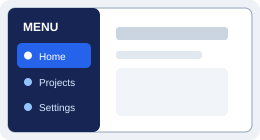   |
| Navigation Rail    | A narrow, usually persistent vertical strip containing primary destinations. The user selects an icon or labeled destination to switch views.                     |    Yes    |        No         | 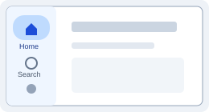       |
| Hamburger Menu     | A compact menu trigger, usually shown as three horizontal lines. The user activates it to reveal navigation or commands.                                          |    Yes    |        No         |          |
| Tab                | Selects one of several related content panels within the same context.                                                                                            |    Yes    |        No         |                                |
| Tab Bar            | A persistent row or column of tabs used to switch among peer views or primary destinations.                                                                       |    Yes    |        No         |                        |
| Menu               | Presents commands or destinations. The user opens it and selects an item.                                                                                         |    Yes    |        No         |                              |
| Dropdown Menu      | A menu that opens below or beside its trigger and presents commands or navigation choices.                                                                        |    Yes    |        No         |            |
| Context menu       | Presents actions relevant to an object or location, commonly after right-click or long-press.                                                                     |    Yes    |        No         |              |
| Breadcrumb         | Shows the current position in a hierarchy. The user can select an ancestor to navigate upward.                                                                    |    Yes    |        No         |                  |
| Link               | Navigates to another location or resource when activated.                                                                                                         |    Yes    |        No         |                              |
| Search field       | Accepts a query and may display suggestions or filters.                                                                                                           |    Yes    |        No         |              |
| Scrollbar          | Indicates position in overflowed content and permits scrolling by dragging or selecting its track.                                                                |    Yes    |        No         |                    |
| Tree view          | Presents hierarchical data. The user expands, collapses, and selects nodes.                                                                                       |    Yes    |        No         |                    |
| Pagination control | Moves between discrete pages of content.                                                                                                                          |    Yes    |        No         |  |
| Carousel           | Shows one or several items in a constrained viewport. The user moves or swipes between items.                                                                     |    Yes    |        No         |                      |
| Map                | Displays spatial information. The user pans, zooms, selects markers, or requests directions.                                                                      |    Yes    |        No         |                                |

### Command menus — proposed additions

| Name | Description — how the user interfaces with it or experiences its effect | Viewable? | Device-dependent? | Example image |
|---|---|---|---|---|
| Menubar | Shows a persistent set of menus through which users select commands or choices. | Yes | No | Not supplied; [reference description](categories/commands/command-collections.md#qmenubar). |

### Hierarchy browsing — proposed additions

| Name | Description — how the user interfaces with it or experiences its effect | Viewable? | Device-dependent? | Example image |
|---|---|---|---|---|
| Cascading-column browser | Explores a hierarchy through adjacent columns representing successive levels. | Yes | No | Not supplied; [reference description](categories/content-and-data/collections-and-hierarchies.md#qcolumnview). |

### Content selection and position — proposed additions

| Name | Description — how the user interfaces with it or experiences its effect | Viewable? | Device-dependent? | Example image |
|---|---|---|---|---|
| Vertical page selector | Selects one content page through vertically arranged tabs; it is not an independently expanding panel set. | Yes | No | Not supplied; [reference description](categories/navigation/page-switching.md#qtoolbox). |

## Container elements

Group, structure, and organize related content or other UI elements.

| Name          | Description — how the user interfaces with it                                                                                                                                                                                                        | Viewable? | Device-dependent? | Example image                                      |
| ------------- | ---------------------------------------------------------------------------------------------------------------------------------------------------------------------------------------------------------------------------------------------------- | :-------: | :---------------: | -------------------------------------------------- |
| Window        | A top-level application or document area. The user moves, resizes, minimizes, maximizes, or closes it.                                                                                                                                               |    Yes    |        No         |                |
| Screen / View | A complete application page or state. The user navigates to it and interacts with its contents.                                                                                                                                                      |    Yes    |        No         |    |
| Panel         | A bounded region grouping related content or controls. The user works with the items within it.                                                                                                                                                      |    Yes    |        No         |                  |
| Container     | A layout object that holds and arranges child objects. It may have no direct interaction or visible boundary.                                                                                                                                        | Sometimes |        No         |          |
| Card          | A bounded unit of related information and actions. The user reads, selects, opens, or acts on it.                                                                                                                                                    |    Yes    |        No         |                    |
| Form          | Groups related fields and actions for entering, reviewing, validating, and submitting data.                                                                                                                                                          |    Yes    |        No         |                    |
| Toolbar       | A row or column of frequently used actions. The user activates its buttons or menus.                                                                                                                                                                 |    Yes    |        No         |              |
| Sidebar       | A vertical region beside the main content that groups navigation, tools, filters, or supporting information.                                                                                                                                         |    Yes    |        No         |              |
| Sheet         | A surface that temporarily or persistently presents supplementary content, controls, or a focused task over or alongside the main view. The user interacts with its contents and may dismiss it when it is temporary.                                |    Yes    |        No         | 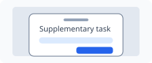                 |
| Side Sheet    | A sheet attached to the inline-start or inline-end edge of a view. Its physical side may change with the interface direction. The user uses it for contextual details, filters, editing, navigation, or related actions, and may open or dismiss it. |    Yes    |        No         | 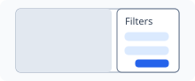       |
| Bottom Sheet  | A sheet attached to the bottom edge of a view. The user opens, expands, collapses, drags, or dismisses it to access contextual actions or content.                                                                                                   |    Yes    |        No         | 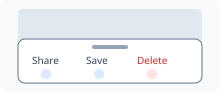   |
| Accordion     | Organizes content into expandable sections. The user expands or collapses each heading.                                                                                                                                                              |    Yes    |        No         |          |
| Popover       | Shows contextual, potentially interactive content anchored to another object.                                                                                                                                                                        |    Yes    |        No         |              |
| Dialog        | Temporarily requests information, confirmation, or a decision.                                                                                                                                                                                       |    Yes    |        No         |                |
| Modal overlay | Blocks interaction with the underlying view until the foreground task is completed or dismissed.                                                                                                                                                     |    Yes    |        No         |  |

### Grouping surfaces — proposed additions

| Name | Description — how the user interfaces with it or experiences its effect | Viewable? | Device-dependent? | Example image |
|---|---|---|---|---|
| Labelled group | Groups related controls under a visible title. | Yes | No | Not supplied; [reference description](categories/containers-and-layout/visual-grouping.md#qgroupbox). |
| Checkable group | Adds a group-level choice that enables or disables associated controls without necessarily hiding them. | Yes | No | Not supplied; [reference description](categories/containers-and-layout/visual-grouping.md#qgroupbox). |

### Content viewports — proposed additions

| Name | Description — how the user interfaces with it or experiences its effect | Viewable? | Device-dependent? | Example image |
|---|---|---|---|---|
| Page stack | Keeps alternative content regions in one location and shows the current region; its selector may be external. | Yes — visible child content | No | Not supplied; [reference description](categories/navigation/page-switching.md#qstackedwidget). |
| Scroll container | Reveals overflowed content through a viewport, with configurable scroll-bar visibility. | Yes | No | Not supplied; [reference description](categories/navigation/scrolling.md#qscrollarea). |

### Workspace surfaces — proposed additions

| Name | Description — how the user interfaces with it or experiences its effect | Viewable? | Device-dependent? | Example image |
|---|---|---|---|---|
| Main-window shell | Combines central work content with surrounding command, status and optional dock regions. | Yes | No — native window integration optional | Not supplied; [reference description](categories/windows-and-dialogs/application-workspaces.md#qmainwindow). |
| Dockable panel | Holds content that can be attached to a workspace edge or presented as a floating surface. | Yes | Conditional — native floating windows | Not supplied; [reference description](categories/windows-and-dialogs/application-workspaces.md#qdockwidget). |
| Internal document window | Presents a document in a movable or resizable internal workspace surface. | Yes | No — internal surface can be emulated | Not supplied; [reference description](categories/windows-and-dialogs/application-workspaces.md#qmdisubwindow). |
| Multiple-document workspace | Hosts and activates multiple document windows inside one work area. | Yes | No | Not supplied; [reference description](categories/windows-and-dialogs/application-workspaces.md#qmdiarea). |

### Focused tasks and guided sequences — proposed additions

| Name | Description — how the user interfaces with it or experiences its effect | Viewable? | Device-dependent? | Example image |
|---|---|---|---|---|
| Message/decision dialog | Presents information or a decision with a small set of explicit responses. | Yes | No | Not supplied; [reference description](categories/windows-and-dialogs/messages-and-operation-progress.md#qmessagebox). |
| Single-value prompt | Requests one value through an input control and dialog actions. | Yes | No | Not supplied; [reference description](categories/windows-and-dialogs/value-and-resource-pickers.md#qinputdialog). |
| Picker dialog | Hosts a specialized picker within a focused dialog task; resource access depends on the chosen picker. | Yes | Conditional — selected resource capability | Not supplied; [reference description](categories/windows-and-dialogs/value-and-resource-pickers.md#qfiledialog). |
| Progress dialog | Shows operation progress and optionally offers cancellation; requesting cancellation is not proof that the operation has stopped. | Yes | No | Not supplied; [reference description](categories/windows-and-dialogs/messages-and-operation-progress.md#qprogressdialog). |
| Suppressible-error dialog | Presents an error and lets the user suppress repeated messages according to application policy. | Yes | No | Not supplied; [reference description](categories/windows-and-dialogs/messages-and-operation-progress.md#qerrormessage). |
| Dialog action group | Arranges actions by semantic role and platform conventions within the owning dialog. | Yes | No | Not supplied; [reference description](categories/windows-and-dialogs/dialog-structure.md#qdialogbuttonbox). |
| Workflow stepper | Guides users through steps with progression and completion rules; it is distinct from a numeric stepper. | Yes | No | Not supplied; [reference description](categories/windows-and-dialogs/guided-sequences.md#qwizard). |
| Wizard | Hosts a guided workflow, often in a dialog, with previous, next and completion actions. | Yes | No | Not supplied; [reference description](categories/windows-and-dialogs/guided-sequences.md#qwizard). |
| Guided step | Contains one workflow step's content and participation in progression rules; it is not inherently a route-level page. | Yes | No | Not supplied; [reference description](categories/windows-and-dialogs/guided-sequences.md#qwizardpage). |

## Layout and structural UI elements/objects

Concrete structural entities that organize, divide, align, or position other UI elements. They may be visible, partly visible, or identifiable only through their effect on the layout.

| Name     | Description — how the user interfaces with it                                                                                                                                                                                   | Viewable?  | Device-dependent? | Example image                            |
| -------- | ------------------------------------------------------------------------------------------------------------------------------------------------------------------------------------------------------------------------------- | :--------: | :---------------: | ---------------------------------------- |
| Grid     | A row-and-column structure used to align and size content. Users interact with the elements arranged by it rather than necessarily with the grid itself.                                                                        | Sometimes  |        No         |   |
| Pane     | A distinct content region within a window or view. The user may interact with, scroll, resize, or switch the content inside it.                                                                                                 |    Yes     |        No         |          |
| Rail     | A narrow structural track along an edge used to align persistent controls, navigation, or supporting content. Direction-sensitive rails should be assigned to logical start or end edges rather than fixed left or right edges. | Sometimes  |        No         |          |
| Stack    | A structure that arranges child elements sequentially along a horizontal, vertical, or depth axis.                                                                                                                              | Sometimes  |        No         |        |
| Scaffold | A top-level structural template defining the major regions of a screen, such as header, body, navigation, and footer.                                                                                                           | Usually no |        No         |  |
| Region   | A semantically or visually distinct area assigned a purpose within a view.                                                                                                                                                      | Sometimes  |        No         |      |
| Splitter | A movable divider between adjacent panes. The user drags it to redistribute their available space.                                                                                                                              |    Yes     |        No         |  |

### Pane structure — proposed additions

| Name | Description — how the user interfaces with it or experiences its effect | Viewable? | Device-dependent? | Example image |
|---|---|---|---|---|
| Splitter handle | Provides the visible affordance for resizing adjacent panes of its owning splitter. | Yes | No | Not supplied; [reference description](categories/containers-and-layout/adjustable-panes.md#qsplitterhandle). |

### Scene composition — proposed additions

| Name | Description — how the user interfaces with it or experiences its effect | Viewable? | Device-dependent? | Example image |
|---|---|---|---|---|
| Graphics scene | Organizes graphical contents and their interaction; one or more viewports may display it. | No — contents are visible through a view | No | Not supplied; [reference description](categories/graphics/scene-composition.md#qgraphicsscene). |
| Graphics group | Groups graphical contents for combined transforms or configured manipulation; it has no automatic frame. | No — members remain visible | No | Not supplied; [reference description](categories/graphics/scene-composition.md#qgraphicsitemgroup). |
| Scene-hosted UI region | Hosts controls or nested arrangement within graphical content. | Sometimes — contents determine appearance | No | Not supplied; [reference description](categories/graphics/scene-composition.md#qgraphicswidget). |

## UI layout mechanisms/definitions

Framework-independent rules that determine how UI elements and structural objects are positioned, sized, aligned, grouped, and adapted to available space.

### Layout rules and relationships

Rules and relationships that determine how structural objects and UI elements occupy and respond to space. The definitions themselves are abstract; their effects are viewable.

| Name              | Description — how the user experiences its effect                                                                                                                                                                       | Viewable? | Device-dependent? | Example image                                             |
| ----------------- | ----------------------------------------------------------------------------------------------------------------------------------------------------------------------------------------------------------------------- | :-------: | :---------------: | --------------------------------------------------------- |
| Containment       | Establishes which object owns, bounds, clips, scrolls, or positions another object.                                                                                                                                     |    No     |        No         |              |
| Flow              | Determines the order and direction in which elements are placed as space is consumed. Direction-sensitive flow follows the writing mode and logical inline or block axis unless the content has an intrinsic direction. |    No     |        No         |                            |
| Alignment         | Positions elements relative to an axis, edge, centerline, baseline, or one another. Direction-adaptive interfaces use logical start and end alignment rather than assuming left and right.                              |    No     |        No         |                  |
| Anchoring         | Keeps an element positioned relative to a container edge, point, or another element as dimensions change. Direction-sensitive anchoring uses logical inline-start or inline-end edges.                                  |    No     |        No         |                  |
| Sizing            | Determines fixed, intrinsic, minimum, maximum, proportional, or available-space dimensions.                                                                                                                             |    No     |        No         |                        |
| Spacing           | Determines gaps, margins, padding, and spatial rhythm between or within elements.                                                                                                                                       |    No     |        No         |                      |
| Wrapping          | Moves overflowing items onto additional lines, rows, or columns when insufficient space remains.                                                                                                                        |    No     |        No         |                    |
| Responsive Reflow | Rearranges, replaces, hides, or resizes elements when available space or presentation conditions change.                                                                                                                |    No     |        No         |  |
| Breakpoint        | A viewport, container, orientation, resolution, or capability threshold at which selected layout or presentation rules change.                                                                                          |    No     |        No         |         |

### Arrangement patterns — proposed additions

| Name | Description — how the user interfaces with it or experiences its effect | Viewable? | Device-dependent? | Example image |
|---|---|---|---|---|
| Label-field arrangement | Aligns labels with input fields and adapts the arrangement to available space. | No — visible through arrangement | No | Not supplied; [reference description](categories/containers-and-layout/arrangement-and-spacing.md#qformlayout). |
| Shared-region layered arrangement | Places content layers in a shared region, showing one or several according to the selected mode. | No — visible through arranged content | No | Not supplied; [reference description](categories/containers-and-layout/arrangement-and-spacing.md#qstackedlayout). |

## UI presentation and style definitions

Framework-independent rules that determine how UI elements look, sound, and visually change without defining the elements themselves.

### Visual appearance and presentation rules

Visual and auditory systems applied consistently to communicate hierarchy, identity, meaning, state, and change. Each illustration shows the effect produced by the definition.

| Name                | Description — how the user experiences its effect                                                                                                                                                                                                                    | Viewable? | Device-dependent? | Example image                                                   |
| ------------------- | -------------------------------------------------------------------------------------------------------------------------------------------------------------------------------------------------------------------------------------------------------------------- | :-------: | :---------------: | --------------------------------------------------------------- |
| Color               | Defines foreground, background, border, accent, and semantic colors that communicate hierarchy, identity, status, and affordance.                                                                                                                                    |    Yes    |        No         |                          |
| Typography          | Defines font family, size, weight, style, line height, letter spacing, and text hierarchy.                                                                                                                                                                           |    Yes    |        No         |                |
| Shape               | Defines geometry such as corner treatment, outlines, clipping paths, and silhouettes.                                                                                                                                                                                |    Yes    |        No         |                          |
| Border              | Defines a boundary’s width, color, pattern, position, and radius.                                                                                                                                                                                                    |    Yes    |        No         |                        |
| Shadow / Elevation  | Uses shadows, tonal separation, or layering cues to communicate depth and stacking.                                                                                                                                                                                  |    Yes    |        No         |  |
| Opacity             | Controls the transparency of an element or layer.                                                                                                                                                                                                                    |    Yes    |        No         |                      |
| Icons / Iconography | Defines the visual language applied to icon elements, including stroke or fill, weight, size, optical alignment, color, stylistic consistency, and direction-aware mirroring. Directional icons may mirror in RTL; culturally fixed or non-directional icons do not. |    Yes    |        No         |      |
| Spacing tokens      | Defines a reusable scale of spacing values used for consistent gaps, margins, and padding. Conceptually, the values support both presentation rhythm and layout.                                                                                                     |    Yes    |        No         |         |
| Visual states       | Defines appearance changes that communicate hover, focus, pressed, selected, disabled, validation, and error states.                                                                                                                                                 |    Yes    |        No         |           |
| Theme               | Coordinates color, typography, shape, iconography, elevation, and other presentation values into a coherent visual system.                                                                                                                                           |    Yes    |        No         |                          |
| Motion              | Defines animation and transition choreography, properties, duration, delay, direction, and easing used to communicate state changes, causality, continuity, and spatial relationships. Directional motion follows semantic navigation and may reverse in RTL.        |    Yes    |        No         |          |
| Visibility          | Determines whether an element is shown, hidden, visually suppressed, clipped, or revealed under specified conditions.                                                                                                                                                |    Yes    |        No         |                |

### Content treatments — proposed additions

| Name | Description — how the user interfaces with it or experiences its effect | Viewable? | Device-dependent? | Example image |
|---|---|---|---|---|
| Blur | Softens existing rendered content without adding a new component. | Yes — applied appearance | No | Not supplied; [reference description](categories/appearance/README.md#qgraphicsblureffect). |
| Color tint | Applies a color treatment to existing rendered content. | Yes — applied appearance | No | Not supplied; [reference description](categories/appearance/README.md#qgraphicscolorizeeffect). |

### State indicators — proposed additions

| Name | Description — how the user interfaces with it or experiences its effect | Viewable? | Device-dependent? | Example image |
|---|---|---|---|---|
| Focus outline | Marks the focused target visually; focus ownership remains an interaction state. | Yes | No | Not supplied; [reference description](categories/status-and-help/interaction-indicators.md#qfocusframe). |
| Provisional-selection outline | Shows a proposed selection area or boundary during an interaction. | Yes | No | Not supplied; [reference description](categories/status-and-help/interaction-indicators.md#qrubberband). |

## UI internationalization and localization definitions

Framework-independent rules and resources that adapt an interface to the user’s language, writing system, locale, and cultural conventions. Internationalization makes this adaptation possible; localization supplies and applies the language- and locale-specific result.

### Language, locale, and writing-system rules

Definitions governing language coverage, translation, writing direction, bidirectional content, culturally appropriate formatting, and localized input. The illustrations show the visible effect of each definition; the rule itself may be abstract.

| Name                                     | Description — how the user experiences its effect                                                                                                                                                                                                                  | Viewable? | Device-dependent? | Example image                                                                       |
| ---------------------------------------- | ------------------------------------------------------------------------------------------------------------------------------------------------------------------------------------------------------------------------------------------------------------------ | :-------: | :---------------: | ----------------------------------------------------------------------------------- |
| Language support                         | Defines the languages and scripts whose text, input, fonts, grammar, and interface behavior the application can correctly support. It is broader than providing translated strings.                                                                                | Sometimes |        No         |                         |
| Internationalization (i18n)              | Structures software, content, and resources so the interface can be adapted to multiple languages, writing systems, locales, and cultural conventions without redesigning the product.                                                                             |    No     |        No         | 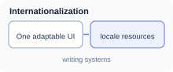                |
| Localization (l10n)                      | Produces a locale-specific interface by translating and culturally adapting text, terminology, images, formats, content, and behavior.                                                                                                                             |    Yes    |        No         | 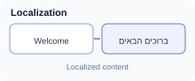                                |
| Locale                                   | Identifies the language and applicable regional conventions, such as `en-US`, `en-GB`, or `he-IL`, used to select localized resources and behavior. A locale is context, not merely a language code.                                                               | Sometimes |        No         | 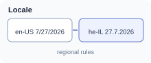                                            |
| Translation                              | Provides language-specific UI labels, instructions, validation messages, notifications, help, and other textual content while preserving meaning and purpose.                                                                                                      |    Yes    |        No         | 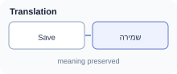                                  |
| Pluralization and grammatical variation  | Selects text according to language-specific plural categories and grammatical factors such as gender, case, definiteness, or the referenced entity.                                                                                                                |    Yes    |        No         | 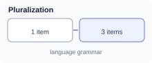                              |
| Text direction and writing mode          | Determines the logical inline and block directions in which text and interface content flow, including LTR, RTL, and vertical writing modes. Direction belongs to content or a text run; it must not be inferred solely from the language of the surrounding page. |    Yes    |        No         | 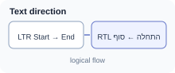                            |
| RTL layout adaptation                    | Adapts directional layout relationships for a right-to-left interface: reading order, logical start/end alignment, navigation placement, panels, lists, and directional motion. It does not blindly reverse every visual object.                                   |    Yes    |        No         | 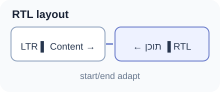                         |
| Bidirectional text                       | Resolves and isolates mixed-direction content, such as Hebrew or Arabic containing Latin names, URLs, email addresses, codes, or numbers, so each run is ordered and displayed correctly.                                                                          |    Yes    |        No         | 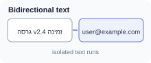                    |
| Directional mirroring                    | Mirrors direction-sensitive layout and imagery when their meaning depends on start/end or forward/back. Media controls, clocks, mathematical symbols, brand marks, and other intrinsically directed or culturally fixed graphics normally remain unchanged.        |    Yes    |        No         | 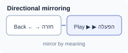                          |
| Date, time, and calendar formatting      | Presents dates, times, day/month order, calendars, time zones, and hour cycles according to locale. Directional layout must not reverse the semantic order produced by the formatter.                                                                              |    Yes    |        No         | 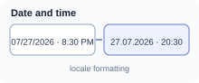                       |
| Number, percentage, and digit formatting | Applies locale-specific decimal marks, grouping separators, signs, percentages, numbering systems, and digit shapes while preserving the internal direction and meaning of numeric values.                                                                         |    Yes    |        No         | 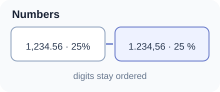                                 |
| Currency and measurement formatting      | Presents currency symbols, symbol placement, values, spacing, and measurement units according to locale and product policy, such as kilometres/miles or Celsius/Fahrenheit.                                                                                        |    Yes    |        No         | 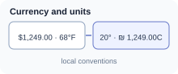 |
| Locale-aware sorting and search          | Compares, orders, filters, and searches text according to locale-specific collation, normalization, case, accents, and script rules rather than raw character-code order.                                                                                          | Sometimes |        No         | 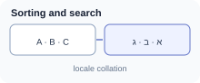                             |
| Font, glyph, and text-metrics support    | Ensures selected fonts contain the required scripts and symbols and provide suitable shaping, fallback, line height, emphasis, and metrics without clipping or layout breakage.                                                                                    |    Yes    |        No         | 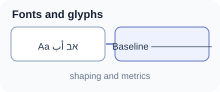                        |
| Localized input and validation           | Supports appropriate keyboards, input methods, character composition, cursor movement, selection, names, addresses, telephone numbers, and validation rules for the active locale and script.                                                                      |    Yes    |     Sometimes     | 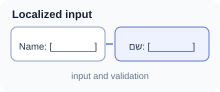                          |

### RTL alignment notes

- Use logical layout terms and properties—inline-start, inline-end, block-start, and block-end—in direction-adaptive specifications. Reserve left and right for cases that are intentionally physical.
- Derive visual order from the writing mode and semantic reading order; do not reverse source or DOM order merely to obtain an RTL appearance.
- Align natural-language text to its logical start by default. Preserve deliberate alignment for tabular numbers, diagrams, code, and other content with intrinsic presentation rules.
- Keep mixed-direction values isolated so embedded URLs, email addresses, phone numbers, version identifiers, and Latin product names do not reorder surrounding text.
- Mirror only direction-sensitive meaning. “Back,” “forward,” disclosure, and start/end placement commonly adapt; play, pause, clocks, mathematical notation, logos, and other fixed symbols normally do not.
- Adapt keyboard navigation, focus traversal, swipe semantics, transitions, and spatial animations to semantic direction instead of assuming that left always means previous and right always means next.
- Localize text before measuring or truncating it. Allow expansion, script-specific line height, font fallback, and wrapping without clipping or overlapping adjacent elements.

## UI interaction definitions

Framework-independent definitions for the states, areas, gestures, and events through which users interact with UI elements. These are interaction concepts rather than UI elements.

### Interaction states

Visual or behavioral conditions that communicate an element’s current availability, focus, activation, or selection.

| Name                   | Description — how the user interfaces with it                                                                  | Viewable? | Device-dependent? | Example image                                                      |
| ---------------------- | -------------------------------------------------------------------------------------------------------------- | :-------: | :---------------: | ------------------------------------------------------------------ |
| Hover state            | A temporary visual or behavioral state shown when a pointing device is positioned over an interactive element. |    Yes    |        Yes        |                      |
| Focus state            | Identifies the element currently prepared to receive keyboard, switch-device, or assistive-technology input.   |    Yes    |        No         |                      |
| Active / Pressed state | Indicates that an element is currently being activated, such as while a pointer button or key is held down.    |    Yes    |        No         |  |
| Selected state         | Indicates that an item, option, text range, or object is currently chosen.                                     |    Yes    |        No         |                |
| Disabled state         | Indicates that an element is currently unavailable and cannot be activated or edited.                          |    Yes    |        No         |                |

### Interaction areas and constraints

Hit regions and usability rules that determine where and how reliably an interactive element can be targeted.

| Name                | Description — how the user interfaces with it                                                                                    | Viewable? | Device-dependent? | Example image                                            |
| ------------------- | -------------------------------------------------------------------------------------------------------------------------------- | :-------: | :---------------: | -------------------------------------------------------- |
| Touch target        | The screen area that responds to touch for an interactive element. The user activates it by touching anywhere within that area.  | Sometimes |        Yes        |          |
| Pointer hit area    | The region in which pointer input is interpreted as targeting a particular element, including any invisible interaction padding. | Sometimes |        Yes        |  |
| Minimum target size | A usability and accessibility constraint defining the smallest acceptable interactive area for reliable activation.              |    No     |        Yes        | Not applicable                                           |
| Target spacing      | A usability constraint defining sufficient separation between adjacent targets to reduce accidental activation.                  | Sometimes |        Yes        |      |

### Gestures

Meaningful movements or contact patterns performed by users and interpreted as higher-level interactions.

| Name          | Description — how the user interfaces with it                                                                                                                                                                                 | Viewable? | Device-dependent? | Example image                                      |
| ------------- | ----------------------------------------------------------------------------------------------------------------------------------------------------------------------------------------------------------------------------- | :-------: | :---------------: | -------------------------------------------------- |
| Tap           | A brief touch and release on a target, normally used to activate or select it.                                                                                                                                                |    No     |        Yes        | Not applicable                                     |
| Double-tap    | Two taps in quick succession, commonly used for zooming or invoking a secondary action.                                                                                                                                       |    No     |        Yes        | Not applicable                                     |
| Long-press    | Touching and holding a target beyond a defined duration, often used to reveal contextual actions or begin selection.                                                                                                          |    No     |        Yes        | Not applicable                                     |
| Swipe         | A quick directional touch movement used to navigate, reveal actions, dismiss content, or move between items. Its semantic result—such as previous, next, reveal, or dismiss—may map to a different physical direction in RTL. |    No     |        Yes        | Not applicable                                     |
| Pinch         | A two-touch gesture in which the distance between contact points changes, normally used to zoom.                                                                                                                              |    No     |        Yes        | Not applicable                                     |
| Rotate        | A two-touch turning gesture used to rotate an object or view.                                                                                                                                                                 |    No     |        Yes        | Not applicable                                     |
| Drag and drop | A compound interaction in which the user presses an object, moves it, and releases it over a valid destination.                                                                                                               |    Yes    |        No         |  |

### Input events

Lower-level occurrences generated by pointer, touch, keyboard, focus, or value changes and used to implement interactions.

| Name                           | Description — how the user interfaces with it                                                                                                                                                                         | Viewable? | Device-dependent? | Example image  |
| ------------------------------ | --------------------------------------------------------------------------------------------------------------------------------------------------------------------------------------------------------------------- | :-------: | :---------------: | -------------- |
| Pointer / mouse button press   | Occurs when a pointer button is pressed. Left, right, middle, or auxiliary buttons may have different meanings.                                                                                                       |    No     |        Yes        | Not applicable |
| Pointer / mouse button release | Occurs when a pressed pointer button is released and may complete a click, selection, or drag operation.                                                                                                              |    No     |        Yes        | Not applicable |
| Click                          | A higher-level activation produced by pressing and releasing a pointer button on a target.                                                                                                                            |    No     |        Yes        | Not applicable |
| Pointer move                   | Occurs when a mouse, pen, or other pointer changes position, with or without a button being pressed.                                                                                                                  |    No     |        Yes        | Not applicable |
| Pointer enter / leave          | Occurs when a pointer crosses into or out of an element’s hit area and commonly controls hover behavior.                                                                                                              |    No     |        Yes        | Not applicable |
| Wheel / scroll event           | Occurs when a mouse wheel, trackpad, or equivalent control requests scrolling or another continuous adjustment.                                                                                                       |    No     |        Yes        | Not applicable |
| Touch start / move / end       | Low-level events produced when touch contacts begin, move across the surface, or end.                                                                                                                                 |    No     |        Yes        | Not applicable |
| Key down                       | Occurs when a standard, modifier, navigation, function, or other keyboard key is pressed.                                                                                                                             |    No     |        Yes        | Not applicable |
| Key up                         | Occurs when a previously pressed keyboard key is released.                                                                                                                                                            |    No     |        Yes        | Not applicable |
| Modifier-key combination       | Combines Ctrl, Alt, Shift, or Meta with another key or pointer action to alter its meaning.                                                                                                                           |    No     |        Yes        | Not applicable |
| Standard character-key input   | Produces letters, numbers, punctuation, or other text characters according to the active keyboard layout.                                                                                                             |    No     |        Yes        | Not applicable |
| Special-key input              | Uses non-character keys such as Enter, Escape, Tab, arrows, Home, End, Delete, or function keys. Directional-key behavior should follow component semantics, writing direction, and established platform conventions. |    No     |        Yes        | Not applicable |
| Focus event                    | Occurs when an element gains or loses input focus.                                                                                                                                                                    |    No     |        No         | Not applicable |
| Input event                    | Occurs while the user changes the value of an editable element, commonly after each edit.                                                                                                                             |    No     |        No         | Not applicable |
| Change event                   | Occurs when an element’s value or selection is committed or otherwise considered changed.                                                                                                                             |    No     |        No         | Not applicable |

_The examples are rendered SVG illustrations, not text or Unicode stand-ins. A visible example is intentionally omitted when the interaction definition itself has no visual representation._

### Reusable interaction behaviors — proposed grouping

#### Entry assistance — proposed additions

| Name | Description — how the user interfaces with it or experiences its effect | Viewable? | Device-dependent? | Example image |
|---|---|---|---|---|
| Text completion | Offers candidate text inline or in a popup for an associated input; the user accepts a suggestion or keeps typing. | No — suggestions provide visible feedback | No | Not supplied; [reference description](categories/input-and-selection/text-and-shortcuts.md#qcompleter). |

#### Choice coordination — proposed additions

| Name | Description — how the user interfaces with it or experiences its effect | Viewable? | Device-dependent? | Example image |
|---|---|---|---|---|
| Exclusive selection coordination | Coordinates mutually exclusive choices without adding a visible group container. | No | No | Not supplied; [reference description](categories/input-and-selection/choices.md#qbuttongroup). |

#### Content motion — proposed additions

| Name | Description — how the user interfaces with it or experiences its effect | Viewable? | Device-dependent? | Example image |
|---|---|---|---|---|
| Kinetic scrolling | Continues and decelerates content movement after a configured gesture, with interruption by further input. | No — movement is visible | Conditional — selected gesture input | Not supplied; [reference description](categories/navigation/scrolling.md#qscroller). |

### Behavior outcomes — synchronized additions

The following 36 outcomes complete the behavior vocabulary without duplicating Text completion, Exclusive selection coordination, Kinetic scrolling or the existing Drag and drop entry. The eight browsing categories and 21 subcategories are defined in the [behavior hierarchy](BEHAVIOR_TAXONOMY_PROPOSAL.md). These rows are concepts, not 36 new scope leaves.

| Name | Description — how the user experiences it | Viewable? | Device-dependent? | Example image |
|---|---|---|---|---|
| Show, hide and close a surface | Changes the presence of a surface. A close request can have lifecycle meaning beyond hiding; dialog result is separate. | Effect-dependent | Target-dependent; see applicability | Not supplied; [B01 Show, hide and close a surface](behaviors/presence/disclosure.md#b01). |
| Disclose and retire transient content | Reveals temporary choices or help and removes them on dismissal, timeout or loss of relevance. Timing and dismissal rules belong to the selected pattern. | Effect-dependent | Target-dependent; see applicability | Not supplied; [B02 Disclose and retire transient content](behaviors/presence/disclosure.md#b02). |
| Expand and collapse content | Changes how much associated content is exposed. Branch collapse and pane collapse are variants, not proof that every checkable group collapses. | Effect-dependent | Target-dependent; see applicability | Not supplied; [B03 Expand and collapse content](behaviors/presence/expansion.md#b03). |
| Restrict interaction to a modal scope | While active, restricts interaction outside the permitted window or application scope. Modality is a configured constraint, not a painted backdrop or a blocked execution thread. | Effect-dependent | Target-dependent; see applicability | Not supplied; [B04 Restrict interaction to a modal scope](behaviors/governance/modality.md#b04). |
| Transfer and traverse focus | Changes the keyboard interaction target through traversal, an associated label or an explicit request. A focus outline only depicts the result. | Effect-dependent | Target-dependent; see applicability | Not supplied; [B05 Transfer and traverse focus](behaviors/governance/focus.md#b05). |
| Contain and restore modal focus | A proposed web interaction obligation: constrain traversal while modal, then return focus to an appropriate target. Review as a part of modal interaction before considering a separate leaf; Qt modality alone does not prove web focus compliance. | Effect-dependent | Target-dependent; see applicability | Not supplied; [B06 Contain and restore modal focus](behaviors/governance/focus.md#b06). |
| Enforce interaction availability | Applies enabled or read-only restrictions. Disabled, read-only and hidden remain different states with different permitted interactions. | Effect-dependent | Target-dependent; see applicability | Not supplied; [B07 Enforce interaction availability](behaviors/governance/availability.md#b07). |
| Change a checked or chosen value | Updates a choice, with binary, partial or single-value semantics determined by its control. The displayed indicator is feedback, not the selection action. | Effect-dependent | Target-dependent; see applicability | Not supplied; [B08 Change a checked or chosen value](behaviors/selection/choice.md#b08). |
| Select collection or scene items | Changes the selected set according to configured selection rules. Current item, keyboard focus and selection are distinct. | Effect-dependent | Target-dependent; see applicability | Not supplied; [B10 Select collection or scene items](behaviors/selection/collections.md#b10). |
| Select by a spatial region | Applies a region to determine selected objects when selection mode and selectable targets allow it. The rubber-band outline alone does not select anything. | Effect-dependent | Target-dependent; see applicability | Not supplied; [B11 Select by a spatial region](behaviors/selection/collections.md#b11). |
| Edit text and transfer clipboard content | Changes text through supported editing and clipboard operations. Read-only state limits mutation; rich formatting and document structure vary by host. | Effect-dependent | Target-dependent; see applicability | Not supplied; [B12 Edit text and transfer clipboard content](behaviors/entry/editing.md#b12). |
| Capture a shortcut sequence | Records a sequence while the field is active and ends capture according to its completion rules. It does not register or execute that shortcut. | Effect-dependent | Target-dependent; see applicability | Not supplied; [B13 Capture a shortcut sequence](behaviors/entry/editing.md#b13). |
| Adjust a bounded value | Changes numeric or temporal values by typing, stepping or dragging within the selected control's rules. Bounds, precision and wrapping configure the action. | Effect-dependent | Target-dependent; see applicability | Not supplied; [B15 Adjust a bounded value](behaviors/entry/values.md#b15). |
| Constrain and validate input | Checks or restricts accepted input or progression. A format, range or validator is configuration; checking or rejecting a change is the response. | Effect-dependent | Target-dependent; see applicability | Not supplied; [B16 Constrain and validate input](behaviors/entry/values.md#b16). |
| Preview a value before completion | Exposes tentative changes while a value is being chosen. Applying or reverting changes to other content requires application policy; cancel does not inherently roll back all side effects. | Effect-dependent | Target-dependent; see applicability | Not supplied; [B17 Preview a value before completion](behaviors/entry/values.md#b17). |
| Switch the current content region | Selects which content region is presented. A selector can be external, and selection need not perform application routing. | Effect-dependent | Target-dependent; see applicability | Not supplied; [B18 Switch the current content region](behaviors/navigation/content.md#b18). |
| Navigate a hierarchy or resource location | Changes the explored path or location. Opening a tree branch and selecting a node are related but distinct responses. | Effect-dependent | Target-dependent; see applicability | Not supplied; [B19 Navigate a hierarchy or resource location](behaviors/navigation/content.md#b19). |
| Follow links and document history | Activates a reference or moves through document history according to the host's policy. External resources and application routes need explicit handling. | Effect-dependent | Target-dependent; see applicability | Not supplied; [B20 Follow links and document history](behaviors/navigation/content.md#b20). |
| Scroll or pan a viewport | Changes which part of content is visible. Scroll controls provide input; clipping and scrollbar policy do not by themselves establish a scrolling behavior. | Effect-dependent | Target-dependent; see applicability | Not supplied; [B21 Scroll or pan a viewport](behaviors/navigation/viewport.md#b21). |
| Reveal a target in a viewport | Moves the visible region enough to expose a target where possible. It is distinct from changing keyboard focus and can be a scrolling action. | Effect-dependent | Target-dependent; see applicability | Not supplied; [B23 Reveal a target in a viewport](behaviors/navigation/viewport.md#b23). |
| Resize a target or adjacent panes | Changes dimensions within constraints. A handle is an affordance; resizing a pane, section or window does not make the handle the resized object. | Effect-dependent | Target-dependent; see applicability | Not supplied; [B24 Resize a target or adjacent panes](behaviors/geometry/sizing.md#b24). |
| Move or reorder within a surface | Changes position or order when enabled. Ordinary dragging or reordering is not necessarily a data-transfer drag-and-drop operation. | Effect-dependent | Target-dependent; see applicability | Not supplied; [B25 Move or reorder within a surface](behaviors/geometry/movement.md#b25). |
| Dock, float or rearrange panels | Changes attachment and workspace placement where supported. Docked/floating state and permitted areas constrain the action. | Effect-dependent | Target-dependent; see applicability | Not supplied; [B27 Dock, float or rearrange panels](behaviors/geometry/placement.md#b27). |
| Transform graphical content | Changes the content's scale, rotation or grouped transform through application-provided actions. A rendered shape has no automatic geometry-editing tools. | Effect-dependent | Target-dependent; see applicability | Not supplied; [B28 Transform graphical content](behaviors/geometry/placement.md#b28). |
| Activate a command | Invokes an associated action through supported input. Command activation is not equivalent to checking, dismissing or committing unless explicitly connected. | Effect-dependent | Target-dependent; see applicability | Not supplied; [B29 Activate a command](behaviors/commands/activation.md#b29). |
| Repeat activation while held | Repeats activation according to enabled repeat policy. Holding is the trigger condition; repetition is the response over time. | Effect-dependent | Target-dependent; see applicability | Not supplied; [B30 Repeat activation while held](behaviors/commands/activation.md#b30). |
| Undo or redo recorded changes | Moves through an available edit/action history. History entries, current position and the domain changes are not interchangeable with ordinary item selection. | Effect-dependent | Target-dependent; see applicability | Not supplied; [B31 Undo or redo recorded changes](behaviors/commands/history.md#b31). |
| Accept, reject or finish an interaction | Completes a task with a result or dismissal policy. Closing the surface alone does not imply successful submission or persistence. | Effect-dependent | Target-dependent; see applicability | Not supplied; [B32 Accept, reject or finish an interaction](behaviors/commands/workflow.md#b32). |
| Advance, revisit and branch a workflow | Chooses the next or previous step subject to completion and validation rules. A disabled Next button is a state consequence, not the workflow definition. | Effect-dependent | Target-dependent; see applicability | Not supplied; [B33 Advance, revisit and branch a workflow](behaviors/commands/workflow.md#b33). |
| Request cancellation of work | Reports a request to stop a running operation. The application controls whether and when work actually stops. | Effect-dependent | Target-dependent; see applicability | Not supplied; [B34 Request cancellation of work](behaviors/commands/workflow.md#b34). |
| Present contextual or host feedback | Presents a message or requested explanation through the selected surface. Host notification delivery depends on capability; embedded controls retain their own interactions. | Effect-dependent | Target-dependent; see applicability | Not supplied; [B35 Present contextual or host feedback](behaviors/feedback/delivery.md#b35). |
| Suppress repeated messages | Prevents subsequent matching messages under the selected policy. The remembered preference and persistence lifetime are separate decisions. | Effect-dependent | Target-dependent; see applicability | Not supplied; [B36 Suppress repeated messages](behaviors/feedback/suppression.md#b36). |
| Change a window presentation state | Activates, minimizes, maximizes, restores or arranges document surfaces where supported. This is not automatic behavior of an arbitrary content container. | Effect-dependent | Target-dependent; see applicability | Not supplied; [B37 Change a window presentation state](behaviors/geometry/placement.md#b37). |
| Sort or filter a presented collection | Changes ordering or the visible eligible records when supported and configured. A header arrow or filter value alone does not execute the change. | Effect-dependent | Target-dependent; see applicability | Not supplied; [B38 Sort or filter a presented collection](behaviors/navigation/collections.md#b38). |
| Group or ungroup graphical contents | Changes which items are manipulated as a compound unit through application commands. This differs from the static existence of a scene/group. | Effect-dependent | Target-dependent; see applicability | Not supplied; [B39 Group or ungroup graphical contents](behaviors/geometry/placement.md#b39). |
| Select a text range | Changes the selected text range for reading or supported clipboard/edit operations. Text selection does not require editable content and is distinct from selecting collection rows or graphical items. | Effect-dependent | Target-dependent; see applicability | Not supplied; [B40 Select a text range](behaviors/entry/editing.md#b40). |
