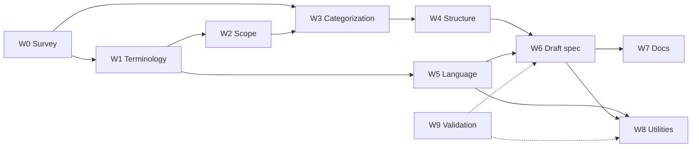

# openui-spec v1 — Publish first edition: plan

Sep 23, 2026 · @Shlomo Anglister

## Plan completion

This plan is a draft. Before execution it needs three passes, in order:

- [ ] 1\. Answer the open questions (Q1–Q14)
  - [x] Validate correctness and freshness of the plan (re-checked 2026-09-26 against v0.3.1)
  - [x] Validate the questions are still valid
  - [x] Enumerate the questions
  - [ ] Decide each open question
- [ ] 2\. Additional structure
- [ ] 3\. Step elaboration and refinement

## Goal and definition of done

Publish openui-spec **v1.0.0** as the first stable edition: one vocabulary, one categorization, one document structure and one UI-description language that downstream work (angular-django2, django-angular3) can build on without expecting breaking churn.

The edition is done when all of these hold:

1. **Terminology** — every normative term is defined once in the glossary, with a cross-framework alias table (HTML/ARIA, openui5, Qt, Angular Material). No other doc redefines a term.
2. **Scope** — a normative in-scope / out-of-scope statement exists and every catalog object falls inside it.
3. **Categorization** — one taxonomy. Today there are four overlapping ones; the Qt and HTML surveys recommend keeping the scope tree and the purpose taxonomy as linked views of one vocabulary.
4. **Structure** — the spec document is split into numbered normative and informative parts. Generator-specific content moves out of the spec.
5. **Language** — the UI-description grammar (EBNF + JSON Schema) is frozen at 1.0, including binding, event and data-reference rules.
6. **Survey traceability** — every leaf scope cites the survey rows that justify it (evidence register).
7. **Utilities** — Python and TypeScript packages parse, model and validate v1.0 documents with identical results on a shared conformance suite.
8. **Validation** — CI runs format, lint, spec-content lint and conformance tests on Linux, Windows and macOS.
9. **Visibility** — a published web page shows the v1.0 spec: taxonomy browser, per-object pages and live rendered examples.

## Current state (openui-spec main @ 1c90f5c, v0.3.1)

Re-checked on 2026-09-26 against `main` (19 commits after the first draft). The survey is now in the repo, the grammar has a single source of truth, and two releases shipped. Rows marked *changed* differ from the 2026-09-23 draft.

| Area | What exists | Gap for v1.0 |
| --- | --- | --- |
| Survey (*changed*) | `spec/survey/` with 4 sources: `angular-material/`, `html5/` (WHATWG HTML), `openui5/`, `qt/`. Each has its own taxonomy mapping, proposed evidence and scope-extension proposal | No cross-source matrix; proposals overlap (e.g. `modal_interaction` in both Angular Material and Qt); `spec/survey/` is excluded from pre-commit, markdownlint and mkdocs |
| Terminology (*changed*) | Glossary in `spec/README.md` (23 term entries). Standalone / Host-bound terms approved 2026-09-23 in `openui5/TERMINOLOGY_PROPOSAL.md`, not yet applied | No alias table across the 4 sources |
| Scope | One-line purpose in `spec/README.md` and `docs/REQUIREMENTS.md` | No explicit in/out list. Qt and HTML surveys already defer host-shell integration, browser internals, storage, workers |
| Categorization (*changed*) | 11 top-level scopes; purpose taxonomy (`docs/generic-ui-taxonomy.md`); 15-category `docs/ui-element-taxonomy.md`; openui5 7-category classification key. Qt and HTML proposals both recommend: keep the scope tree + purpose taxonomy as linked views, extend in place, no new tree | Decision not yet recorded; role of `ui-element-taxonomy.md` undecided |
| Structure | `spec/README.md` mixes glossary, artifact roles, format, grammar, incremental generation | No normative/informative split; generator content inside the spec |
| Language (*changed*) | `EBNF.txt` declared authoritative; JSON Schema is a projection; `spec/tooling/check_grammar_consistency.py` enforces EBNF ↔ schema ↔ README ↔ catalog in pre-commit. 0.3.0 added same-document element references (quoted ids in Uses attrs) | Still `string \| null` values and `[x]` / `(x)` keys; no data-binding, event-payload or i18n rules |
| Catalog (*changed*) | 47 leaf `*.scope.md` files; 82 distinct type literals; new `Route`, `NavItem`, `NavGroup`, `ToolBar`, `ToolBarRow`, `ToolAction` contracts | Many leaves still Purpose-only; evidence register does not yet cite the survey |
| Utilities | Python: `openui_spec`, `compare_openui_spec`, `to_json`, TatSu parser, grammar consistency checker. TS: `OpenUiJson`, `ng-openui-spec` CLI (ajv) | No shared conformance suite; no object model beyond the JSON tree |
| Validation | pre-commit (prettier, markdownlint, ruff, yamllint, check-json, grammar/catalog consistency); unittest; CI on Ubuntu + Windows | No macOS runner; no scope-template / evidence / glossary-link lint |
| Visibility | `generated-examples` Angular app with screenshots; Read the Docs via mkdocs | No single published page for the spec itself |

## Workstreams

Ten workstreams in three layers: consolidate the foundations (W1–W5), write the spec (W6), then document, tool and validate it (W7–W9).

| # | Workstream | Question it answers | Main deliverable |
| --- | --- | --- | --- |
| W0 | Survey consolidation | What do HTML, openui5, Qt and Angular Material call and group each UI artifact, and which proposed scopes are accepted? | Cross-source comparison matrix (4 surveys) + reconciled scope-extension list |
| W1 | Terminology | Which word does OpenUI use, and what does it mean? | Glossary v1 + cross-framework alias table |
| W2 | Scope | What is the spec, what is in, what is out? | Normative scope statement (in / out / deferred) |
| W3 | UI categorization | What is the single most natural way to group UI artifacts? | One taxonomy; the other two re-expressed as informative views |
| W4 | Specification structure | How is the spec document organized? | Numbered outline with normative/informative parts; file layout |
| W5 | UI description language | How does an author describe a UI? | Grammar v1.0 (EBNF + JSON Schema), binding/event/i18n rules, versioning policy |
| W6 | Draft first spec | — | v1.0.0-rc.1 spec text + regenerated catalog |
| W7 | Documentation | — | Updated README, REQUIREMENTS, CONTRIBUTING, AGENTS/CLAUDE, CHANGELOG, Read the Docs site |
| W8 | Spec utilities | Can tools parse, model and validate v1.0? | Python + TS parse/model/validate APIs passing one conformance suite |
| W9 | Validation | Is every change checked the same way everywhere? | Format + lint + spec-content lint + tests in CI on 3 OSes |

W9 starts first and runs alongside everything else; dashed arrows mean it gates the others rather than feeding content.

## Tasks

Each task ends with a validation step and a visual demo, per the project rules. One task = one GitHub issue = one PR, approved step by step.

**W9 Validation (first, runs throughout)**

1. Add `macos-latest` to the `build.yml` matrix. *Validate:* green CI on 3 OSes. *Demo:* CI badge row in README.
2. Add a spec-content linter (`bin/lint_spec.py`) wired into pre-commit:
   1. every leaf `*.scope.md` matches `template.scope.md` sections;
   2. every leaf has exactly one row in `evidence.md`;
   3. glossary terms are defined once; other docs link instead of redefining;
   4. ~~`openui.json` is up to date with the prose~~ — **done**: enforced by `check_grammar_consistency.py` since 2026-09-26. *Validate:* unit tests with passing and failing fixtures. *Demo:* HTML lint report page.
3. Add a Markdown link checker to pre-commit. *Validate:* zero broken internal links.

**W0 Survey consolidation**

4. ~~Commit the survey results~~ — **done** (`spec/survey/`, 4 sources). Remaining: decide where consolidated outputs live, since `spec/survey/` is excluded from lint and docs (Q12).
5. Build `matrix.csv` by merging the four `TAXONOMY_MAPPING.md` files: concept × {HTML, WAI-ARIA, openui5, Qt, Angular Material}. Columns: name, category in that source, key properties, events, OpenUI scope. Flag each row: *same term/same meaning*, *same term/different meaning*, *different term/same meaning*, *unique*. *Validate:* script checks every catalog type appears in the matrix. *Demo:* sortable/filterable matrix web page.
6. Reconcile the scope-extension proposals (Angular Material `proposed-scopes/`, Qt P01–P06, HTML P1–P8) into one accept / defer / reject list, de-duplicating overlaps such as `modal_interaction` and `collapsible`. *Demo:* proposal table on the matrix page.

**W1 Terminology**

7. Pick the canonical-term rule (e.g. W3C/ARIA name first, then majority across frameworks) and record it as a decision.
8. Extend the glossary to cover every catalog type and every matrix row flagged as a conflict.
9. Add the alias table (canonical term → openui5 / Qt / Angular Material / ARIA names). *Validate:* lint task 2.3 passes. *Demo:* searchable glossary page with alias lookup.

**W2 Scope**

10. Write the normative scope section: purpose, audience, in scope, out of scope, deferred to later editions.
11. Classify every catalog object and every survey concept as in / out / deferred. *Validate:* no catalog object is out of scope. *Demo:* scope map page.
12. Split `docs/REQUIREMENTS.md` so spec requirements and generator requirements are separate.

**W3 UI categorization**

13. Choose the primary axis (see open questions) and define the category set with inclusion rules.
14. Re-map all 47 leaf scopes and all taxonomy entries to it; turn the other two taxonomies into informative views generated from the mapping.
15. Rename or move scope folders to match. *Validate:* every object has exactly one primary category; catalog regenerates. *Demo:* interactive taxonomy tree with per-framework overlay.

**W4 Specification structure**

16. Define the v1.0 outline, e.g.: 1 Introduction & scope · 2 Conformance · 3 Terminology · 4 Document model & language · 5 Categories & objects · 6 Catalog · Annex A Grammar · Annex B Survey mapping · Annex C Examples.
17. Define RFC 2119 keyword use (MUST/SHOULD/MAY) and mark normative vs. informative sections.
18. Move incremental-generation and generator content out of `spec/README.md` into the generator docs.

**W5 UI description language**

19. Decide attribute value typing (string/null only vs. typed values).
20. Replace the Angular-flavoured `[x]` / `(x)` key syntax with a framework-neutral one for Uses / Produces / Behaves, or formally adopt it.
21. Define data-binding references, event payloads and i18n string references. Same-document element references already exist (0.3.0); extend, don't replace.
22. Define versioning and compatibility policy (SemVer for the spec; how documents declare the version).
23. Update `EBNF.txt` (authoritative) and regenerate the JSON Schema projection; `check_grammar_consistency.py` already enforces agreement. *Validate:* both accept/reject the same conformance fixtures. *Demo:* live playground page — paste JSON, see validation and rendered tree.

**W6 Draft first spec**

24. Rewrite the spec per W4 outline, using W1–W5 outputs.
25. Enrich each leaf scope (Attributes, Child model) from the survey matrix; add evidence rows.
26. Regenerate `openui.json`, bump to `1.0.0-rc.1`, migrate all examples and fixtures.
27. Review period, then release `1.0.0`. *Validate:* full CI + conformance suite. *Demo:* published spec site with a rendered example per object (reuse `generated-examples`).

**W7 Documentation**

28. Update README, REQUIREMENTS, CONTRIBUTING, RELEASING, AGENTS.md / CLAUDE.md / GEMINI.md, `.github/copilot-instructions.md`, agent files under `.github/agents/`.
29. Write CHANGELOG `1.0.0` with a 0.3 → 1.0 migration guide.
30. Publish to Read the Docs. *Demo:* the site itself.
31. Notify downstream: angular-django2 (#98/#103 TS parser) and django-angular3.

**W8 Spec utilities**

32. Create a shared conformance suite (`spec/conformance/`: valid + invalid documents with expected diagnostics).
33. Python: parse (EBNF + JSON) → typed object model → validate (grammar, catalog membership, scope contract).
34. TypeScript: same API surface in `@shlomoa/openui-spec`.
35. Both packages pass the same suite; publish `1.0.0` to PyPI and npm. *Demo:* the W5 playground uses the TS validator.

## Milestones

Five GitHub milestones, each closing with a visible web page. No dates yet — set them once the open questions are answered.

| Milestone | Tasks | Exit criterion | Visual demo |
| --- | --- | --- | --- |
| M1 Guard rails | 1–3 | CI green on 3 OSes with spec-content lint | Lint report page |
| M2 Survey consolidated | 4–6 | Matrix covers all 82 catalog types | Survey matrix page |
| M3 Foundations agreed | 7–18 | Glossary, scope, taxonomy and outline approved | Glossary + taxonomy tree pages |
| M4 Language frozen | 19–23, 32 | Grammar 1.0 + conformance suite merged | Validation playground |
| M5 v1.0.0 published | 24–31, 33–35 | Packages at 1.0.0 on PyPI + npm; docs live | Published spec site with rendered examples |

M2 and M1 can run in parallel. M4 can start as soon as W1 terminology is settled (task 9); it does not need the taxonomy.

## Open questions

Re-validated 2026-09-26: of the original 9, 2 are answered by the repo, 3 are partly answered by the survey proposals and reframed, 4 stand as asked, and 5 are new. Nothing starts until the open ones are decided.

| # | Question | Status | Evidence / options |
| --- | --- | --- | --- |
| Q1 | Which is the fourth surveyed source? | Answered — confirm | HTML (WHATWG Living Standard), `spec/survey/html5/` |
| Q2 | Where are the survey results? | Answered | `spec/survey/` on `main` since commit 215f2e7 |
| Q3 | Is the first edition `1.0.0`, or a `0.x` candidate with `1.0.0` later? | Open | Repo is at 0.3.1 and still moving; freezing at 1.0.0 locks grammar (M4) |
| Q4 | Adopt the surveys' categorization: 11-scope contract tree + purpose taxonomy as linked views, extend in place? | Reframed | Qt `TAXONOMY_STRUCTURE_PROPOSAL.md` and HTML `SCOPE_TREE_PROPOSAL.md` both say yes, no new tree. Sub-question: retire, merge or keep `docs/ui-element-taxonomy.md` (15 categories)? |
| Q5 | Canonical-term rule: HTML/ARIA name wins, or majority across sources? | Open | — |
| Q6 | Attribute values: keep `string \| null`, or add typed values? | Open | 0.3.0 element references are quoted strings, which leans to string-only |
| Q7 | Attribute keys: keep `[x]` / `(x)`, or neutral keys (`uses.x`, `produces.x`, `behaves.x`)? | Open | Still Angular syntax in `spec/README.md` and the leaf template |
| Q8 | Does the Angular generator stay in openui-spec for v1.0, or move to angular-django2? | Open | Still at `generators/angular/` |
| Q9 | Qt desktop-only concepts: confirm host-shell presence deferred, MDI / docking as optional runtime capabilities? | Reframed | Already proposed so in Qt `SCOPE_EXTENSION_PROPOSAL.md` |
| Q10 | Apply the approved Standalone / Host-bound glossary entries now, or inside W1? | New | Approved 2026-09-23, glossary diff held in `openui5/TERMINOLOGY_PROPOSAL.md` |
| Q11 | Which proposed scopes enter v1.0? | New | Angular Material `proposed-scopes/`, Qt P01–P06, HTML P1–P8 (task 6) |
| Q12 | Where do the plan and consolidated outputs live? | New | `spec/survey/` is excluded from lint and docs. Two plan copies exist: `spec/survey/specui_v1_publish_plan.md` (main) and `spec/survey/openui-spec-v1_publish_plan.md` (branch `shlomoa/consolidate_survey_data_pr`). Also: repo file vs. this doc — which is the source of truth? |
| Q13 | Add HTML's conditional Accessibility and Composition top-level scopes in v1.0, or defer? | New | HTML P6 / P7 |
| Q14 | Close or merge branch `shlomoa/consolidate_survey_data_pr`? | New | Its only change is the second plan copy |

## Sources

- [shlomoa/openui-spec](https://github.com/shlomoa/openui-spec) — `main` at `1c90f5c` (v0.3.1), re-checked 2026-09-26: `CHANGELOG.md`, `spec/EBNF.txt`, `spec/README.md`, `spec/scopes/`, `spec/tooling/check_grammar_consistency.py`, `.pre-commit-config.yaml`, `.github/workflows/build.yml`, `spec/survey/**` (proposal and README files).
- First draft based on `main` at `b97f3f8` (v0.2.0), 2026-09-23.
