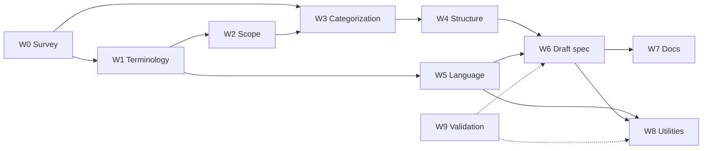

# openui-spec v1 — Publish first edition: plan

Sep 23, 2026 · @Shlomo Anglister

## Goal and definition of done

Publish openui-spec **v1.0.0** as the first stable edition: one vocabulary, one categorization, one document structure and one UI-description language that downstream work (angular-django2, django-angular3) can build on without expecting breaking churn.

The edition is done when all of these hold:

1. **Terminology** — every normative term is defined once in the glossary, with a cross-framework alias table (W3C/ARIA, openui5, Qt, Angular Material). No other doc redefines a term.
2. **Scope** — a normative in-scope / out-of-scope statement exists and every catalog object falls inside it.
3. **Categorization** — one taxonomy. Today there are three competing ones; two become informative views that map onto it.
4. **Structure** — the spec document is split into numbered normative and informative parts. Generator-specific content moves out of the spec.
5. **Language** — the UI-description grammar (EBNF + JSON Schema) is frozen at 1.0, including binding, event and data-reference rules.
6. **Survey traceability** — every leaf scope cites the survey rows that justify it (evidence register).
7. **Utilities** — Python and TypeScript packages parse, model and validate v1.0 documents with identical results on a shared conformance suite.
8. **Validation** — CI runs format, lint, spec-content lint and conformance tests on Linux, Windows and macOS.
9. **Visibility** — a published web page shows the v1.0 spec: taxonomy browser, per-object pages and live rendered examples.

## Current state (openui-spec main, v0.2.0)

Much of the raw material exists; the gap is convergence, not creation. Findings from the `main` branch as of today:

| Area | What exists | Gap for v1.0 |
| --- | --- | --- |
| Terminology | Glossary in `spec/README.md`: 16 core terms + 6 UI terms, ARIA/MDN references | No openui5 or Qt aliases; only 6 UI terms have cross-framework meanings |
| Scope | One-line purpose in `spec/README.md` and `docs/REQUIREMENTS.md` | No explicit in/out list; REQUIREMENTS mixes spec with generator scope |
| Categorization | Three models: 11 top-level scopes (`spec/scopes/`), 12 purpose groups (`docs/generic-ui-taxonomy.md`), 15 categories (`docs/ui-element-taxonomy.md`) | Overlapping axes (purpose vs. layer vs. composition); `taxonomy_mapping.md` bridges only one pair |
| Structure | `spec/README.md` (816 lines) mixes glossary, artifact roles, format, EBNF, incremental generation | No normative/informative split; generator content inside the spec |
| Language | `EBNF.txt` + `openui.schema.json`: id/type/attrs/children; attrs are `string \| null`; `[x]` / `(x)` key syntax | Key syntax is Angular-flavoured; no typed values, data binding, event or i18n rules |
| Catalog | `spec/openui.json` generated from 42 leaf `*.scope.md` files, 82 type literals | Leaf contracts are mostly Purpose-only; evidence cites Angular Material + ARIA only |
| Survey | Not in the repo | openui5 / Qt / Angular Material results need to be committed and linked |
| Utilities | Python: `openui_spec`, `compare_openui_spec`, `to_json`, TatSu EBNF parser. TS: `OpenUiJson`, `ng-openui-spec` CLI (ajv) | No shared conformance suite; no object model beyond JSON tree |
| Validation | pre-commit (prettier, markdownlint, ruff, yamllint, check-json); unittest; CI on Ubuntu + Windows | No macOS runner; no spec-content lint (template conformance, glossary links, evidence completeness) |
| Visibility | `generators/angular/generated-examples` app with screenshots; `docs/generic-ui-taxonomy.html`; Read the Docs config | No single published page for the spec itself |

## Workstreams

Ten workstreams in three layers: consolidate the foundations (W1–W5), write the spec (W6), then document, tool and validate it (W7–W9).

| # | Workstream | Question it answers | Main deliverable |
| --- | --- | --- | --- |
| W0 | Survey consolidation | What do openui5, Qt and Angular Material (+ 4th framework) call and group each UI artifact? | `survey/` folder: one normalized comparison matrix (term × framework × W3C/ARIA) |
| W1 | Terminology | Which word does OpenUI use, and what does it mean? | Glossary v1 + cross-framework alias table |
| W2 | Scope | What is the spec, what is in, what is out? | Normative scope statement (in / out / deferred) |
| W3 | UI categorization | What is the single most natural way to group UI artifacts? | One taxonomy; the other two re-expressed as informative views |
| W4 | Specification structure | How is the spec document organized? | Numbered outline with normative/informative parts; file layout |
| W5 | UI description language | How does an author describe a UI? | Grammar v1.0 (EBNF + JSON Schema), binding/event/i18n rules, versioning policy |
| W6 | Draft first spec | — | v1.0.0-rc.1 spec text + regenerated catalog |
| W7 | Documentation | — | Updated README, REQUIREMENTS, CONTRIBUTING, AGENTS/CLAUDE, CHANGELOG, Read the Docs site |
| W8 | Spec utilities | Can tools parse, model and validate v1.0? | Python + TS parse/model/validate APIs passing one conformance suite |
| W9 | Validation | Is every change checked the same way everywhere? | Format + lint + spec-content lint + tests in CI on 3 OSes |

W9 starts first and runs alongside everything else; dashed arrows mean it gates the others rather than feeding content.

## Tasks

Each task ends with a validation step and a visual demo, per the project rules. One task = one GitHub issue = one PR, approved step by step.

**W9 Validation (first, runs throughout)**

1. Add `macos-latest` to the `build.yml` matrix. *Validate:* green CI on 3 OSes. *Demo:* CI badge row in README.
2. Add a spec-content linter (`bin/lint_spec.py`) wired into pre-commit:
   1. every leaf `*.scope.md` matches `template.scope.md` sections;
   2. every leaf has exactly one row in `evidence.md`;
   3. glossary terms are defined once; other docs link instead of redefining;
   4. `openui.json` is up to date with the prose (regenerate + diff). *Validate:* unit tests with passing and failing fixtures. *Demo:* HTML lint report page.
3. Add a Markdown link checker to pre-commit. *Validate:* zero broken internal links.

**W0 Survey consolidation**

4. Commit the survey results under `survey/` (one file per framework, same columns).
5. Build `survey/matrix.csv`: concept × {W3C/HTML, WAI-ARIA, openui5, Qt, Angular Material, 4th}. Columns: name, category in that framework, key properties, events.
6. Flag each row: *same term/same meaning*, *same term/different meaning*, *different term/same meaning*, *unique*. *Validate:* script checks every catalog type appears in the matrix. *Demo:* sortable/filterable matrix web page.

**W1 Terminology**

7. Pick the canonical-term rule (e.g. W3C/ARIA name first, then majority across frameworks) and record it as a decision.
8. Extend the glossary to cover every catalog type and every matrix row flagged as a conflict.
9. Add the alias table (canonical term → openui5 / Qt / Angular Material / ARIA names). *Validate:* lint task 2.3 passes. *Demo:* searchable glossary page with alias lookup.

**W2 Scope**

10. Write the normative scope section: purpose, audience, in scope, out of scope, deferred to later editions.
11. Classify every catalog object and every survey concept as in / out / deferred. *Validate:* no catalog object is out of scope. *Demo:* scope map page.
12. Split `docs/REQUIREMENTS.md` so spec requirements and generator requirements are separate.

**W3 UI categorization**

13. Choose the primary axis (see open questions) and define the category set with inclusion rules.
14. Re-map all 42 leaf scopes and all taxonomy entries to it; turn the other two taxonomies into informative views generated from the mapping.
15. Rename or move scope folders to match. *Validate:* every object has exactly one primary category; catalog regenerates. *Demo:* interactive taxonomy tree with per-framework overlay.

**W4 Specification structure**

16. Define the v1.0 outline, e.g.: 1 Introduction & scope · 2 Conformance · 3 Terminology · 4 Document model & language · 5 Categories & objects · 6 Catalog · Annex A Grammar · Annex B Survey mapping · Annex C Examples.
17. Define RFC 2119 keyword use (MUST/SHOULD/MAY) and mark normative vs. informative sections.
18. Move incremental-generation and generator content out of `spec/README.md` into the generator docs.

**W5 UI description language**

19. Decide attribute value typing (string/null only vs. typed values).
20. Replace the Angular-flavoured `[x]` / `(x)` key syntax with a framework-neutral one for Uses / Produces / Behaves, or formally adopt it.
21. Define data-binding references, event payloads and i18n string references.
22. Define versioning and compatibility policy (SemVer for the spec; how documents declare the version).
23. Update `EBNF.txt` and `openui.schema.json` together. *Validate:* EBNF and JSON Schema accept/reject the same fixture set. *Demo:* live playground page — paste JSON, see validation and rendered tree.

**W6 Draft first spec**

24. Rewrite the spec per W4 outline, using W1–W5 outputs.
25. Enrich each leaf scope (Attributes, Child model) from the survey matrix; add evidence rows.
26. Regenerate `openui.json`, bump to `1.0.0-rc.1`, migrate all examples and fixtures.
27. Review period, then release `1.0.0`. *Validate:* full CI + conformance suite. *Demo:* published spec site with a rendered example per object (reuse `generated-examples`).

**W7 Documentation**

28. Update README, REQUIREMENTS, CONTRIBUTING, RELEASING, AGENTS.md / CLAUDE.md / GEMINI.md, `.github/copilot-instructions.md`, agent files under `.github/agents/`.
29. Write CHANGELOG `1.0.0` with a 0.2 → 1.0 migration guide.
30. Publish to Read the Docs. *Demo:* the site itself.
31. Notify downstream: angular-django2 (#98/#103 TS parser) and django-angular3.

**W8 Spec utilities**

32. Create a shared conformance suite (`spec/conformance/`: valid + invalid documents with expected diagnostics).
33. Python: parse (EBNF + JSON) → typed object model → validate (grammar, catalog membership, scope contract).
34. TypeScript: same API surface in `@shlomoa/openui-spec`.
35. Both packages pass the same suite; publish `1.0.0` to PyPI and npm. *Demo:* the W5 playground uses the TS validator.

## Milestones

Five GitHub milestones, each closing with a visible web page. No dates yet — set them once the open questions are answered.

| Milestone | Tasks | Exit criterion | Visual demo |
| --- | --- | --- | --- |
| M1 Guard rails | 1–3 | CI green on 3 OSes with spec-content lint | Lint report page |
| M2 Survey consolidated | 4–6 | Matrix covers all 82 catalog types | Survey matrix page |
| M3 Foundations agreed | 7–18 | Glossary, scope, taxonomy and outline approved | Glossary + taxonomy tree pages |
| M4 Language frozen | 19–23, 32 | Grammar 1.0 + conformance suite merged | Validation playground |
| M5 v1.0.0 published | 24–31, 33–35 | Packages at 1.0.0 on PyPI + npm; docs live | Published spec site with rendered examples |

M2 and M1 can run in parallel. M4 can start as soon as W1 terminology is settled (task 9); it does not need the taxonomy.

## Open questions

These block execution. Per the repo rules, each is medium or high ambiguity, so no task starts until it is answered.

- [ ] **Fourth framework.** The survey names openui5, Qt and Angular Material. Which is the fourth (e.g. MUI/React, Fluent, Flutter)?
- [ ] **Survey location.** The survey is not on `main`. Where are the results — another branch, issue, or local files?
- [ ] **Version number.** Is the "first edition" `1.0.0`, or `0.3.0` as a candidate with `1.0.0` later?
- [ ] **Primary categorization axis.** Purpose (input / output / navigation / container), composition level (control → widget → container → view → page → application), or both as two orthogonal facets?
- [ ] **Canonical-term rule.** W3C/ARIA wins by default, or majority across surveyed frameworks?
- [ ] **Attribute values.** Keep `string | null`, or add typed values (number, boolean, object, reference)?
- [ ] **Attribute key syntax.** Keep `[x]` / `(x)`, or move to neutral keys (e.g. `uses.x`, `produces.x`, `behaves.x`)?
- [ ] **Generator location.** Does the Angular generator stay in this repo for v1.0, or move to angular-django2?
- [ ] **Survey scope.** Is Qt included only for terminology, or also for desktop-only concepts (docking, MDI) that may land in "out of scope"?

## Sources

- [shlomoa/openui-spec](https://github.com/shlomoa/openui-spec) — `main` at `b97f3f8` (v0.2.0): `spec/README.md`, `spec/EBNF.txt`, `spec/openui.schema.json`, `spec/scopes/`, `docs/`, `.pre-commit-config.yaml`, `.github/workflows/build.yml`, `CHANGELOG.md`.
