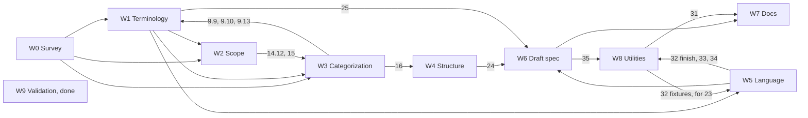

# openui-spec v1 — Publish first edition: plan

## Goal and definition of done

Publish openui-spec **v1.0.0** as the first stable edition: one vocabulary, one categorization, one document structure and one UI-description language that downstream work (angular-django2, django-angular3) can build on without expecting breaking churn.

*Directive (Q3, decided):* release as `0.x.0` / `0.x.y` versions until the spec is validated in downstream tools and packages; no release candidate before then. Every `1.0.0-rc.1` and `1.0.0` target in this plan waits on that validation.

The edition is done when all of these hold:

1. **Terminology** — every normative term is defined once in the glossary, with a cross-framework alias table (HTML/ARIA, openui5, Qt, Angular Material). No other doc redefines a term.
2. **Scope** — a normative in-scope / out-of-scope statement exists and every catalog object falls inside it.
3. **Categorization** — one taxonomy, specified by three spec documents with one owner for each fact: the generic UI taxonomy (sections, subcategories and entries), the UI element taxonomy (abstract element types and the classification rules) and the taxonomy mapping (the link from each entry to its scope object). The taxonomy and the scope tree are linked views of one vocabulary.
4. **Structure** — the spec document is split into numbered normative and informative parts. Generator-specific content moves out of the spec.
5. **Language** — the UI-description grammar (EBNF + JSON Schema) is frozen at 1.0, including binding, event and data-reference rules.
6. **Survey traceability** — every leaf scope cites the survey rows that justify it (evidence register).
7. **Utilities** — Python and TypeScript packages parse, model and validate v1.0 documents with identical results on a shared conformance suite.
8. **Validation** — CI runs format, lint, spec-content lint and conformance tests on Linux and Windows.
9. **Visibility** — a published web page shows the v1.0 spec: taxonomy browser, per-object pages and live rendered examples.

## Current state (2026-09-29, v0.8.0)

Re-checked on 2026-09-29 on `main` after PR #170 (`0.8.0`): workstreams W0–W5 and W9 are done, and so are W8 tasks 32–34. Earlier snapshots: `0.4.0` (2026-09-29), `main` at `1c90f5c` (2026-09-26) and `b97f3f8` (2026-09-23).

| Area | What exists | Gap for v1.0 |
| --- | --- | --- |
| Survey | `spec/survey/` with 4 sources: `angular-material/`, `html5/` (WHATWG HTML), `openui5/`, `qt/`. The applied change files are named `*.done.md`; what is not applied yet is in `*.notdone.md`. `spec/survey/` is excluded from pre-commit, markdownlint and mkdocs | The `*.notdone.md` items go to W6 25 or are out of v1 (Q9) |
| Terminology | Glossary in [`spec/scopes/scope.md`](../scopes/scope.md#glossary), with "Same name, different meaning" notes; the approved [`terminology.md`](../scopes/terminology.md#summary) is applied; the alias table is four columns of the taxonomy mapping (HTML / WAI-ARIA, OpenUI5, Qt, Angular Material) | None |
| Scope | The `## Scope` section of `spec/README.md` (in scope, out of scope, deferred) and the classification in [`scope_statement.md`](scope_statement.md#scope-statement) | None |
| Categorization | One taxonomy in three spec documents with one owner for each fact; one primary category for each placed leaf scope; the interactive taxonomy tree (`spec/taxonomy/taxonomy-tree.html`) with a per-framework overlay | None |
| Structure | A numbered outline (six parts, three annexes), the Conformance part with BCP 14 keywords and the normative / informative marking; `spec/README.md` is written to it (W6 24, `0.9.0`) | None |
| Language | Typed attributes: `uses.x` / `produces.x` / `behaves.x` keys and typed values, in `EBNF.txt`, the JSON Schema and the catalog ([`language_change.done.md`](language_change.done.md)); `spec/bin/migrate.py`; the playground page | None for v1 (internationalization postponed) |
| Catalog | 50 leaf scopes, each with an evidence row, a worked example and generator fixtures; 17 leaves have no Child model and 8 no Attributes section | Enrich the leaves (W6 25) |
| Utilities | Python `bin/openui_document.py` and TypeScript `src/document.ts` parse, model and validate with identical results on the conformance suite (`spec/conformance/`) | Publish `1.0.0` (W8 35) |
| Validation | pre-commit, the spec-content lint, the link check, the taxonomy page checks, unit tests, npm tests and the `generated-examples` app checks; CI on Ubuntu, macOS and Windows | None |
| Visibility | `generated-examples` app with screenshots, the taxonomy pages and the playground; Read the Docs via mkdocs | The published spec site with a rendered example per object (W6 27, W7 30) |

## Workstreams

Ten workstreams in three layers: consolidate the foundations (W1–W5), write the spec (W6), then document, tool and validate it (W7–W9).

| # | Workstream | Question it answers | Main deliverable |
| --- | --- | --- | --- |
| W0 | [x] Survey consolidation | What do HTML, openui5, Qt and Angular Material call and group each UI artifact, and which proposed scopes are accepted? | Approved change files in `spec/survey/` (terminology, category, taxonomy mapping, scope, architecture, structure, schema) |
| W1 | [x] Terminology | Which word does OpenUI use, and what does it mean? | Glossary v1 + cross-framework alias table |
| W2 | [x] Scope | What is the spec, what is in, what is out? | Normative scope statement (in / out / deferred) |
| W3 | [x] UI categorization | What is the single most natural way to group UI artifacts? | One taxonomy in three spec documents (generic UI taxonomy, UI element taxonomy, taxonomy mapping), one owner for each fact |
| W4 | [x] Specification structure | How is the spec document organized? | Numbered outline with normative/informative parts; file layout |
| W5 | [x] UI description language | How does an author describe a UI? | Grammar v1.0 (EBNF + JSON Schema), binding/event/i18n rules, versioning policy |
| W6 | [ ] Draft first spec | — | v1.0.0-rc.1 spec text + regenerated catalog (*directive, Q3:* released as `0.x.0` until downstream validation) |
| W7 | [ ] Documentation | — | Updated README, REQUIREMENTS, CONTRIBUTING, AGENTS/CLAUDE, CHANGELOG, Read the Docs site |
| W8 | [ ] Spec utilities | Can tools parse, model and validate v1.0? | Python + TS parse/model/validate APIs passing one conformance suite |
| W9 | [x] Validation | Is every change checked the same way everywhere? | Format + lint + spec-content lint + tests in CI on Linux and Windows |

```mermaid
flowchart LR
  W0[W0 Survey] --> W1[W1 Terminology]
  W0 --> W2[W2 Scope]
  W0 --> W3[W3 Categorization]
  W1 --> W2
  W1 --> W3
  W3 -- "9.9, 9.10, 9.13" --> W1
  W2 -- "14.12, 15" --> W3
  W3 -- "16" --> W4[W4 Structure]
  W1 --> W5[W5 Language]
  W8 -- "32 fixtures, for 23" --> W5
  W4 -- "24" --> W6[W6 Draft spec]
  W1 -- "25" --> W6
  W5 --> W6
  W6 --> W7[W7 Docs]
  W5 -- "32 finish, 33, 34" --> W8[W8 Utilities]
  W6 -- "35" --> W8
  W8 -- "31" --> W7
  W9[W9 Validation, done]
```

W9 is done: it ran first, and its checks now run on every change. An arrow without a label holds for the whole workstream; a labelled arrow holds only for the named tasks of the workstream it points to:

- W1 waits on W3 for 9.9, 9.10 and 9.13, which use the merged taxonomy (W3 14.1–14.5, 14.9, 14.13).
- W3 waits on W2 only for 14.12 and 15 (14.12 needs W2 11).
- W4 waits on W3 only for 16; 17 needs 16, and 18 needs nothing.
- W5 waits on W8 for 23, which is validated against the fixtures of 32; the fixture structure of 32 needs nothing.
- W6 waits on W4 only for 24, and on W1 for 25 (the alias table, 9.9); 25 and 26 also need W5.
- W8 waits on W6 only for 35 (the joint release); the finished suite of 32, and 33–34, need W5 23.
- W7 waits on W8 only for 31, which notifies downstream after W8 task 35.

## Tasks

Each task ends with a validation step and a visual demo, per the project rules. One task = one GitHub issue = one PR, approved step by step.

### W9 Validation (first, runs throughout)

1. [x] Consolidate validation infrastructure.
   - 1.1 [x] Create a `spec/bin` folder.
   - 1.2 [x] Move `spec/to_json` into `spec/bin`.
   - 1.3 [x] Move tooling tools into `spec/bin`; create a tool for each tool in tooling just like `to_json`. Result: `spec/bin/check_grammar_consistency/`; the guides `editing.md` and `comparison.md` stay in `spec/tooling/`.
   - 1.4 [x] Update code, tests, and documents.
2. [x] Add a spec-content linter (`spec/bin/lint_spec.py`) wired into pre-commit; implement its framework first, then enable terminology-dependent rules after W1 task 7. *Validate:* unit tests with passing and failing fixtures. *Demo:* HTML lint report page (`--html`).
   - 2.1 [x] every leaf `*.scope.md` has the `template.scope.md` sections, in order; a leaf may omit only the sections the template marks "Omit the whole section" (`template-sections`).
   - 2.2 [x] every leaf has exactly one row in `evidence.md` (`evidence-row`).
   - 2.3 [x] glossary terms are defined once in `spec/scopes/scope.md#glossary`, and no other spec document (outside `spec/survey/`) redefines one in glossary form (`glossary-single-definition`).
   - 2.4 [x] `openui.json` is up to date with the prose; enforced by `check_grammar_consistency`.
   - 2.5 [x] Linter framework, run by the `openui-spec-lint` pre-commit hook, with the `--html` report and unit tests.
3. [x] Check links and file references in the documentation. *Validate:* zero broken internal links.
   - 3.1 [x] Add a Markdown link checker to pre-commit (`spec/bin/check_links.py`).
   - 3.2 [x] Remove the plain-text references in `AGENTS.md` to `docs/TEST_PLAN.md` and `generators/angular/generator/docs/TDD.md`, which do not exist; the link checker checks links only, so it cannot catch them (execution order step 1).

   Implemented in [PR #159](https://github.com/shlomoa/openui-spec/pull/159) and, for 3.2, [PR #160](https://github.com/shlomoa/openui-spec/pull/160): tools run as `python -m spec.bin.<tool>`; the link checker fixed 9 broken internal links.

### W0 Survey consolidation

*Directive:* the four surveyed sources are Angular Material, HTML (the WHATWG Living Standard, `spec/survey/html5/`), OpenUI5 and Qt Widgets. The survey results live in `spec/survey/` (on `main` since commit 215f2e7), and so do this plan and the consolidated change records. A change record moves next to the spec once it is applied, as [`terminology.md`](../scopes/terminology.md#summary) did.

4. [x] Choose a directory structure and content for all surveys.
   References in markdown files must point to an existing file in inventory folder (once created and content moved) and section.

   - 4.1 [x] inventory: a folder to include all the surveyed data
     - 4.1.1 [x] Move all surveyed data files into this folder
   - 4.2 [x] taxonomy_mapping.md: content with references
   - 4.3 [x] category.md: content with references
   - 4.4 [x] README.md: summary and TOC
   - 4.5 [x] PLAN.md: The plan executed
   - 4.6 [x] SUMMARY.md a summary of the survey, the steps, findings, decisions, reasoning, etc.
   - 4.7 [x] architecture_proposal.md: contains a change proposal for the entire solution or part of it \[optional\]
   - 4.8 [x] scopes_proposal.md: scopes tree architectural and content change \[optional\]
   - 4.9 [x] openui_schema_proposal.md: proposal for schema change \[optional\]
   - 4.10 [x] opens.md: open and unresolved questions / issues / directions with references \[optional\]

   Applies to all four surveys (`angular-material/`, `html5/`, `openui5/`, `qt/`). Each survey's original data moved unchanged into its `inventory/` folder, with relative links rewritten; `html5/inventory/inventory/` keeps the chapter files. `openui5/` has no `openui_schema_proposal.md` because that survey proposes no schema change. A `scopes` folder for a consolidated specification was dropped (decided 2026-09-27): the consolidated outputs live in `spec/survey/`, and applying them is W1 and W3 work.

   **Consolidated proposals (2026-09-27):** [`terminology.md`](../scopes/terminology.md#summary) (all decisions approved), [`schema_change.md`](schema_change.done.md#schema-change-proposal) (not needed) and [`structure_change.md`](structure_change.done.md#add) (two new Behaviors scopes). [`category.md`](category.done.md#summary) (2026-09-27) consolidates the four survey `category.md` files and is approved in full. [`taxonomy_mapping_change.md`](taxonomy_mapping_change.done.md#summary) (2026-09-27) consolidates the four survey `taxonomy_mapping.md` files and is approved in full. [`architecture_change.md`](architecture_change.done.md#summary) (2026-09-27) consolidates the four `architecture_proposal.md` files and is approved in full.

5. [x] Decide whether to build a cross-source matrix (`matrix.csv`: concept × HTML, WAI-ARIA, openui5, Qt, Angular Material). Decided 2026-09-27: not built. Its name, category and scope columns would repeat the approved [`terminology.md`](../scopes/terminology.md#summary), [`category.md`](category.done.md#summary) and [`taxonomy_mapping_change.md`](taxonomy_mapping_change.done.md#summary); the per-framework names come from the four survey mappings in the alias table (W1 task 9.9); properties and events are read from the survey inventories in W6 task 25.
6. [x] Reconcile the scope-extension proposals (Angular Material `proposed-scopes/`, Qt P01–P06, HTML P1–P8) into one accept / defer / reject list, de-duplicating overlaps such as `modal_interaction` and `collapsible`. *Demo:* the tables of [`structure_change.md`](structure_change.done.md#add) and [`scope_change.md`](scope_change.done.md#summary).
   - 6.1 [x] Decide which proposed scopes enter v1.0 (2026-09-27, 2026-09-29): `Behaviors/input_assistance`, `Behaviors/viewport_and_focus_control` and `Behaviors/modal_overlay`. Applied in W1 tasks 9.4 and 9.5.

   Three new scopes are accepted: two in [`structure_change.md`](structure_change.done.md#add) and `Behaviors/modal_overlay` (task 6.1); every other proposed scope was remapped to an existing scope or dropped, as recorded in [`terminology.md`](../scopes/terminology.md#49-terms-that-need-a-new-scope). The changes the surveys ask for in existing scopes are in [`scope_change.md`](scope_change.done.md#summary) (approved).

### W1 Terminology

7. [x] Create a separate local terminology / vocabulary / glossary section in `scope.md` files for terms local to the current scope level:
   - 7.1 [x] Move all terminology / glossary / vocabulary definitions from `spec/README.md`, `spec/scopes/evidence.md`, `spec/scopes/taxonomy_mapping.md`, and `spec/scopes/template.scope.md` into `spec/scopes/scope.md`.
   - 7.2 [x] Add appropriate references from the former locations to the moved content.

   Implemented in [PR #161](https://github.com/shlomoa/openui-spec/pull/161): the glossary is in [`spec/scopes/scope.md`](../scopes/scope.md#glossary), and the former locations link to it.
8. [x] Pick the canonical-term rule (e.g. W3C/ARIA name first, then majority across frameworks) and record it as a decision.
   - 8.1 [x] Collect all the terms from existing scopes and surveyed UI frameworks.
   - 8.2 [x] Create a canonical list of terms.
   - 8.3 [x] Add an alias table (canonical term → openui5 / Qt / Angular Material / ARIA names). Built in task 9.9, with the final names. *Directive (2026-09-29):* the alias table is not a separate document; it is four columns of `spec/scopes/taxonomy_mapping.md` (HTML / WAI-ARIA, OpenUI5, Qt, Angular Material), one row per taxonomy entry.
   - 8.4 [x] Catalog any conflict / duplicate / wrong aliased term.
   - 8.5 [x] Decide the canonical-term rule (2026-09-27) and apply it: keep the existing OpenUI term; otherwise the HTML or WAI-ARIA name; otherwise the name most surveyed frameworks share; otherwise a neutral descriptive name. Applied in the glossary and the taxonomy mapping (W1 9.1–9.3).

   The canonical-term rule and every term decision are in [`terminology.md`](../scopes/terminology.md#appendix-a-canonical-term-rule) (approved).
9. [x] Review and resolve conflicts in terminology, then apply the result. The review is [`terminology.md`](../scopes/terminology.md#summary) (approved in full, including the terms not added).

   Apply the approved terminology. These are specification changes, so they follow [`RELEASING.md`](../../RELEASING.md#schema-and-catalog-version-changes). Do task 7 first, so the glossary changes land in their final location.
   - 9.1 [x] Glossary: add A1–A5 (Owner, Controlled element, Controlling element, Trigger, Window); apply C6 (move "component" and "UI component" from the Widget aliases to the Object aliases) and D2 (remove "widget instance" from the Element aliases); add the conflicting-meaning notes for Page, Control, Element and Grid ([appendix A](../scopes/terminology.md#appendix-a-canonical-term-rule)). Owner, Controlled element and Controlling element replace the proposed Standalone entry, which is not added.
   - 9.2 [x] Taxonomy mapping: apply C1–C5, R1–R11 and D1 in `spec/scopes/taxonomy_mapping.md`, and add A6–A76 with their scope and abstraction level. Apply [`taxonomy_mapping_change.md`](taxonomy_mapping_change.done.md#summary) in the same pass.
   - 9.3 [x] Generic taxonomy: make the same renames and additions in `spec/generic-ui-taxonomy.md`, which the taxonomy mapping is based on. Its HTML rendering, `spec/generic-ui-taxonomy.html`, is generated from it for ease of use (`python -m spec.bin.render_taxonomy_html`; a pre-commit check keeps it up to date).
   - 9.4 [x] New scopes: create `Behaviors/input_assistance.scope.md` and `Behaviors/viewport_and_focus_control.scope.md` from `template.scope.md`, list them in `Behaviors/scope.md`, and add one row each to `spec/scopes/evidence.md`.
   - 9.5 [x] Decide whether Modal overlay, moved to Behaviors by C4, needs its own scope file or is covered by an existing leaf. Decided 2026-09-29: its own scope, `Behaviors/modal_overlay`, with Modal interaction as its alias.
   - 9.6 [x] Scope contracts: apply [`scope_change.md`](scope_change.done.md#summary) in the same pass: the Purpose texts, the behavior target references and the Validation notes rules. Apply [`architecture_change.md`](architecture_change.done.md#summary) with it: the Behaviors folder description, the Boundaries rules of the folder scopes and the tree rules in `spec/scopes/scope.md`.
   - 9.7 [x] Bump `SCHEMA_VERSION` and the package versions to the next `0.x.0` (directive Q3), regenerate `spec/openui.json` and the fixtures with the new version, and update `CHANGELOG.md`. `spec/openui.json` and the generator fixtures already follow each scope change, because pre-commit and the tests enforce it. The examples are tasks 9.10–9.12. Released as `0.4.0` (2026-09-29).
   - 9.8 [x] Validate: pre-commit, unit tests, `mkdocs build --strict` and the npm tests. Result (2026-09-29): all pass — pre-commit on all files, the unit tests of `tests/` and `spec/tests/`, `mkdocs build --strict`, `git diff --check`, the npm tests of the root and the generator, and the `generated-examples` checks (format, lint, 44 tests, build).
   - 9.9 [x] Build the alias table (task 8.3) from the survey `taxonomy_mapping.md` files, using the final names: add the HTML / WAI-ARIA, OpenUI5, Qt and Angular Material columns to `spec/scopes/taxonomy_mapping.md` and fill them for every entry ("—" where a source has no name). The names sit on the entry's own row, so they need no term-existence check; extend `tests/test_taxonomy_mapping.py` to check that every row has the four columns. *Directive (2026-09-29):* move only framework-specific names (OpenUI5, Qt, Angular Material) out of the glossary Aliases lines into these columns. HTML, WAI-ARIA and CSS names are standard names, not framework names, and stay as glossary aliases (for example "CSS grid", "ARIA grid", "HTML table" and "`aria-controls` target"). Move the HTML and WAI-ARIA names still in mapping notes (for example HTML `output` and `menuitem`) into the HTML / WAI-ARIA column. A framework name spelled like an OpenUI term but meaning something else is not an alias; it stays in the glossary (task 14.9). *Directive (2026-09-29):* the method of the four columns is the one approved on 2026-09-27 (task 5): HTML and Angular Material names per entry from their survey mappings, WAI-ARIA names from the WAI-ARIA 1.2 role list, Qt rows matched to an entry by hand, and every OpenUI5 class matched again to one entry from the survey class descriptions. Result: the four columns are in [`taxonomy_mapping.md`](../scopes/taxonomy_mapping.md#taxonomy-mapping) for all 244 entries ("—" where a source has no name); the HTML and WAI-ARIA names of the notes moved into them; all 580 OpenUI5 classes are matched to one entry, or listed as fitting none with the reason, in the Abstract concept column of [the OpenUI5 survey mapping](openui5/taxonomy_mapping.md#summary); no glossary Aliases line held a framework name; `tests/test_taxonomy_mapping.py` checks the four columns of every row.
   - 9.10 [x] Generate the examples for every new addition with the [Spec JSON File Generator](../../.github/agents/spec-json-file-generator.agent.md) agent, using the Add rows of the consolidated files as its input: [`terminology.md`](../scopes/terminology.md#4-add), [`taxonomy_mapping_change.md`](taxonomy_mapping_change.done.md#4-add) and the approved rows of [`ui_element_taxonomy_merge_proposal.md`](ui_element_taxonomy_merge_proposal.done.md#4-add). Each row gives the term, its scope and its level; the evidence it links to gives the attribute values and the child composition. The output: for each Alias and Grouped leaf addition, including the merge additions (Menu item, Date and time field, Captions), a node in its scope's example, with an id derived from the term (for example `highlightedText`) and the scope's catalog type. Glossary-only terms (terminology A1–A5) get no example. The three new Behaviors scopes (`input_assistance`, `viewport_and_focus_control`, `modal_overlay`) already have their leaf examples, their entries in `Behaviors/scope.example.json` and the index rows in `spec/examples/README.md` (tasks 9.4, 9.5). Result: 63 addition nodes in 29 examples (terminology, taxonomy mapping change A13–A14 and merge A1–A3); Main window, Dockable panel and Multiple-document workspace get none, as they are out of v1 (Q9). The existing Text completion, Viewport scrolling and Modal interaction nodes take the id of their term. Nodes carry no attributes beyond the Behaviors `[target]`, since attribute names for the new capabilities wait on W6 task 25 ([`scope_change.notdone.md`](scope_change.notdone.md#deferred)); Wizard, Page stack and Progress dialog have the children their Child model requires. The input fixtures are synchronized.
   - 9.11 [x] Regenerate the existing examples that the scope changes affect, with the same agent, so that each example meets the new Validation notes ([`scope_change.md`](scope_change.done.md#4-add), A1–A9). Result: the Date/time pickers example (A8) binds a range with `[start]`, `[end]` and `(dateChange)`, with no single-value binding, value-format or Angular-only attributes; the Dialog example (A7) handles the cancellation request with `(cancel)`, apart from `(close)`; the input fixtures are synchronized; the examples of A1–A6 and A9 already met their notes.
     - 9.11.1 [x] Behavior targets (pulled forward, 2026-09-29): the Collapsible, Resizable and Drag and drop examples and the Behaviors folder example now reference their controlled element with `[target]` and own no children ([`scope_change.md`](scope_change.done.md#2-replace), R1). The attributes their Validation notes do not authorize are removed. `tests/test_spec_examples_format.py` checks that every behavior node in every example has a `[target]` that names another element of the same document, and no children.
   - 9.12 [x] Validate: add a test that reads the same Add rows and checks that each addition with a scope is shown in that scope's example (a node whose id matches the term), then run the examples tests (EBNF, catalog type literals, one example per leaf and per folder). *Demo:* the new examples in the `generated-examples` app, with screenshots. *Directive (2026-09-29):* show the new examples the same way the app shows the existing ones. Result: `tests/test_spec_examples_format.py` checks that every Alias and Grouped leaf addition has its node in its scope's example, and that the app shows each node as written; the examples tests pass. The app shows the 63 nodes as examples of their components (four new ones: Controls, Widgets, Containers, Behaviors), with screenshots `example-11-*-examples.png`.
   - 9.13 [x] Add the approved terms that are missing from their scope Purposes: Menu item and Captions ([merge proposal](ui_element_taxonomy_merge_proposal.done.md#4-add) A2, A3), Tree and Tree grid ([taxonomy mapping change](taxonomy_mapping_change.done.md#4-add) A13, A14); regenerate `spec/openui.json`. Result: the four terms are in the Purposes of Menu widgets, Media widgets, List and Data grid; the applied sections are removed from the two `*.notdone.md` files; `spec/openui.json` is regenerated.

### W2 Scope

10. [x] Write the normative scope section: purpose, audience, in scope, out of scope, deferred to later editions. *Directive (Q9, decided 2026-09-29):* host-shell presence (such as a notification-area icon), docking and multiple-document workspaces are out of v1 and deferred to a later edition; Main window, Dockable panel and Multiple-document workspace (terminology A41–A43) stay out of the taxonomy and the glossary. *Directive (Q13, decided 2026-09-29):* the Accessibility and Composition top-level scopes (HTML P6, P7) are deferred: accessibility is a property of every element, not an element, and content projection is not a requirement. Result: the [Scope section](../README.md#12-scope) of `spec/README.md` states what is in scope, out of scope and deferred, with the two definitions; [`scope_statement.md`](scope_statement.md#decisions) gives the source of each item and the owner decisions of 2026-09-29.
11. [x] Classify every catalog object and every survey concept as in / out / deferred. *Validate:* no catalog object is out of scope. *Demo:* scope map page. Result: the [classification](scope_statement.md#classification) lists all 61 catalog objects as In (the scope map) and classifies the terminology rows, the 222 abstract types, the scope-extension proposals and the survey inventories; `tests/test_scope_statement.py` checks that every scope document is listed once, as In.
12. [x] *Lowest priority:* `docs/REQUIREMENTS.md` does not affect the spec. Split `docs/REQUIREMENTS.md` so spec requirements and generator requirements are separate. *Directive:* `docs/REQUIREMENTS.md` lists the requirements for the solution as the user and owner perceive them, not requirements for the spec; spec content (artifact roles, vocabulary, catalog rules) belongs in `spec/` and is only linked from it. Result: section 1 of [`docs/REQUIREMENTS.md`](../../docs/REQUIREMENTS.md#1-specification) now states only what the solution needs from the spec and links the scope, the artifact roles, the glossary with the known object type contract, and the object contracts; the rules it repeated from the spec are removed. Section 2 keeps the generator requirements and section 3 the generated examples, each separate.

### W3 UI categorization

13. [x] Choose the primary axis and define the category set with inclusion rules.

   Result: [`category.md`](category.done.md#summary) (approved 2026-09-27): keep the 11-scope contract tree and the purpose taxonomy as linked views of one vocabulary and extend them in place, with no new tree; keep the nine sections, add a Behaviors section and 21 subcategories with inclusion rules and member lists. Applied in W1 task 9.3 and W3 task 14.4.
14. [x] Re-map all 50 leaf scopes and all taxonomy entries to it; keep `spec/generic-ui-taxonomy.md` and `spec/ui-element-taxonomy.md` as parts of the specification (decided 2026-09-29; this reverses the 2026-09-27 decision to merge, then retire, `spec/ui-element-taxonomy.md`). *Directive (2026-09-29):* both documents are part of the spec, not views of it; they are structured correctly and stay so, and each fact they hold has one owner among the taxonomy documents, the glossary and the scope files (task 14.9):
    - 14.1 [x] Merge proposal: write [`spec/survey/ui_element_taxonomy_merge_proposal.md`](ui_element_taxonomy_merge_proposal.done.md#summary) with the same mechanism as [`terminology.md`](../scopes/terminology.md#appendix-a-canonical-term-rule). For each of the 222 abstract types (221 distinct names) that matches no taxonomy entry or approved term (91 already match), record Change, Replace, Delete or Add with section, subcategory, scope, abstraction level, evidence and source URL, or list it under "Not added" with the reason. The ten Accessibility types are not added: none is a UI element, whatever Q13 decides ([decision 3](ui_element_taxonomy_merge_proposal.done.md#decisions)). Depends on the decisions of task 13.
    - 14.2 [x] Approve the merge proposal, decision by decision ([decisions](ui_element_taxonomy_merge_proposal.done.md#decisions), 2026-09-28).
    - 14.3 [x] Classification rules: write the rules the approved changes already define into `spec/scopes/taxonomy_mapping.md` ([merge proposal section 5](ui_element_taxonomy_merge_proposal.done.md#5-classification-rules)): each subcategory's Holds text from [`category.md`](category.done.md#4-add) as its inclusion rule, one subcategory per entry, and secondary roles in the notes. Done in the same pass as 14.4.
    - 14.4 [x] Apply the category changes: the heading changes, the Behaviors section and the subcategories of [`category.md`](category.done.md#summary) in `spec/scopes/taxonomy_mapping.md` and `spec/generic-ui-taxonomy.md`. Done in the same pass as W1 tasks 9.2 and 9.3.
    - 14.5 [x] Apply the approved merge additions from 14.1 in the same pass.
    - 14.6 [x] Record the reversal: remove the "Retirement of the UI element taxonomy" sections from [`category.notdone.md`](category.notdone.md#category-change-not-done) and [`ui_element_taxonomy_merge_proposal.notdone.md`](ui_element_taxonomy_merge_proposal.notdone.md#ui-element-taxonomy-merge-not-done); remove "is being merged into it and retired" from `spec/README.md` and "(retiring)" from the `mkdocs.yml` navigation. *Directive (Q4 sub-question, revised 2026-09-29):* keep `spec/ui-element-taxonomy.md`; its content was merged into the taxonomy (14.1–14.5), and the file stays as a part of the specification. Result: both sections removed and the reversal recorded in the two `*.notdone.md` files; the README and the navigation name it a part of the specification.
    - 14.8 [x] Move the taxonomy documents to `spec/taxonomy/`: `generic-ui-taxonomy.md`, `generic-ui-taxonomy.html`, `ui-element-taxonomy.md` and `images/`. They are spec documents that specify the taxonomy, not scope registers, so they get their own folder next to `spec/scopes/`. Update every link and path: the spec README and scopes index, the survey records, `mkdocs.yml`, the `render_taxonomy_html` tool and its pre-commit hook, and the tests. Result: moved with `git mv`; links and paths updated in the spec README, `spec/scopes/scope.md` (so `spec/openui.json` was regenerated), the taxonomy mapping, the evidence register, CONTRIBUTING, the survey records, `mkdocs.yml`, the tool, its hook and the tests.
    - 14.9 [x] Record which document owns each fact, in the introduction of each taxonomy document and in `spec/scopes/scope.md`, and link the documents to each other:
      - `spec/taxonomy/generic-ui-taxonomy.md`: the sections and their purpose, the subcategories and their inclusion rule (Holds), the entries and where each belongs, and how the user meets each entry (description, viewable, device-dependent, image);
      - `spec/taxonomy/ui-element-taxonomy.md`: the abstract element types in 15 categories, their purpose and typical concrete elements, the OpenUI term each type maps to (14.10), and the classification rules with their primary and secondary role examples;
      - `spec/scopes/taxonomy_mapping.md`: for each entry, its scope object, abstraction level and scope-specific notes; its section and subcategory headings mirror the generic UI taxonomy, and a test keeps them equal;
      - the glossary keeps term definitions and generic aliases: synonyms such as "hyperlink" or "push button", and standard HTML, WAI-ARIA and CSS names such as "CSS grid" or "HTML table";
      - a framework name that means the same as an OpenUI term (such as `QPushButton` or `QDockWidget`) lives only in the alias columns of the taxonomy mapping (task 9.9); glossary-only terms that are not taxonomy entries, such as Owner and Element, get no framework aliases;
      - a framework name spelled like an OpenUI term but meaning something else lives in that term's glossary entry, in a note headed "Same name, different meaning:" (decided 2026-09-29), for example OpenUI5 `sap.m.Page`, which is a container, under Page;
      - the scope files keep object contracts; a taxonomy description may not contradict the glossary or a scope file.
      - Result: the owner table is in [`spec/scopes/scope.md`](../scopes/scope.md#taxonomy-documents), and each taxonomy document's introduction states what it owns and links the others. The Holds lines and the entry-placement rules moved from the taxonomy mapping into the generic UI taxonomy; `tests/test_taxonomy_mapping.py` checks that the mapping headings mirror the generic taxonomy. No framework name sits in a glossary Aliases line to move; the move of framework names into the alias columns stays with task 9.9.
    - 14.9.1 [x] Rename the glossary notes headed "Framework meanings differ:" (under Control, Element and Page in `spec/scopes/scope.md`) to "Same name, different meaning:", each written as: the framework, its name, what it is there, then what OpenUI means. Done 2026-09-29.
    - 14.10 [x] Refresh `spec/taxonomy/ui-element-taxonomy.md` and add its new content, keeping its structure (15 categories of abstract types):
      - add an "OpenUI term" column filled from [appendix A of the merge proposal](ui_element_taxonomy_merge_proposal.done.md#appendix-a-where-each-abstract-type-went) (for example Comparison Chart → Chart, Voice Input → not added);
      - replace the retired names it still uses: Hamburger menu / Hamburger Menu (now Hamburger button), Dropdown Menu as the classification example (now Menu button) and the section name "UI interaction definitions" (now Interaction definitions);
      - give a home to the approved terms that no abstract type reaches yet (about 60 of the 169 element and behavior terms, for example Hero banner, Shell bar, Object page, Wizard, Tree grid, Column browser, Keyboard shortcut field, Value help, Input assistance, Modal overlay, Startup screen), as new abstract types or as examples of existing ones, or state why a term is left out;
      - state the approved decisions in the category introductions without removing the types: category 7's visualizations sit with the data they show in Collections and data presentation (merge decision 1); category 14's identity types are compound widgets of existing elements (decision 2); category 15's accessibility types are properties of other elements, not elements (decision 3, Q13);
      - add a test that every term in the "OpenUI term" column exists in `spec/scopes/taxonomy_mapping.md`.
      - Result: the 222 types keep their 15 categories and gain the "OpenUI term" column from appendix A ("Not added" for the 23 types OpenUI does not add, with a link to the reasons). All 60 unreached terms now have a home: 40 as OpenUI terms of existing types and 20 in 15 new types (for example Shortcut Input, Font Selection, Menu Bar, Window, Page, View, Bar, Value Lookup), so every one of the 169 element and behavior terms is reached. The retired names are replaced (the interaction section name in 14.13), categories 7, 14 and 15 state decisions 1–3 in their introductions, and `tests/test_taxonomy_mapping.py` checks that every OpenUI term is an entry or a spec object of the taxonomy mapping.
    - 14.11 [x] Refresh `spec/taxonomy/generic-ui-taxonomy.md`: align the entry descriptions with the glossary and the scope Purposes: View as the [glossary View](../scopes/scope.md#view) does (it still says "a complete application page or state", which is a Page); Window as the [glossary Window](../scopes/scope.md#window) does (it still says "a top-level application or document area" that the user maximizes, and multiple-document workspaces are out of v1, Q9); Tab, which describes a tab selector while its spec object is the Tabs container; Date picker ("commonly through a calendar", while the Purpose makes the calendar optional); Report ("for reading, printing or export", while the Purpose is filtering, sorting, grouping and paging); draw the images of the 85 entries marked "None yet", in the style of `spec/taxonomy/images/`; regenerate `generic-ui-taxonomy.html`.
      - Result: the View, Window, Tab, Date picker and Report descriptions follow the glossary and the scope Purposes; all 85 entries marked "None yet" have an SVG image in `spec/taxonomy/images/`, in the style of the existing ones; the HTML is regenerated, and `tests/test_taxonomy_mapping.py` checks that every entry has an existing image or "Not applicable".
    - 14.13 [x] Remove the duplicates and contradictions between the taxonomy documents and the rest of the spec, following the owners of 14.9 (found 2026-09-29):
      - duplicated between the generic UI taxonomy and the taxonomy mapping: the entry list and placement (244 entries), the subcategory rules (Holds lines only in the mapping; the generic taxonomy has them for none of the 21 subcategories, and paraphrases the old ones), the section introductions (only in the generic taxonomy) and the classification rules (in the mapping and in the UI element taxonomy); mapping notes that restate the entry description keep only scope-specific information;
      - nine entry names are spelled differently in the two documents (for example "Currency and measurement formatting" and "Currency/measurement formatting"; "Pointer enter / leave" and "Pointer enter/leave"); use one spelling;
      - the UI element taxonomy names the interaction companion groups "Interaction target properties" and "Input events and commands", where the generic taxonomy says "Interaction areas and constraints" and "Input events";
      - `tests/test_taxonomy_mapping.py` checks entries in one direction only, ignores placement, and still allows the retired combined row "table/data grid"; make it check both directions, the exact names and the section and subcategory of each entry.
      - Result: the subcategory rules and the placement rules are only in the generic UI taxonomy (14.9) and the classification rules only in the UI element taxonomy; the mapping notes keep only scope-specific information ("—" where none is left); the nine entry names use the generic taxonomy's spelling; the UI element taxonomy names the four Interaction definitions subcategories as the generic taxonomy does and links them; `tests/test_taxonomy_mapping.py` compares the (section, subcategory, entry) lists of the two documents exactly, in both directions, and no longer allows "table/data grid".
    - 14.12 [x] Give each of the 50 leaf scopes one primary section and subcategory in `spec/scopes/taxonomy_mapping.md`, from the taxonomy entries that link to it; other subcategories its entries fall in are secondary roles. Depends on W2 task 11 (only in-scope leaves are mapped). Result: the [primary categories](../scopes/taxonomy_mapping.md#primary-categories-of-the-leaf-scopes) section of the taxonomy mapping gives 47 leaves one primary place by three rules (the Existing object entry; Behaviors for a Behaviors leaf; otherwise the place of most entries, a tie going to the Grouped leaf entry), with their secondary roles; favicon.ico, index.html and Native are not placed, as the approved [taxonomy mapping change](taxonomy_mapping_change.done.md#not-added) gives them no entry. `tests/test_taxonomy_mapping.py` checks the table against the rules.
    - 14.7 [x] Validate: pre-commit, link check, `mkdocs build --strict` and unit tests; every taxonomy entry belongs to exactly one section and at most one subcategory. Result (2026-09-29): all pass; `tests/test_taxonomy_mapping.py` now checks the section and subcategory rule for every entry of both documents.
15. [x] Rename or move scope folders to match. *Validate:* every object has exactly one primary category; catalog regenerates. *Demo:* interactive taxonomy tree with per-framework overlay. Result: no folder or leaf is renamed or moved. The approved [architecture change](architecture_change.done.md#kept) keeps the eleven top-level scopes and every scope id, instance type and leaf path, and its rule A5 makes the taxonomy and the scope tree linked views: a section or subcategory does not create or move a scope folder. The primary category of each leaf is therefore recorded in the [taxonomy mapping](../scopes/taxonomy_mapping.md#primary-categories-of-the-leaf-scopes) (14.12), not in the folder tree. Validated: every placed leaf has exactly one primary category (`tests/test_taxonomy_mapping.py`), and `spec/openui.json` regenerates unchanged. Demo: the interactive [taxonomy tree](../taxonomy/taxonomy-tree.html), generated from the taxonomy mapping by `python -m spec.bin.render_taxonomy_tree`: the sections, subcategories and entries as a collapsible tree, with the four alias columns of W1 9.9 as a per-source name overlay; the `taxonomy-tree-html` pre-commit hook and `tests/test_render_taxonomy_tree.py` keep it up to date.

### W4 Specification structure

16. [x] Define the v1.0 outline; the three taxonomy documents are part of it (section 5). For example: 1 Introduction & scope · 2 Conformance · 3 Terminology · 4 Document model & language · 5 Categories & objects · 6 Catalog · Annex A Grammar · Annex B Survey mapping · Annex C Examples. Result: the [outline](outline.done.md#1-outline) places every spec document in six parts and three annexes, with the source of each point; `spec/README.md` has the numbered [Outline](../README.md#outline) and the `mkdocs.yml` navigation follows it. No file moved (W6 24 does the rewrite).
17. [x] Define RFC 2119 keyword use (MUST/SHOULD/MAY) and mark normative vs. informative sections. Result: [`spec/README.md` § Conformance](../README.md#2-conformance) defines the keywords by BCP 14 (RFC 2119, RFC 8174: only in capitals, only in normative parts) and marks each part of the outline normative or informative; Annex B, Annex C (examples) and the tooling are informative. `tests/test_conformance_keywords.py` checks that informative documents and README sections use no keyword.
18. [x] Move incremental-generation and generator content out of `spec/README.md` into the generator docs. *Directive (Q8, decided 2026-09-29):* the Angular generator stays in openui-spec for v1.0, in `generators/angular/`, as [`docs/REQUIREMENTS.md`](../../docs/REQUIREMENTS.md#2-angular-typescript-generator) states. Result: the Incremental generation section (scenarios and algorithm) and the list of how generators use the three artifacts moved from `spec/README.md` to [`GENERATION.md`](../../generators/angular/generator/docs/GENERATION.md#incremental-generation); every link and code comment now points there.

### W5 UI description language

19. [x] Decide attribute value typing (string/null only vs. typed values). *Directive (Q6, decided):* introduce typed values in a W5 grammar revision; this task defines which types, and task 23 adds them to the grammar. Result (2026-09-29, [language change](language_change.done.md#decisions)): string, boolean, integer, number, url, enum, reference and list; no temporal type until scope change A8's locale, format and time zone are decided.
20. [x] Replace the Angular-flavoured `[x]` / `(x)` key syntax with a framework-neutral one for Uses / Produces / Behaves. *Directive (Q7, decided 2026-09-29):* attribute keys and values change into typed attributes, as planned; this task designs the new key syntax together with the value types of task 19, and task 23 converts the grammar. Until then, keys and values stay strings, and no other task waits on this one. Result (2026-09-29, [language change](language_change.done.md#decisions)): keys `uses.x`, `produces.x` and `behaves.x`; a Uses attribute declares its value type in the Attributes line, and the catalog carries it.
21. [x] Define data-binding references, event payloads and i18n string references. Same-document element references already exist (0.3.0); extend, don't replace. Result (2026-09-29, [language change](language_change.done.md#decisions)): bindings stay unquoted strings and literals quoted strings; event and behavior values stay target-language expressions; element references keep the quoted id and gain `reference(Type)` typing; i18n string references are postponed by the owner.
22. [x] Define versioning and compatibility policy (SemVer for the spec; how documents declare the version). Result (2026-09-29, [language change](language_change.done.md#decisions)): Semantic Versioning; every spec change is a new, breaking version; a tool accepts only the spec version it implements; no deprecation period and no pre-release versions in documents; package versions stay separate.
23. [x] Update `EBNF.txt` (authoritative) and regenerate the JSON Schema projection; `spec/bin/check_grammar_consistency` already enforces agreement. *Validate:* both accept/reject the same conformance fixtures. *Demo:* live playground page — paste JSON, see validation and rendered tree. Result (2026-09-29): the EBNF, the JSON Schema, the checker, the converter, the 58 leaf Attributes lines, the catalog, the README format rules, the template and the glossary use typed keys and values ([language change](language_change.done.md#summary)); `spec.bin.migrate` regenerated every example and generator fixture; both formats agree on every conformance case; demo: [`spec/playground.html`](../playground.html).

### W6 Draft first spec

24. [x] Rewrite the spec per W4 outline, using W1–W5 outputs. Result: `spec/README.md` follows the numbered parts 1–6 and Annexes A–C of the [outline](outline.done.md#1-outline) (no file split, as its file layout states), part 2 names the conformance targets, each rule is written once (duplicates removed from `spec/scopes/scope.md`), the stale Angular wording and example are gone, and normative requirements use BCP 14 capitals; released as `0.9.0` ([PR #172](https://github.com/shlomoa/openui-spec/pull/172)).
25. [ ] Enrich each leaf scope (Attributes, Child model) from the survey inventories and the alias table (W1 task 9.9); add evidence rows. Include the contract items the change files deferred to this task: the chart kind, legend and annotation of Chart, the message severity of Feedback widgets and repeat-while-pressed of Action controls ([`ui_element_taxonomy_merge_proposal.notdone.md`](ui_element_taxonomy_merge_proposal.notdone.md#chart-contract)); the attribute names of the new capabilities ([`scope_change.notdone.md`](scope_change.notdone.md#deferred)); and the Qt "Enhance" rows ([`taxonomy_mapping_change.notdone.md`](taxonomy_mapping_change.notdone.md#deferred)).
26. [ ] Regenerate `openui.json`, bump to `1.0.0-rc.1`, migrate all examples and fixtures. *Directive (Q3):* bump to the next `0.x.0` instead; `1.0.0-rc.1` waits on downstream validation.
    - 26.1 [ ] Downstream validation (added 2026-09-29): hand the `0.x.0` release of task 26 to angular-django2 (#98/#103 TS parser) and django-angular3, have them build on it, and record their results and any spec issues they find in the plan. This is the downstream validation directive Q3 waits on; tasks 27, 29 and 35 start after it. *Validate:* each downstream project reports its result, and each spec issue it finds is fixed or recorded as a task.
27. [ ] After task 26.1, review period, then coordinate the M5 `1.0.0` release with W8 task 35. *Directive (Q3):* `1.0.0` waits on downstream validation; until then each release is `0.x.0` / `0.x.y`. *Validate:* full CI + conformance suite. *Demo:* published spec site with a rendered example per object (reuse `generated-examples`).

### W7 Documentation

28. [ ] Update README, REQUIREMENTS (*lowest priority*, as task 12), CONTRIBUTING, RELEASING, AGENTS.md / CLAUDE.md / GEMINI.md, `.github/copilot-instructions.md`, agent files under `.github/agents/`.
29. [ ] Write CHANGELOG `1.0.0` with a 0.3 → 1.0 migration guide. *Directive (Q3):* written for the `1.0.0` release, after downstream validation.
30. [ ] Publish to Read the Docs. *Demo:* the site itself.
31. [ ] After W6 task 27 and W8 task 35, notify downstream: angular-django2 (#98/#103 TS parser) and django-angular3.

### W8 Spec utilities

32. [x] Create a shared conformance suite (`spec/conformance/`: valid + invalid documents with expected diagnostics); create its fixture structure early and finalize the suite after W5 task 23 freezes the grammar and schema.
    - 32.1 [x] Fixture structure. Result: [`spec/conformance/`](../conformance/README.md#conformance-suite) holds `valid/<case>.json`, `invalid/<case>.json` and `invalid/<case>.expected.json`; `diagnostics.schema.json` defines the expected-diagnostics format (a `code` with a stage prefix, `grammar/`, `document/`, `catalog/` or `contract/`, and a JSON Pointer `path`) and is the only list of codes. The ten former inline cases of `check_grammar_consistency` are now fixtures, and the checker reads them; two more show a duplicate id and an unknown type; `tests/test_conformance_suite.py` checks the layout.
    - 32.2 [x] Finish the suite after W5 task 23. Result: every diagnostic code has an invalid case (22 cases, now including `document/unsupported-version` and the three `contract/` codes), five valid documents cover typed literals, expressions and element references, the README defines the stage order, and a test keeps every document at the current spec version.
33. [x] After W5 task 23 and task 32, Python: parse (EBNF + JSON) → typed object model → validate (grammar, catalog membership, scope contract). Result: `bin/openui_document.py` parses text (JSON with duplicate-member detection, the grammar rules and the TatSu-compiled EBNF) into `Document`, `Element` and `Attribute` objects and validates the document, catalog and contract stages; it passes every conformance case, finds no problem in the catalog or the examples, and now backs `OpenUiJson.validate()`, `check_grammar_consistency` and `spec.bin.migrate`.
34. [x] After W5 task 23 and task 32, TypeScript: same API surface in `@shlomoa/openui-spec`. Result: `src/document.ts` mirrors `bin/openui_document.py` (`parse`, `validate`, `validateText`, `Catalog`, `Document`, `Element`, `Attribute`, `Diagnostic`, `OpenUiParseError`), is exported from `@shlomoa/openui-spec`, backs `OpenUiJson.validate()` and the `ng-openui-spec` CLI, and reports the same diagnostics as Python on every conformance case, the catalog and the examples.
35. [ ] Both packages pass the same suite; publish `1.0.0` to PyPI and npm as part of the M5 release. *Directive (Q3):* publish `0.x.0` versions until downstream validation clears `1.0.0`. *Demo:* the W5 playground uses the TS validator.

## Milestones

Five GitHub milestones, each ending with a tagged release and a visible web page. No dates yet — set them once the open questions are answered.

| Milestone | Release | Tasks | Exit criterion | Visual demo |
| --- | --- | --- | --- | --- |
| [x] M1 Guard rails | `0.4.0` | 1–3 | CI green on Linux and Windows with spec-content lint | Lint report page |
| [x] M2 Survey consolidated | `0.4.0` | 4–6 | All consolidated change files approved | The change files in `spec/survey/` |
| [x] M3 Foundations agreed | `0.5.0`–`0.8.0` | 7–18 | Glossary, scope, taxonomy and outline approved | Glossary + taxonomy tree pages |
| [x] M4 Language frozen | `0.6.0` | 19–23, 32–34 | Grammar 1.0 + conformance suite merged | Validation playground |
| [ ] M5 v1.0.0 published | `1.0.0` | 24–31, 35 | Packages at 1.0.0 on PyPI + npm; docs live | Published spec site with rendered examples |

*Directive (Q3):* M5's `1.0.0` release waits on downstream validation; until then each milestone ships a `0.x.0` release.

M1 and M2 are complete: they were released as `0.4.0` (tag `v0.4.0`, 2026-09-29), together with the step 3 changes. M4 is complete: the typed grammar, the conformance suite and the Python and TypeScript validators were released as `0.6.0` (PR #169). M3 is complete: its tasks were released across `0.5.0` (PR #164), `0.7.0` (PR #168) and `0.8.0` (PR #170). The releases `0.5.0` and `0.6.0` have no git tag; `v0.4.0` and `v0.7.0` do. Milestones carry no fixed version number: each release takes the next free `0.x.0` (directive Q3), and only M5 has a fixed number, `1.0.0`.

## Execution order

The execution stack, top first. A step starts when the steps it depends on are done; steps with the same number can run in parallel. The order puts decisions before edits, and collects every change to the glossary, the taxonomy mapping and the generic taxonomy into one application pass and one release.

| # | Step | Plan tasks | Depends on | Status |
| --- | --- | --- | --- | --- |
| 1 | [x] Guard rails: tooling folder, spec-content lint framework, link checker | W9 1, 2.2, 2.4, 2.5, 3.1 | — | Done |
| 1 | [x] Remove stale file references from `AGENTS.md` | W9 3.2 | — | Done |
| 1 | [x] Category decisions in [`category.md`](category.done.md#summary) | W3 13 | — | Done |
| 1 | [x] Matrix decision (not built) | W0 5 | — | Done |
| 1 | [x] Scope reconciliation | W0 6 | — | Done |
| 2 | [x] UI element taxonomy merge proposal and its approval | W3 14.1, 14.2 | Step 1 category decisions (target subcategories) | Done |
| 2 | [x] Move the glossary to its final location | W1 7 | — | Done |
| 3 | [x] Apply terminology, categories and merge in one pass: glossary, taxonomy mapping, generic taxonomy, classification rules, three new Behaviors scopes, scope contracts | W1 9.1–9.6; W3 14.3–14.5 | Step 2 | Done |
| 3 | [x] Implement and enable the scope-template and glossary lint rules | W9 2.1, 2.3 | W1 7 | Done |
| 4 | [x] Add the missing terms to their scope Purposes; generate the examples for the new additions from the consolidated data; validate; release the next `0.x.0` | W1 9.13, 9.10–9.12, 9.8, in this order | Step 3 | Done — PR #168 (`0.6.0`) |
| 4 | [x] Keep the taxonomy documents as parts of the spec and align them: record the reversal, move them to `spec/taxonomy/`, record one owner for each fact, remove the duplicates and contradictions, refresh and extend the UI element taxonomy, refresh the generic taxonomy; validate all of W3 14 | W3 14.6, 14.8, 14.9, 14.13, 14.10, 14.11, 14.7, in this order | Step 3 | Done — PR #164 |
| 4 | [x] Move incremental-generation and generator content out of `spec/README.md` | W4 18 | — | Done |
| 5 | [x] Alias table from the survey mappings, with the final names | W1 9.9 (8.3) | Step 4 taxonomy row (W3 14.9 decides which names go in the alias columns; 14.13 sets the final entry names) | Done — PR #168 |
| 5 | [x] Language decisions and grammar (M4 may start here) | W5 19 and 20 (together), 21, 22 and W8 32 fixture structure (independent of each other); then W5 23 | Step 3; W5 23 needs 19–22 and the fixture structure of W8 32 | Done — PR #169 (`0.6.0`) |
| 6 | [x] Scope statement and in / out classification | W2 10, then 11; W2 12 (lowest priority) | Step 3 | Done |
| 6 | [ ] Enrich each leaf scope from the survey inventories and the alias table | W6 25 | W1 9.9 (step 5); W5 19–23 (step 5) | Open |
| 7 | [x] Map leaf scopes to the categories; rename or move scope folders | W3 14.12, then 15 | Step 4 taxonomy row; W2 11 (step 6) | Done |
| 8 | [x] Specification outline and normative split | W4 16, then 17 | Step 7 | Done |
| 9 | [x] Draft the spec per the outline | W6 24 | Step 8; step 5 language row (W5 19–23) | Done — PR #172 (`0.9.0`) |
| 9 | [x] Conformance suite and Python / TypeScript utilities | W8 32 (finish the suite), 33, 34 | W5 23 | Done — PR #169 (`0.6.0`) |
| 10 | [ ] Regenerate, migrate all examples and fixtures, `1.0.0-rc.1` | W6 26 | W6 24, 25; W5 23 | Open |
| 11 | [ ] Downstream validation of the step 10 release | W6 26.1 | Step 10 | Open |
| 12 | [ ] Review and release `1.0.0`; packages; documentation; notify downstream | W6 27; W8 35; W7 28–31 | Step 11; step 9 utilities | Open |

Rows marked In progress are taken by a sub-agent; other agents take other rows.

*Directive (Q3):* the `1.0.0-rc.1` of step 10 and the `1.0.0` of step 12 wait on downstream validation (step 11, task 26.1); until then each release is `0.x.0` / `0.x.y`.

Priority: step 3 is the first specification change and unblocks the language work (step 5), so the decisions and proposals feeding it (steps 1–2) come first. The categorization of scope folders (step 7) waits on the scope statement, as the workstream graph requires.

## Open questions

Only the questions still open are listed. Answered questions became directives where they apply; decisions already applied are recorded as completed tasks (W0 6.1, W1 8.5 and 9.1, W3 13); decisions not yet applied are directives on the tasks they affect (Q3, the Q4 sub-question, Q6, Q7 on W5 task 20, Q8 on W4 task 18, Q9 and Q13 on W2 task 10). A question blocks only the workstream task that depends on its decision; unrelated work may proceed.

None.

## Sources

- [shlomoa/openui-spec](https://github.com/shlomoa/openui-spec) — `main` at `1c90f5c` (v0.3.1), re-checked 2026-09-26: `CHANGELOG.md`, `spec/EBNF.txt`, `spec/README.md`, `spec/scopes/`, `spec/bin/check_grammar_consistency/`, `.pre-commit-config.yaml`, `.github/workflows/build.yml`, `spec/survey/**` (proposal and README files).
- First draft based on `main` at `b97f3f8` (v0.2.0), 2026-09-23.
