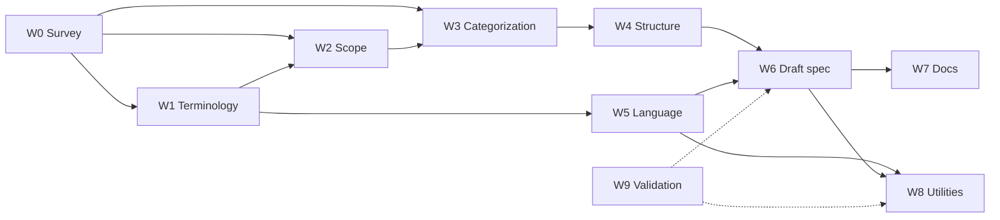

# openui-spec v1 — Publish first edition: plan

Sep 23, 2026 · @Shlomo Anglister

## Plan completion

This plan is a draft. Before execution it needs three passes, in order:

- [x] 1\. Resolve or defer the open questions (Q1–Q13) to their owning workstreams
  - [x] 1.1 Validate correctness and freshness of the plan (re-checked 2026-09-26 against v0.3.1)
  - [x] 1.2 Validate the questions are still valid
  - [x] 1.3 Enumerate the questions
  - [x] 1.4 Record a decision or owning-workstream deferral for each question
- [ ] 2\. Additional structure
- [ ] 3\. Step elaboration and refinement

## Goal and definition of done

Publish openui-spec **v1.0.0** as the first stable edition: one vocabulary, one categorization, one document structure and one UI-description language that downstream work (angular-django2, django-angular3) can build on without expecting breaking churn.

The edition is done when all of these hold:

1. **Terminology** — every normative term is defined once in the glossary, with a cross-framework alias table (HTML/ARIA, openui5, Qt, Angular Material). No other doc redefines a term.
2. **Scope** — a normative in-scope / out-of-scope statement exists and every catalog object falls inside it.
3. **Categorization** — one taxonomy. Today there are four overlapping ones; the Qt and HTML surveys recommend keeping the scope tree and the purpose taxonomy as linked views of one vocabulary.
4. **Structure** — the spec document is split into numbered normative and informative parts. Generator-specific content moves out of the spec.
5. **Language** — the UI-description grammar (EBNF + JSON Schema) is frozen at 1.0, including binding, event and data-reference rules.
6. **Survey traceability** — every leaf scope cites the survey rows that justify it (evidence register).
7. **Utilities** — Python and TypeScript packages parse, model and validate v1.0 documents with identical results on a shared conformance suite.
8. **Validation** — CI runs format, lint, spec-content lint and conformance tests on Linux and Windows.
9. **Visibility** — a published web page shows the v1.0 spec: taxonomy browser, per-object pages and live rendered examples.

## Current state (openui-spec main @ 1c90f5c, v0.3.1)

Re-checked on 2026-09-26 against `main` (19 commits after the first draft). The survey is now in the repo, the grammar has a single source of truth, and two releases shipped. Rows marked *changed* differ from the 2026-09-23 draft.

| Area | What exists | Gap for v1.0 |
| --- | --- | --- |
| Survey (*changed*) | `spec/survey/` with 4 sources: `angular-material/`, `html5/` (WHATWG HTML), `openui5/`, `qt/`. Each has its own taxonomy mapping, proposed evidence and scope-extension proposal | No cross-source matrix; proposals overlap (e.g. `modal_interaction` in both Angular Material and Qt); `spec/survey/` is excluded from pre-commit, markdownlint and mkdocs |
| Terminology (*changed*) | Glossary in `spec/README.md` (23 term entries). All terminology decisions approved 2026-09-27 in [`terminology.md`](terminology.md#summary), not yet applied | No alias table across the 4 sources |
| Scope | One-line purpose in `spec/README.md` and `docs/REQUIREMENTS.md` | No explicit in/out list. Qt and HTML surveys already defer host-shell integration, browser internals, storage, workers |
| Categorization (*changed*) | 11 top-level scopes; purpose taxonomy (`docs/generic-ui-taxonomy.md`); 15-category `docs/ui-element-taxonomy.md`; openui5 7-category classification key. Qt and HTML proposals both recommend: keep the scope tree + purpose taxonomy as linked views, extend in place, no new tree | Decided in [`category.md`](category.md#summary), not yet applied; `ui-element-taxonomy.md` to be merged, then retired (W3 task 14) |
| Structure | `spec/README.md` mixes glossary, artifact roles, format, grammar, incremental generation | No normative/informative split; generator content inside the spec |
| Language (*changed*) | `EBNF.txt` declared authoritative; JSON Schema is a projection; `spec/bin/check_grammar_consistency` (moved from `spec/tooling/` by PR #159) enforces EBNF ↔ schema ↔ README ↔ catalog in pre-commit. 0.3.0 added same-document element references (quoted ids in Uses attrs) | Still `string \| null` values and `[x]` / `(x)` keys; no data-binding, event-payload or i18n rules |
| Catalog (*changed*) | 47 leaf `*.scope.md` files; 82 distinct type literals; new `Route`, `NavItem`, `NavGroup`, `ToolBar`, `ToolBarRow`, `ToolAction` contracts | Many leaves still Purpose-only; evidence register does not yet cite the survey |
| Utilities | Python: `openui_spec`, `compare_openui_spec`, `to_json`, TatSu parser, grammar consistency checker. TS: `OpenUiJson`, `ng-openui-spec` CLI (ajv) | No shared conformance suite; no object model beyond the JSON tree |
| Validation | pre-commit (prettier, markdownlint, ruff, yamllint, check-json, grammar/catalog consistency); unittest; CI on Ubuntu + Windows | Evidence-row lint and internal link check exist (PR #159); scope-template and glossary lint rules (W9 2.1, 2.3) wait on W1 task 7 |
| Visibility | `generated-examples` Angular app with screenshots; Read the Docs via mkdocs | No single published page for the spec itself |

## Workstreams

Ten workstreams in three layers: consolidate the foundations (W1–W5), write the spec (W6), then document, tool and validate it (W7–W9).

| # | Workstream | Question it answers | Main deliverable |
| --- | --- | --- | --- |
| W0 | Survey consolidation | What do HTML, openui5, Qt and Angular Material call and group each UI artifact, and which proposed scopes are accepted? | Cross-source comparison matrix (4 surveys) + reconciled scope-extension list |
| W1 | Terminology | Which word does OpenUI use, and what does it mean? | Glossary v1 + cross-framework alias table |
| W2 | Scope | What is the spec, what is in, what is out? | Normative scope statement (in / out / deferred) |
| W3 | UI categorization | What is the single most natural way to group UI artifacts? | One taxonomy; the other two re-expressed as informative views |
| W4 | Specification structure | How is the spec document organized? | Numbered outline with normative/informative parts; file layout |
| W5 | UI description language | How does an author describe a UI? | Grammar v1.0 (EBNF + JSON Schema), binding/event/i18n rules, versioning policy |
| W6 | Draft first spec | — | v1.0.0-rc.1 spec text + regenerated catalog |
| W7 | Documentation | — | Updated README, REQUIREMENTS, CONTRIBUTING, AGENTS/CLAUDE, CHANGELOG, Read the Docs site |
| W8 | Spec utilities | Can tools parse, model and validate v1.0? | Python + TS parse/model/validate APIs passing one conformance suite |
| W9 | Validation | Is every change checked the same way everywhere? | Format + lint + spec-content lint + tests in CI on Linux and Windows |

```mermaid
flowchart LR
  W0[W0 Survey] --> W1[W1 Terminology]
  W0 --> W2[W2 Scope]
  W0 --> W3[W3 Categorization]
  W1 --> W2[W2 Scope]
  W2 --> W3
  W3 --> W4[W4 Structure]
  W1 --> W5[W5 Language]
  W4 --> W6[W6 Draft spec]
  W5 --> W6
  W6 --> W7[W7 Docs]
  W5 --> W8[W8 Utilities]
  W6 --> W8
  W9[W9 Validation] -.-> W6
  W9 -.-> W8
```

W9 starts first and runs alongside everything else; dashed arrows mean it gates W6 and W8 rather than feeding content.

## Tasks

Each task ends with a validation step and a visual demo, per the project rules. One task = one GitHub issue = one PR, approved step by step.

### W9 Validation (first, runs throughout)

1. Consolidate validation infrastructure.
   - 1.1 Create a `spec/bin` folder. — **done**
   - 1.2 Move `spec/to_json` into `spec/bin`. — **done**
   - 1.3 Move tooling tools into `spec/bin`; create a tool for each tool in tooling just like `to_json`. — **done**: `spec/bin/check_grammar_consistency/`; the guides `editing.md` and `comparison.md` stay in `spec/tooling/`.
   - 1.4 Update code, tests, and documents. — **done**
2. Add a spec-content linter (`spec/bin/lint_spec.py`) wired into pre-commit; implement its framework first, then enable terminology-dependent rules after W1 task 7:
   - 2.1 after W1 task 7, every leaf `*.scope.md` matches `template.scope.md` sections; — **open**: registered as `template-sections` but disabled and not implemented; implement and enable after W1 task 7 (execution order step 4);
   - 2.2 every leaf has exactly one row in `evidence.md`; — **done** (`evidence-row`)
   - 2.3 after W1 task 7, glossary terms are defined once; other docs link instead of redefining; — **open**: registered as `glossary-single-definition` but disabled and not implemented; implement and enable after W1 task 7 (execution order step 4);
   - 2.4 ~~`openui.json` is up to date with the prose~~ — **done**: enforced by `check_grammar_consistency` since 2026-09-26. Framework, `--html` report and tests — **done**. *Validate:* unit tests with passing and failing fixtures. *Demo:* HTML lint report page.
3. Add a Markdown link checker to pre-commit. *Validate:* zero broken internal links. — **done** (`spec/bin/check_links.py`)
   - 3.1 Remove the plain-text references in `AGENTS.md` to `docs/TEST_PLAN.md` and `generators/angular/generator/docs/TDD.md`, which do not exist; the link checker checks links only, so it cannot catch them. — **open** (execution order step 1)

   **Done (2026-09-27) for 1, 2 (framework and 2.2) and 3** in [PR #159](https://github.com/shlomoa/openui-spec/pull/159), merged 2026-09-27 and merged into this branch: tools moved to `spec/bin` (`python -m spec.bin.<tool>`), `lint_spec.py` with rule 2.2 and an `--html` report, and `check_links.py` in pre-commit; 9 broken internal links fixed. Still open: 2.1, 2.3 and 3.1.

### W0 Survey consolidation

4. Choose a directory structure and content for all surveys.
   References in markdown files must point to an existing file in inventory folder (once created and content moved) and section.

   - 4.1 inventory: a folder to include all the surveyed data
     - 4.1.1 Move all surveyed data files into this folder
   - 4.2 taxonomy_mapping.md: content with references
   - 4.3 category.md: content with references
   - 4.4 README.md: summary and TOC
   - 4.5 PLAN.md: The plan executed
   - 4.6 SUMMARY.md a summary of the survey, the steps, findings, decisions, reasoning, etc.
   - 4.7 architecture_proposal.md: contains a change proposal for the entire solution or part of it \[optional\]
   - 4.8 scopes_proposal.md: scopes tree architectural and content change \[optional\]
   - 4.9 openui_schema_proposal.md: proposal for schema change \[optional\]
   - 4.10 opens.md: open and unresolved questions / issues / directions with references \[optional\]
   - 4.11 scopes: a folder of structure not yet decided to include the consolidated surveyed specification

   **Done (2026-09-26) for 4.1–4.10** in all four surveys (`angular-material/`, `html5/`, `openui5/`, `qt/`). Each survey's original data moved unchanged into its `inventory/` folder, with relative links rewritten; `html5/inventory/inventory/` keeps the chapter files. `openui5/` has no `openui_schema_proposal.md` because that survey proposes no schema change. 4.11 is dropped (decided 2026-09-27): the consolidated outputs live in `spec/survey/`, and applying them is W1 and W3 work.

   **Consolidated proposals (2026-09-27):** [`terminology.md`](terminology.md#summary) (all decisions approved), [`schema_change.md`](schema_change.md#schema-change-proposal) (not needed) and [`structure_change.md`](structure_change.md#add) (two new Behaviors scopes). [`category.md`](category.md#summary) (2026-09-27) consolidates the four survey `category.md` files and is approved in full. [`taxonomy_mapping_change.md`](taxonomy_mapping_change.md#summary) (2026-09-27) consolidates the four survey `taxonomy_mapping.md` files and is approved in full.

5. Build `matrix.csv` by merging the four `TAXONOMY_MAPPING.md` files: concept × {HTML, WAI-ARIA, openui5, Qt, Angular Material}. Columns: name, category in that source, key properties, events, OpenUI scope. Flag each row: *same term/same meaning*, *same term/different meaning*, *different term/same meaning*, *unique*. *Validate:* script checks every catalog type appears in the matrix. *Demo:* sortable/filterable matrix web page.
6. Reconcile the scope-extension proposals (Angular Material `proposed-scopes/`, Qt P01–P06, HTML P1–P8) into one accept / defer / reject list, de-duplicating overlaps such as `modal_interaction` and `collapsible`. *Demo:* proposal table on the matrix page.
   **Partly done (2026-09-27):** the new-scope proposals are reconciled. Two new scopes are accepted in [`structure_change.md`](structure_change.md#add); every other proposed scope was remapped to an existing scope or dropped, as recorded in [`terminology.md`](terminology.md#49-terms-that-need-a-new-scope). The accept / defer / reject list for existing-leaf enhancements is still open.

### W1 Terminology

7. Create a separate local terminology / vocabulary / glossary section in `scope.md` files for terms local to the current scope level:
   - 7.1 Move all terminology / glossary / vocabulary definitions from `spec/README.md`, `spec/scopes/evidence.md`, `spec/scopes/taxonomy_mapping.md`, and `spec/scopes/template.scope.md` into `spec/scopes/scope.md`.
   - 7.2 Add appropriate references from the former locations to the moved content.
8. Pick the canonical-term rule (e.g. W3C/ARIA name first, then majority across frameworks) and record it as a decision.
   - 8.1 Collect all the terms from existing scopes and surveyed UI frameworks.
   - 8.2 Create a canonical list of terms.
   - 8.3 Add an alias table (canonical term → openui5 / Qt / Angular Material / ARIA names).
   - 8.4 Catalog any conflict / duplicate / wrong aliased term.

   **Done (2026-09-27) for 8, 8.1, 8.2 and 8.4** in [`terminology.md`](terminology.md#appendix-a-canonical-term-rule): the canonical-term rule is approved, and each term is recorded as a Change, Replace, Delete or Add. 8.3 is deferred to task 9.8, so the alias table uses the final names.
9. Review and resolve conflicts in terminology.

   **Done (2026-09-27):** [`terminology.md`](terminology.md#summary) is approved in full, including the terms not added.

   Apply the approved terminology. These are specification changes, so they follow [`RELEASING.md`](../../RELEASING.md#schema-and-catalog-version-changes). Do task 7 first, so the glossary changes land in their final location.
   - 9.1 Glossary: add A1–A5 (Owner, Controlled element, Controlling element, Trigger, Window); apply C6 (move "component" and "UI component" from the Widget aliases to the Object aliases) and D2 (remove "widget instance" from the Element aliases); add the conflicting-meaning notes for Page, Control, Element and Grid ([appendix A](terminology.md#appendix-a-canonical-term-rule)).
   - 9.2 Taxonomy mapping: apply C1–C6, R1–R11 and D1 in `spec/scopes/taxonomy_mapping.md`, and add A6–A72 with their scope and abstraction level. Apply [`taxonomy_mapping_change.md`](taxonomy_mapping_change.md#summary) in the same pass.
   - 9.3 Generic taxonomy: make the same renames and additions in `docs/generic-ui-taxonomy.md`, which the taxonomy mapping is based on.
   - 9.4 New scopes: create `Behaviors/input_assistance.scope.md` and `Behaviors/viewport_and_focus_control.scope.md` from `template.scope.md`, list them in `Behaviors/scope.md`, and add one row each to `spec/scopes/evidence.md`.
   - 9.5 Decide whether Modal overlay, moved to Behaviors by C4, needs its own scope file or is covered by an existing leaf.
   - 9.6 Regenerate `spec/openui.json`, bump `SCHEMA_VERSION` and the package versions, and update examples, fixtures and `CHANGELOG.md`.
   - 9.7 Validate: pre-commit, unit tests, `mkdocs build --strict` and the npm tests.
   - 9.8 Build the alias table (task 8.3) from the survey `taxonomy_mapping.md` files, using the final names.

### W2 Scope

10. Write the normative scope section: purpose, audience, in scope, out of scope, deferred to later editions.
11. Classify every catalog object and every survey concept as in / out / deferred. *Validate:* no catalog object is out of scope. *Demo:* scope map page.
12. Split `docs/REQUIREMENTS.md` so spec requirements and generator requirements are separate.

### W3 UI categorization

13. Choose the primary axis (see open questions) and define the category set with inclusion rules.

   **Done (2026-09-27):** [`category.md`](category.md#summary) is approved: keep the nine sections, add a Behaviors section and 21 subcategories with inclusion rules and member lists. It is applied in W1 step 9.3 and W3 task 14.4.
14. Re-map all 47 leaf scopes and all taxonomy entries to it; keep `docs/generic-ui-taxonomy.md` as an informative view of the mapping, and merge, then retire, `docs/ui-element-taxonomy.md` (decided 2026-09-27, Q4 sub-question):
    - 14.1 Merge proposal: write `spec/survey/ui_element_taxonomy_merge_proposal.md` with the same mechanism as [`terminology.md`](terminology.md#appendix-a-canonical-term-rule). For each of the about 176 abstract types that match no taxonomy entry or approved term, record Change, Replace, Delete or Add with section, subcategory, scope, abstraction level, evidence and source URL, or list it under "Not added" with the reason. Types for Accessibility wait on Q13. Depends on the decisions of task 13.
    - 14.2 Approve the merge proposal, decision by decision.
    - 14.3 Classification rules: move the "Classification rules" section of `docs/ui-element-taxonomy.md` into `spec/scopes/taxonomy_mapping.md` as the inclusion rules of the sections and subcategories.
    - 14.4 Apply the category changes: the heading changes, the Behaviors section and the subcategories of [`category.md`](category.md#summary) in `spec/scopes/taxonomy_mapping.md` and `docs/generic-ui-taxonomy.md`. Done in the same pass as W1 tasks 9.2 and 9.3.
    - 14.5 Apply the approved merge additions from 14.1 in the same pass.
    - 14.6 Retire `docs/ui-element-taxonomy.md`: delete it, fix every link to it, and record in the merge proposal where each of its categories and abstract types went.
    - 14.7 Validate: pre-commit, link check, `mkdocs build --strict` and unit tests; every taxonomy entry belongs to exactly one section and at most one subcategory.
15. Rename or move scope folders to match. *Validate:* every object has exactly one primary category; catalog regenerates. *Demo:* interactive taxonomy tree with per-framework overlay.

### W4 Specification structure

16. Define the v1.0 outline, e.g.: 1 Introduction & scope · 2 Conformance · 3 Terminology · 4 Document model & language · 5 Categories & objects · 6 Catalog · Annex A Grammar · Annex B Survey mapping · Annex C Examples.
17. Define RFC 2119 keyword use (MUST/SHOULD/MAY) and mark normative vs. informative sections.
18. Move incremental-generation and generator content out of `spec/README.md` into the generator docs.

### W5 UI description language

19. Decide attribute value typing (string/null only vs. typed values).
20. Replace the Angular-flavoured `[x]` / `(x)` key syntax with a framework-neutral one for Uses / Produces / Behaves, or formally adopt it.
21. Define data-binding references, event payloads and i18n string references. Same-document element references already exist (0.3.0); extend, don't replace.
22. Define versioning and compatibility policy (SemVer for the spec; how documents declare the version).
23. Update `EBNF.txt` (authoritative) and regenerate the JSON Schema projection; `check_grammar_consistency.py` already enforces agreement. *Validate:* both accept/reject the same conformance fixtures. *Demo:* live playground page — paste JSON, see validation and rendered tree.

### W6 Draft first spec

24. Rewrite the spec per W4 outline, using W1–W5 outputs.
25. Enrich each leaf scope (Attributes, Child model) from the survey matrix; add evidence rows.
26. Regenerate `openui.json`, bump to `1.0.0-rc.1`, migrate all examples and fixtures.
27. Review period, then coordinate the M5 `1.0.0` release with W8 task 35. *Validate:* full CI + conformance suite. *Demo:* published spec site with a rendered example per object (reuse `generated-examples`).

### W7 Documentation

28. Update README, REQUIREMENTS, CONTRIBUTING, RELEASING, AGENTS.md / CLAUDE.md / GEMINI.md, `.github/copilot-instructions.md`, agent files under `.github/agents/`.
29. Write CHANGELOG `1.0.0` with a 0.3 → 1.0 migration guide.
30. Publish to Read the Docs. *Demo:* the site itself.
31. After W6 task 27 and W8 task 35, notify downstream: angular-django2 (#98/#103 TS parser) and django-angular3.

### W8 Spec utilities

32. Create a shared conformance suite (`spec/conformance/`: valid + invalid documents with expected diagnostics); create its fixture structure early and finalize the suite after W5 task 23 freezes the grammar and schema.
33. After W5 task 23 and task 32, Python: parse (EBNF + JSON) → typed object model → validate (grammar, catalog membership, scope contract).
34. After W5 task 23 and task 32, TypeScript: same API surface in `@shlomoa/openui-spec`.
35. Both packages pass the same suite; publish `1.0.0` to PyPI and npm as part of the M5 release. *Demo:* the W5 playground uses the TS validator.

## Milestones

Five GitHub milestones, each ending with a tagged release and a visible web page. No dates yet — set them once the open questions are answered.

| Milestone | Release | Tasks | Exit criterion | Visual demo |
| --- | --- | --- | --- | --- |
| M1 Guard rails | `0.4.0` | 1–3 | CI green on Linux and Windows with spec-content lint (1, 2.2 and 3 merged in PR #159; 2.1 and 2.3 wait on W1 task 7) | Lint report page |
| M2 Survey consolidated | `0.5.0` | 4–6 | Matrix covers all 82 catalog types | Survey matrix page |
| M3 Foundations agreed | `0.6.0` | 7–19 | Glossary, scope, taxonomy and outline approved | Glossary + taxonomy tree pages |
| M4 Language frozen | `0.7.0` | 20–24, 32–34 | Grammar 1.0 + conformance suite merged | Validation playground |
| M5 v1.0.0 published | `1.0.0` | 25–31, 35 | Packages at 1.0.0 on PyPI + npm; docs live | Published spec site with rendered examples |

M2 and M1 can run in parallel. M4 can start as soon as W1 terminology is settled (task 9); it does not need the taxonomy.

## Execution order

The execution stack, top first. A step starts when the steps it depends on are done; steps with the same number can run in parallel. The order puts decisions before edits, and collects every change to the glossary, the taxonomy mapping and the generic taxonomy into one application pass and one release.

| # | Step | Plan tasks | Depends on | Status |
| --- | --- | --- | --- | --- |
| 1 | Guard rails: tooling folder, spec-content lint framework, link checker | W9 1, 2 (framework, 2.2), 3 | — | Done in [PR #159](https://github.com/shlomoa/openui-spec/pull/159), merged |
| 1 | Remove stale file references from `AGENTS.md` | W9 3.1 | — | Open |
| 1 | Category decisions in [`category.md`](category.md#summary) | W3 13 | — | Done (2026-09-27) |
| 1 | Cross-source matrix and the rest of the scope reconciliation | W0 5, 6 | — | Open (6 partly done) |
| 2 | UI element taxonomy merge proposal and its approval | W3 14.1, 14.2 | Step 1 category decisions (target subcategories) | Open |
| 2 | Move the glossary to its final location | W1 7 | — | Open |
| 3 | Apply terminology, categories and merge in one pass: glossary, taxonomy mapping, generic taxonomy, classification rules, two new Behaviors scopes, Modal overlay decision | W1 9.1–9.5; W3 14.3–14.5 | Steps 2 | Open |
| 4 | Regenerate, version and validate; release `0.x.0` | W1 9.6, 9.7; W3 14.7 | Step 3 | Open |
| 4 | Retire `docs/ui-element-taxonomy.md` | W3 14.6 | Step 3 | Open |
| 4 | Implement and enable the scope-template and glossary lint rules | W9 2.1, 2.3 | W1 7 | Open |
| 5 | Alias table from the survey mappings, with the final names | W1 9.8 (8.3) | Steps 3, W0 5 | Open |
| 5 | Language decisions and grammar (M4 may start here) | W5 19–23; W8 32 fixture structure | W1 9 | Open |
| 6 | Scope statement and in / out classification; answers Q9 and Q13 | W2 10–12 | W1 9, W0 6 | Open |
| 7 | Accessibility types of the merge, if Q13 puts them in scope | W3 14.1–14.5 (remainder) | Step 6 | Open |
| 7 | Map leaf scopes to the categories; rename or move scope folders | W3 14, 15 | Steps 4, 6 | Open |
| 8 | Specification outline and normative split | W4 16–18 | Step 7 | Open |
| 9 | Draft the spec, enrich leaves from the matrix, `1.0.0-rc.1` | W6 24–26 | Steps 5, 8 | Open |
| 9 | Conformance suite and Python / TypeScript utilities | W8 32–34 | W5 23 | Open |
| 10 | Review and release `1.0.0`; packages; documentation; notify downstream | W6 27; W8 35; W7 28–31 | Step 9 | Open |

Priority: step 3 is the first specification change and unblocks the language work (step 5), so the decisions and proposals feeding it (steps 1–2) come first. The categorization of scope folders (step 7) waits on the scope statement, as the workstream graph requires.

## Open questions

Re-validated 2026-09-26: of the original 9, 2 are answered by the repo, 3 are partly answered by the survey proposals and reframed, 4 stand as asked, and 4 are new. A question blocks only the workstream task that depends on its decision; unrelated work may proceed.

| # | Question | Status | Evidence / options |
| --- | --- | --- | --- |
| Q1 | Which is the fourth surveyed source? | Decided | HTML (WHATWG Living Standard), `spec/survey/html5/` |
| Q2 | Where are the survey results? | Decided | `spec/survey/` on `main` since commit 215f2e7 |
| Q3 | Is the first edition `1.0.0`, or a `0.x` candidate with `1.0.0` later? | Decided — continue `0.x.0` / `0.x.y` releases; defer any release candidate | Validate the spec in downstream tools and packages before attempting a release candidate |
| Q4 | Adopt the surveys' categorization: 11-scope contract tree + purpose taxonomy as linked views, extend in place? | Decided — keep the scope tree and the purpose taxonomy as linked views and extend in place: nine sections plus Behaviors, with 21 subcategories ([`category.md`](category.md#summary)) | Qt `TAXONOMY_STRUCTURE_PROPOSAL.md` and HTML `SCOPE_TREE_PROPOSAL.md` both say yes, no new tree; [`category.md`](category.md#kept) proposes it. Sub-question decided 2026-09-27: merge `docs/ui-element-taxonomy.md` (15 categories) into the canonical taxonomy, then retire it (W3 tasks 14.1–14.7) |
| Q5 | Canonical-term rule: HTML/ARIA name wins, or majority across sources? | Decided — keep the existing OpenUI term; otherwise the HTML or WAI-ARIA name; otherwise the majority across frameworks; otherwise a neutral descriptive name | [`terminology.md`](terminology.md#appendix-a-canonical-term-rule) |
| Q6 | Attribute values: keep `string \| null`, or add typed values? | Decided — introduce typed values in a later W5 grammar revision | Current grammar permits `string \| null`; 0.3.0 element references are quoted strings |
| Q7 | Attribute keys: keep `[x]` / `(x)`, or neutral keys (`uses.x`, `produces.x`, `behaves.x`)? | Deferred — blocks W5 task 20 | Still Angular syntax in `spec/README.md` and the leaf template |
| Q8 | Does the Angular generator stay in openui-spec for v1.0, or move to angular-django2? | Deferred — no workstream currently blocked | Still at `generators/angular/` |
| Q9 | Qt desktop-only concepts: confirm host-shell presence deferred, MDI / docking as optional runtime capabilities? | Deferred — W2 tasks 10–11, informed by W0 task 6 | Already proposed so in Qt `SCOPE_EXTENSION_PROPOSAL.md` |
| Q10 | Apply the approved Standalone / Controlling element glossary entries now, or inside W1? | Superseded — Standalone is not added; Owner, Controlled element and Controlling element are approved instead and applied in W1 task 9.1 | [`terminology.md`](terminology.md#41-glossary-terms) |
| Q11 | Which proposed scopes enter v1.0? | Decided — include all scopes resulting from W0 survey consolidation: `Behaviors/input_assistance` and `Behaviors/viewport_and_focus_control` | [`structure_change.md`](structure_change.md#add) |
| Q12 | Where do the plan and consolidated outputs live? | Superseded — the current plan location is defined; W0 task 4 placed the consolidated outputs in `spec/survey/` | The current plan is `spec/survey/specui_v1_publish_plan.md`; W0 task 4 defined the output location, so this combined question is obsolete |
| Q13 | Add HTML's conditional Accessibility and Composition top-level scopes in v1.0, or defer? | Deferred — W2 tasks 10–11 determine whether they are in this project's scope | HTML P6 / P7 |

## Sources

- [shlomoa/openui-spec](https://github.com/shlomoa/openui-spec) — `main` at `1c90f5c` (v0.3.1), re-checked 2026-09-26: `CHANGELOG.md`, `spec/EBNF.txt`, `spec/README.md`, `spec/scopes/`, `spec/tooling/check_grammar_consistency.py`, `.pre-commit-config.yaml`, `.github/workflows/build.yml`, `spec/survey/**` (proposal and README files).
- First draft based on `main` at `b97f3f8` (v0.2.0), 2026-09-23.
