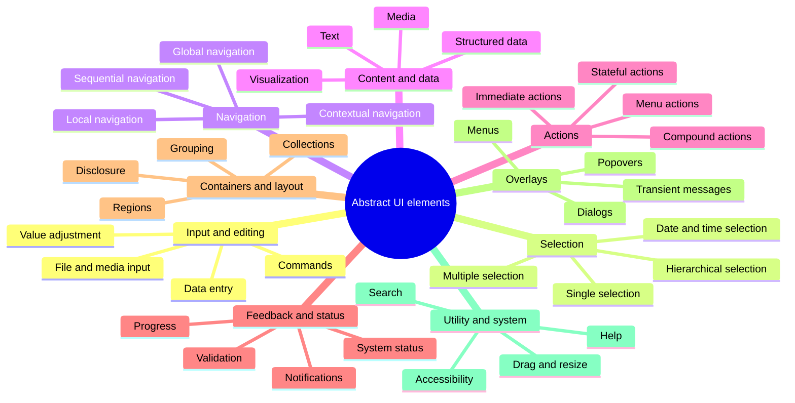

# Taxonomy of Abstract UI Element Types

An **abstract UI element type** describes an element by its purpose and behavior, independent of framework, platform, visual style, or implementation technology.

This document is one of the three [taxonomy documents](../scopes/scope.md#taxonomy-documents).
It owns the abstract element types in 15 categories, with their purpose and typical
concrete elements, the OpenUI term each type maps to, and the
[classification rules](#classification-rules) with their primary and secondary role
examples. The [generic UI taxonomy](generic-ui-taxonomy.md) owns the sections,
subcategories and entries that the OpenUI terms belong to, and the
[taxonomy mapping](../scopes/taxonomy_mapping.md) owns their scope objects. Term
definitions and aliases live in the [glossary](../scopes/scope.md#glossary), and object
contracts in the scope files; a type description MUST NOT contradict them.

There is no universally standardized “complete” taxonomy. The following model aims to cover the element types used across web, desktop, mobile, touch, TV, embedded, voice-assisted, and mixed-interface applications.

The **OpenUI term** column names the taxonomy entries each abstract type maps to; Status
indicator is the name of a scope object. The column follows the merge of this taxonomy into
the OpenUI taxonomy ([merge proposal, appendix A](https://github.com/shlomoa/openui-spec/blob/archive/spec-survey/spec/survey/ui_element_taxonomy_merge_proposal.done.md#appendix-a-where-each-abstract-type-went)).
Some types were added later to give a home to an OpenUI term that no other type reached.
"Not added" marks a type that OpenUI does not add; the reasons are in the merge proposal's
[Not added](https://github.com/shlomoa/openui-spec/blob/archive/spec-survey/spec/survey/ui_element_taxonomy_merge_proposal.done.md#not-added) and [Delete](https://github.com/shlomoa/openui-spec/blob/archive/spec-survey/spec/survey/ui_element_taxonomy_merge_proposal.done.md#3-delete) lists.

## 1. Input and Editing Elements

Elements that allow users to enter, modify, upload, or manipulate information.

| Abstract type             | Purpose                                                      | Typical concrete elements                           | OpenUI term                                              |
| ------------------------- | ------------------------------------------------------------ | --------------------------------------------------- | -------------------------------------------------------- |
| Text Input                | Enter short, unformatted text                                | Text field, search field, URL field                 | Text field                                               |
| Structured Text Input     | Enter text constrained to a format                           | Email, telephone, IP address, mask input            | Text field; Constraint validation                        |
| Numeric Input             | Enter a number                                               | Number field, stepper, spin box                     | Spin box                                                 |
| Password Input            | Enter concealed sensitive text                               | Password field, PIN field                           | Password field                                           |
| Multiline Text Input      | Enter longer textual content                                 | Text area, expanding editor                         | Text area                                                |
| Rich-Text Input           | Enter formatted content                                      | Rich-text editor, Markdown editor                   | Rich text editor                                         |
| Code Input                | Enter or edit source code                                    | Code editor, query editor                           | Text area                                                |
| Autocomplete Input        | Enter text with suggestions                                  | Combobox, typeahead                                 | Suggestion-backed combo box; Combo box; Input assistance |
| Tokenized Input           | Enter multiple discrete values                               | Chip input, recipient field, tag editor             | Token collection; Editable chip collection               |
| Boolean Input             | Set a binary value                                           | Checkbox, switch, toggle                            | Checkbox; Switch; Toggle button                          |
| Range Input               | Choose a value within a range                                | Slider, range slider, dial                          | Slider; Rotary value control                             |
| Incremental Input         | Increase or decrease a value                                 | Stepper, spinner                                    | Step input                                               |
| Direct Manipulation Input | Change a value by manipulating its representation            | Drag handle, resize handle, rotation control        | Drag handle; Resize handle; Drag and drop                |
| Drawing Input             | Provide freehand or geometric input                          | Canvas, signature pad, sketch area                  | Drawing area; Canvas                                     |
| Color Input               | Select or enter a color                                      | Color picker, palette, eyedropper                   | Color picker                                             |
| File Input                | Select files from storage                                    | File picker, upload field, drop zone, folder picker | File picker; File upload; Folder picker                  |
| Capture Input             | Capture information from a device                            | Camera capture, microphone recorder, scanner        | Microphone input; Camera preview                         |
| Voice Input               | Enter content through speech                                 | Dictation button, voice prompt                      | Not added                                                |
| Form                      | Group related inputs into a submission or editing unit       | Registration form, settings form                    | Form                                                     |
| Form Field                | Combine an input with its label, help, state, and validation | Labeled field, field wrapper                        | Form field                                               |
| Input Group               | Combine related inputs or input accessories                  | Address group, field with unit selector             | Form group; Form field                                   |
| Shortcut Input            | Record a key combination                                     | Keyboard shortcut field, hotkey editor              | Keyboard shortcut field                                  |
| Metadata-Driven Input     | Pick the editor from the data type of the value              | Smart field, generic value editor                   | Metadata-driven field                                    |

## 2. Selection Elements

Elements used to choose one or more options from a known or discoverable set.

| Abstract type             | Purpose                                 | Typical concrete elements             | OpenUI term                                                    |
| ------------------------- | --------------------------------------- | ------------------------------------- | -------------------------------------------------------------- |
| Binary Selection          | Choose between two states               | Checkbox, switch                      | Checkbox; Switch                                               |
| Exclusive Selection       | Select exactly one option               | Radio group, segmented control        | Radio button; Exclusive selection coordination; Selection mode |
| Optional Single Selection | Select zero or one option               | Dropdown, select, listbox             | Dropdown; List box; Selection mode                             |
| Multiple Selection        | Select zero or more options             | Checkbox group, multi-select          | Selection mode; Checkbox; Multi-select combo box               |
| Segmented Selection       | Select from a small visible set         | Segmented button, choice chips        | Toggle button; Exclusive selection coordination                |
| List Selection            | Select entries from a list              | Listbox, selectable list              | List box                                                       |
| Grid Selection            | Select cells or items in two dimensions | Data grid, image picker               | Data grid                                                      |
| Hierarchical Selection    | Select from nested options              | Tree view, cascading selector         | Tree view                                                      |
| Transfer Selection        | Move selected items between sets        | Transfer list, dual listbox           | Not added                                                      |
| Ordered Selection         | Select and arrange items                | Reorderable list, ranking control     | List; Drag and drop                                            |
| Date Selection            | Select a calendar date                  | Date picker, calendar, date field     | Date picker; Date field                                        |
| Time Selection            | Select a time                           | Time picker, clock picker, time field | Time picker; Time field                                        |
| Date-Time Selection       | Select a combined date and time         | Date-time picker                      | Date and time field                                            |
| Duration Selection        | Select a length of time                 | Duration field, interval picker       | Not added                                                      |
| Range Selection           | Select start and end values             | Date-range picker, dual-thumb slider  | Range slider; Date picker                                      |
| Wheel Selection           | Select values by rotating columns       | Wheel picker, scroll picker           | Wheel picker                                                   |
| Rating Selection          | Choose an ordinal evaluation            | Star rating, reaction scale           | Rating control                                                 |
| Spatial Selection         | Select a location or region             | Map picker, crop region               | Geographic map; Graphics viewport                              |
| Font Selection            | Select a font                           | Font picker, font-family list         | Font picker; Font-family selector                              |

## 3. Action and Command Elements

Elements through which users request operations.

| Abstract type       | Purpose                                         | Typical concrete elements          | OpenUI term                     |
| ------------------- | ----------------------------------------------- | ---------------------------------- | ------------------------------- |
| Primary Action      | Invoke the main action in a context             | Primary button                     | Button                          |
| Secondary Action    | Invoke a supporting action                      | Secondary button                   | Button                          |
| Tertiary Action     | Invoke a lower-emphasis action                  | Text button, link button           | Button                          |
| Icon Action         | Invoke an action using a compact symbol         | Icon button, tool button           | Icon button; Tool button        |
| Destructive Action  | Perform a potentially damaging operation        | Delete button                      | Button                          |
| Stateful Action     | Invoke and represent a persistent state         | Toggle button, favorite button     | Toggle button                   |
| Repeating Action    | Repeat while activated                          | Press-and-hold control             | Not added                       |
| Split Action        | Offer a default action and related alternatives | Split button                       | Menu button                     |
| Compound Action     | Present several related actions as one unit     | Button group, toolbar              | Toolbar                         |
| Floating Action     | Expose a prominent contextual action            | Floating action button             | Button                          |
| Menu Action         | Invoke an action from a menu                    | Menu item, dropdown-menu item      | Menu item                       |
| Contextual Action   | Act on a selected or focused object             | Context menu command, row action   | Context menu; Menu item         |
| Submission Action   | Commit entered data                             | Submit, save, apply                | Button                          |
| Cancellation Action | Abandon or reverse an operation                 | Cancel, dismiss                    | Button                          |
| Undoable Action     | Reverse a recent operation                      | Undo, redo                         | Button; Menu item; List         |
| Shortcut Action     | Invoke a command through an alternate input     | Keyboard shortcut, gesture command | Modifier-key combination; Swipe |
| Menu Bar            | Offer menus of commands in a bar                | Application menu bar               | Menubar                         |

## 4. Navigation Elements

Elements that move users between locations, views, sections, records, or states.

| Abstract type           | Purpose                                          | Typical concrete elements                           | OpenUI term                                     |
| ----------------------- | ------------------------------------------------ | --------------------------------------------------- | ----------------------------------------------- |
| Navigation Link         | Move to another destination                      | Hyperlink, navigation item                          | Link; Navigation item                           |
| Global Navigation       | Navigate among major application areas           | Navigation bar, app bar, navigation rail, shell bar | Navigation bar; Navigation Rail; Shell bar      |
| Local Navigation        | Navigate within the current area                 | Sidebar, local menu                                 | Navigation group                                |
| Responsive Navigation   | Provide navigation adapted to limited space      | Hamburger button, navigation drawer                 | Hamburger button; Navigation Drawer             |
| Tab Navigation          | Switch between peer views                        | Tabs, tab bar                                       | Tab Bar                                         |
| Hierarchical Navigation | Move through nested structures                   | Tree navigation, nested menu, column browser        | Tree view; Column browser                       |
| Path Navigation         | Show and navigate the current hierarchy          | Breadcrumbs                                         | Breadcrumb                                      |
| Sequential Navigation   | Move forward or backward through ordered content | Previous/next controls                              | Pagination control; Carousel                    |
| Step Navigation         | Move through a multi-stage process               | Stepper, wizard navigation                          | Workflow stepper; Wizard                        |
| Pagination              | Navigate among discrete result pages             | Paginator                                           | Pagination control                              |
| Continuous Navigation   | Move through an unbounded collection             | Infinite scroll, load-more control                  | List                                            |
| Record Navigation       | Move between individual records                  | First, previous, next, last                         | Pagination control                              |
| Index Navigation        | Jump to a named or alphabetic section            | Index, A–Z rail                                     | Not added                                       |
| Anchor Navigation       | Jump within the current document or view         | Table of contents, anchor links                     | Link                                            |
| History Navigation      | Move through previously visited states           | Back, forward                                       | Routing; Route                                  |
| Spatial Navigation      | Move focus based on direction                    | D-pad navigation, focus grid                        | Focus management; Special-key input             |
| View Switcher           | Change the presentation of the same content      | List/grid switcher                                  | Toggle button; Exclusive selection coordination |
| Destination Launcher    | Open a destination, tool, or application         | App launcher, shortcut tile                         | Tile                                            |

## 5. Content and Data-Presentation Elements

Elements that communicate information without primarily accepting input.

| Abstract type     | Purpose                                               | Typical concrete elements                     | OpenUI term                 |
| ----------------- | ----------------------------------------------------- | --------------------------------------------- | --------------------------- |
| Text Content      | Present textual information                           | Paragraph, heading, caption, highlighted text | Text; Highlighted text      |
| Label             | Identify another element or value                     | Field label, item label                       | Label                       |
| Value Display     | Present a discrete value                              | Read-only field, metric                       | Text; Calculated output     |
| Icon              | Communicate identity, state, or meaning symbolically  | Functional icon, status icon                  | Icon                        |
| Image             | Present raster or vector visual content               | Photo, illustration                           | Image                       |
| Avatar            | Represent a person, entity, or agent                  | User avatar, organization mark                | Avatar                      |
| Badge             | Display a compact status or count                     | Notification badge, status badge              | Badge                       |
| Tag               | Display classification or metadata                    | Tag, chip, label                              | Tag                         |
| Key–Value Display | Present named attributes                              | Description list, property panel              | Description list            |
| List              | Present an ordered or unordered collection            | List, feed                                    | List                        |
| Table             | Present aligned data records                          | Table, matrix                                 | Table                       |
| Data Grid         | Present structured interactive tabular data           | Sortable grid, spreadsheet, tree grid         | Data grid; Tree grid        |
| Card              | Present a bounded collection representing one subject | Product card, summary card                    | Card                        |
| Tile              | Present a compact selectable destination or item      | Dashboard tile                                | Tile                        |
| Tree              | Present hierarchical data                             | File tree, outline                            | Tree                        |
| Timeline          | Present events in chronological order                 | Activity timeline                             | List                        |
| Calendar View     | Present information organized by date                 | Month view, agenda                            | Planning calendar           |
| Code Display      | Present source or machine-readable text               | Code block, diff viewer                       | Text                        |
| Quote Display     | Present attributed or emphasized text                 | Blockquote, testimonial                       | Text                        |
| Divider           | Express separation between regions                    | Separator, rule                               | Divider; Separator          |
| Placeholder       | Reserve or describe absent content                    | Skeleton, empty slot                          | Loader; Illustrated message |
| Empty State       | Explain that content is unavailable or nonexistent    | No-results state                              | Illustrated message         |
| Thumbnail         | Provide a small preview                               | Image thumbnail, document preview             | Image                       |
| Preview           | Present a representation before opening or committing | File preview, print preview                   | Not added                   |
| Shape             | Draw a geometric shape                                | Ellipse, rectangle, line, path                | Geometric shape             |
| Custom Graphics   | Show content that the application draws itself        | Graphics API surface                          | Custom graphics surface     |

## 6. Media Elements

Elements used to display or control time-based or immersive content.

| Abstract type     | Purpose                                             | Typical concrete elements         | OpenUI term                  |
| ----------------- | --------------------------------------------------- | --------------------------------- | ---------------------------- |
| Image Viewer      | Display and inspect images                          | Lightbox, zoomable viewer         | Image; Popover               |
| Gallery           | Present a navigable media collection                | Image gallery, carousel           | Carousel; Icon collection    |
| Audio Player      | Play and control audio                              | Podcast player                    | Media player                 |
| Video Player      | Play and control video                              | Embedded video player             | Media player                 |
| Media Controller  | Control playback independently of the media surface | Playbar, transport controls       | Media player                 |
| Timeline Scrubber | Navigate through time-based content                 | Seek bar                          | Media player                 |
| Volume Controller | Adjust sound level                                  | Volume slider, mute control       | Media player                 |
| Caption Display   | Present synchronized text                           | Subtitles, closed captions        | Captions                     |
| Transcript        | Present a textual media representation              | Audio transcript                  | Text                         |
| Live Media View   | Present real-time media                             | Live stream, camera monitor       | Media player; Camera preview |
| Immersive View    | Present panoramic or spatial content                | 360° viewer, AR view, VR viewport | Not added                    |
| Audio Description | Describe the visual content of a video in speech    | Described-video track             | Audio description            |

## 7. Data-Visualization Elements

Elements that encode values, relationships, or spatial information visually. In OpenUI these visualizations sit with the data they show, in the generic UI taxonomy's [Collections and data presentation](generic-ui-taxonomy.md#collections-and-data-presentation) subcategory, not in a category of their own ([merge decision 1](https://github.com/shlomoa/openui-spec/blob/archive/spec-survey/spec/survey/ui_element_taxonomy_merge_proposal.done.md#decisions)).

| Abstract type            | Purpose                                        | Typical concrete elements       | OpenUI term       |
| ------------------------ | ---------------------------------------------- | ------------------------------- | ----------------- |
| Indicator                | Show a value using a compact visual encoding   | Sparkline, signal meter         | Chart; Meter      |
| Gauge                    | Show a value relative to a range               | Dial, meter                     | Meter             |
| Progress Visualization   | Show completion quantitatively                 | Progress bar, progress ring     | Progress bar      |
| Comparison Chart         | Compare categorical values                     | Bar chart, dot plot             | Chart             |
| Trend Chart              | Show change over an ordered dimension          | Line chart, area chart          | Chart             |
| Composition Chart        | Show parts of a whole                          | Pie chart, stacked chart        | Chart             |
| Distribution Chart       | Show frequency or spread                       | Histogram, box plot             | Chart             |
| Relationship Chart       | Show correlation or association                | Scatter plot, bubble chart      | Chart             |
| Hierarchy Visualization  | Show nested quantitative relationships         | Treemap, sunburst               | Chart             |
| Network Visualization    | Show nodes and relationships                   | Graph, dependency diagram       | Chart             |
| Flow Visualization       | Show movement between stages                   | Sankey diagram                  | Chart             |
| Temporal Visualization   | Show events or intervals over time             | Timeline, Gantt chart           | Planning calendar |
| Geographic Visualization | Show spatially located data                    | Map, choropleth                 | Geographic map    |
| Diagram                  | Explain structure, process, or relationships   | Flowchart, architecture diagram | Image             |
| Legend                   | Explain visual encodings                       | Chart legend                    | Chart             |
| Annotation               | Add explanatory information to a visualization | Marker, callout, reference line | Chart             |

## 8. Feedback, Status, and Messaging Elements

Elements that communicate system state, results, validation, or changes.

| Abstract type          | Purpose                                              | Typical concrete elements                           | OpenUI term                       |
| ---------------------- | ---------------------------------------------------- | --------------------------------------------------- | --------------------------------- |
| Status Indicator       | Communicate a persistent state                       | Online dot, health indicator                        | Status indicator                  |
| Loading Indicator      | Indicate activity with unknown duration              | Spinner, loader                                     | Loader; Spinner                   |
| Determinate Progress   | Show measurable completion                           | Progress bar                                        | Progress mode                     |
| Indeterminate Progress | Show ongoing activity without a known endpoint       | Indeterminate bar                                   | Progress mode                     |
| Skeleton               | Represent the structure of loading content           | Skeleton screen                                     | Loader                            |
| Inline Message         | Communicate information near relevant content        | Hint, inline alert                                  | Alert                             |
| Validation Message     | Explain valid or invalid input                       | Field error, success indicator                      | Form field; Constraint validation |
| Global Alert           | Communicate significant application-wide information | Alert banner                                        | Alert                             |
| Notification           | Communicate an event asynchronously                  | Notification item                                   | Notification                      |
| Toast                  | Present brief, non-blocking feedback                 | Snackbar, toast                                     | Toast; Snackbar                   |
| Confirmation           | Confirm that an action succeeded                     | Success message                                     | Alert                             |
| Warning                | Communicate risk or a potentially undesirable state  | Warning banner                                      | Alert                             |
| Error                  | Communicate failure                                  | Error panel                                         | Alert                             |
| Blocking Message       | Require acknowledgment or action                     | Blocking error dialog                               | Dialog                            |
| Status Summary         | Aggregate several statuses                           | Validation summary, system-health panel, status bar | List; Alert; Status bar           |
| Counter                | Communicate a changing quantity                      | Unread count, character count                       | Badge                             |
| Connectivity Indicator | Communicate connection state                         | Offline indicator, sync status                      | Badge                             |
| Spoken Message         | Present text or interface state as speech            | Read-aloud, screen narration                        | Narration                         |
| Launch Screen          | Show branding while the application starts           | Splash screen                                       | Startup screen                    |

## 9. Container, Grouping, and Layout Elements

Elements that organize other elements or establish visual and semantic regions.

| Abstract type          | Purpose                                            | Typical concrete elements           | OpenUI term                                                                                      |
| ---------------------- | -------------------------------------------------- | ----------------------------------- | ------------------------------------------------------------------------------------------------ |
| Generic Container      | Group related content without specialized behavior | Panel, box                          | Container; Panel                                                                                 |
| Semantic Region        | Define a meaningful application area               | Header, main, footer, scaffold      | Region; Scaffold                                                                                 |
| Section                | Group related content under a common subject       | Content section                     | Region                                                                                           |
| Field Group            | Group related form controls                        | Fieldset, checkable group box       | Form group; Labelled group; Checkable group                                                      |
| Action Group           | Group related commands                             | Toolbar, button group, tool bar row | Toolbar; Tool bar row; Tool action                                                               |
| List Container         | Organize repeated items                            | List, collection                    | List                                                                                             |
| Grid Container         | Arrange content in rows and columns                | Layout grid                         | Grid                                                                                             |
| Stack                  | Arrange elements along one axis                    | Vertical stack, horizontal stack    | Stack                                                                                            |
| Split Layout           | Divide space into resizable or fixed regions       | Split pane, splitter handle         | Splitter; Pane; Splitter handle                                                                  |
| Sidebar Region         | Present supplementary or navigational content      | Sidebar, rail                       | Sidebar; Rail                                                                                    |
| Drawer                 | Hold content that enters from an edge              | Navigation drawer                   | Navigation Drawer                                                                                |
| Scroll Container       | Provide a constrained scrollable region            | Scroll panel, scrollbar             | Scroll container; Scrollbar                                                                      |
| Viewport               | Define the visible portion of larger content       | Canvas viewport                     | Scroll container; Graphics viewport; Viewport and focus control; Viewport scrolling; Scroll lock |
| Responsive Container   | Adapt contents to available space                  | Adaptive panel                      | Responsive Reflow; Breakpoint                                                                    |
| Aspect-Ratio Container | Preserve a media or content proportion             | Video wrapper                       | Sizing                                                                                           |
| Safe-Area Container    | Avoid platform-reserved display regions            | Mobile safe-area wrapper            | Spacing                                                                                          |
| Portal Region          | Render content outside its logical hierarchy       | Overlay host, portal outlet         | Not added                                                                                        |
| Banner Region          | Greet the user at the top of a page                | Hero banner, welcome banner         | Hero banner                                                                                      |
| Window                 | Frame content with a title and window controls     | Application window, tool window     | Window                                                                                           |
| Page                   | Present one addressable screen of an application   | Object page, dashboard, shell page  | Object page; Dashboard; Shell page; Empty page                                                   |
| View                   | Present business objects or a workflow             | Detail view, report                 | View; Report                                                                                     |
| Bar                    | Arrange items along an edge-attached strip         | App bar, tab bar, status bar        | Bar                                                                                              |

## 10. Disclosure and Collection-Presentation Elements

Elements that control whether grouped content is visible or how a collection is traversed.

| Abstract type          | Purpose                                             | Typical concrete elements  | OpenUI term            |
| ---------------------- | --------------------------------------------------- | -------------------------- | ---------------------- |
| Disclosure Control     | Show or hide associated content                     | Expander, details control  | Disclosure             |
| Accordion              | Manage several expandable sections                  | Accordion                  | Accordion              |
| Collapsible Panel      | Reveal or conceal a content region                  | Expansion panel            | Collapsible            |
| Tabbed Container       | Show one peer content panel at a time               | Tab panel, page stack      | Tab; Page stack        |
| Carousel               | Traverse a sequence within a bounded viewport       | Image carousel             | Carousel               |
| Tree Disclosure        | Expand or collapse hierarchical branches            | Tree node                  | Tree view              |
| Truncation Control     | Reveal content omitted for compactness              | “Show more”                | Text                   |
| Virtualized Collection | Present part of a large collection efficiently      | Virtual list, virtual grid | Not added              |
| Filtered Collection    | Present items matching criteria                     | Filterable list            | List; Filter bar       |
| Grouped Collection     | Divide items into named groups                      | Sectioned list             | List                   |
| Master–Detail View     | Coordinate collection selection with detail content | Inbox layout               | Flexible column layout |

## 11. Overlay and Transient Elements

Elements displayed above the normal content layer.

| Abstract type    | Purpose                                                          | Typical concrete elements            | OpenUI term                                               |
| ---------------- | ---------------------------------------------------------------- | ------------------------------------ | --------------------------------------------------------- |
| Modal Dialog     | Require interaction before returning to the underlying interface | Confirmation dialog, progress dialog | Dialog; Progress dialog; Modal overlay; Modal interaction |
| Non-Modal Dialog | Present a movable or persistent auxiliary window                 | Tool dialog                          | Dialog                                                    |
| Alert Dialog     | Require acknowledgment of an urgent message                      | Critical warning                     | Dialog                                                    |
| Sheet            | Present a task or choices from an edge                           | Bottom sheet, side sheet             | Sheet; Bottom Sheet                                       |
| Popover          | Present contextual interactive content                           | Settings popover                     | Popover                                                   |
| Tooltip          | Provide brief explanatory text                                   | Hover tooltip                        | Tooltip                                                   |
| Menu             | Present a temporary list of commands or choices                  | Dropdown menu                        | Menu                                                      |
| Context Menu     | Present actions relevant to a target                             | Right-click menu                     | Context menu                                              |
| Dropdown Panel   | Present selectable or interactive content below an anchor        | Select panel                         | Popover                                                   |
| Lightbox         | Focus attention on media                                         | Image lightbox                       | Popover                                                   |
| Inspector        | Present contextual properties or details                         | Object inspector                     | Side Sheet; Description list                              |
| Coach Mark       | Explain an interface element in context                          | Product-tour callout                 | Popover                                                   |
| Scrim            | Visually separate an overlay from underlying content             | Modal backdrop                       | Backdrop                                                  |

## 12. Search, Filtering, Sorting, and Query Elements

Elements used to locate, narrow, arrange, or formulate information.

| Abstract type      | Purpose                                      | Typical concrete elements      | OpenUI term           |
| ------------------ | -------------------------------------------- | ------------------------------ | --------------------- |
| Search Input       | Enter a free-text query                      | Search box                     | Search field          |
| Search Suggestions | Propose queries or destinations              | Autocomplete suggestions       | Text completion       |
| Search Scope       | Constrain where a search applies             | Scope selector                 | Search field          |
| Filter Control     | Include or exclude content by criteria       | Filter dropdown, filter chip   | Filter bar            |
| Faceted Filter     | Filter by multiple data dimensions           | Facet panel                    | Filter bar            |
| Active Filter      | Represent an applied constraint              | Filter tag                     | Filter bar            |
| Sort Control       | Set ordering criteria                        | Sort dropdown                  | Personalization panel |
| Group Control      | Set collection grouping                      | Group-by selector              | Personalization panel |
| Query Builder      | Construct compound logical criteria          | Rule builder                   | Not added             |
| Saved Query        | Store and reapply query criteria             | Saved search                   | Not added             |
| Results Summary    | Explain result quantity and applied criteria | Result count                   | Text                  |
| Search Result      | Represent one matching item                  | Result card, result row        | List                  |
| Value Lookup       | Find and choose a valid value for a field    | Value help dialog, lookup list | Value help            |

## 13. Help, Guidance, and Onboarding Elements

Elements that explain the interface or help users complete tasks.

| Abstract type        | Purpose                                             | Typical concrete elements | OpenUI term     |
| -------------------- | --------------------------------------------------- | ------------------------- | --------------- |
| Helper Text          | Explain expected input or behavior                  | Field hint                | Form field      |
| Tooltip Help         | Provide brief contextual assistance                 | Informational tooltip     | Tooltip         |
| Contextual Help      | Provide assistance relevant to the current location | Help panel                | Contextual help |
| Example              | Demonstrate an acceptable value or action           | Input example             | Text field      |
| Instruction          | Explain how to perform a task                       | Instruction block         | Text            |
| Walkthrough          | Guide users through a sequence                      | Product tour              | Not added       |
| Coach Mark           | Draw attention to a particular control              | Feature callout           | Popover         |
| Onboarding Checklist | Track introductory tasks                            | Getting-started checklist | List; Checkbox  |
| Documentation Link   | Lead to extended help                               | “Learn more” link         | Link            |
| Glossary Definition  | Explain terminology                                 | Definition popover        | Popover         |

## 14. Identity, Account, and Permission Elements

Elements representing users, roles, access, and authentication state. In OpenUI these are compound widgets built from existing elements, such as Avatar, Menu, Form and Badge; OpenUI adds no identity element ([merge decision 2](https://github.com/shlomoa/openui-spec/blob/archive/spec-survey/spec/survey/ui_element_taxonomy_merge_proposal.done.md#decisions)).

| Abstract type           | Purpose                                     | Typical concrete elements | OpenUI term                      |
| ----------------------- | ------------------------------------------- | ------------------------- | -------------------------------- |
| Identity Representation | Represent a person or account               | Avatar, profile chip      | Avatar                           |
| Account Selector        | Switch among identities or tenants          | Account switcher          | Avatar; Menu                     |
| Authentication Input    | Collect authentication credentials          | Login form, OTP input     | Form; Text field; Password field |
| Permission Request      | Ask for access to protected capabilities    | Permission prompt         | Not added                        |
| Role Indicator          | Communicate an assigned role                | Administrator badge       | Tag                              |
| Presence Indicator      | Show availability or activity               | Online status             | Badge                            |
| Participant List        | Present users involved in a context         | Member list               | List                             |
| Attribution             | Identify the creator or modifier of content | Byline, audit identity    | Text                             |

## 15. Accessibility and Alternative-Interaction Elements

Accessibility and alternative interaction are properties of other elements, not elements. OpenUI adds none of these types as an element ([merge decision 3](https://github.com/shlomoa/openui-spec/blob/archive/spec-survey/spec/survey/ui_element_taxonomy_merge_proposal.done.md#decisions)).

| Abstract type         | Purpose                                                | Typical concrete elements       | OpenUI term |
| --------------------- | ------------------------------------------------------ | ------------------------------- | ----------- |
| Focus Indicator       | Show the current keyboard or spatial-navigation target | Focus ring                      | Not added   |
| Skip Control          | Bypass repetitive interface regions                    | Skip-to-content link            | Not added   |
| Accessibility Label   | Provide a nonvisual accessible name                    | ARIA label, semantic label      | Not added   |
| Description           | Provide additional assistive context                   | Accessible description          | Not added   |
| Live Region           | Announce dynamic changes                               | Status announcement             | Not added   |
| Landmark              | Expose page regions to assistive technology            | Navigation, main, complementary | Not added   |
| Keyboard Alternative  | Provide keyboard access to an operation                | Shortcut, access key            | Not added   |
| Gesture Alternative   | Provide a non-gesture method for the same operation    | Visible previous/next buttons   | Not added   |
| Caption or Transcript | Provide a text alternative to media                    | Closed captions, transcript     | Not added   |
| Error Association     | Connect an invalid input with its explanation          | Described field error           | Not added   |

## Classification Rules

Many concrete components belong to more than one abstract category. Classification SHOULD therefore be based on the element’s **primary purpose in its current context**.

Examples:

| Concrete element | Primary type                  | Possible secondary roles           |
| ---------------- | ----------------------------- | ---------------------------------- |
| Dropdown         | Single selection              | Disclosure, overlay                |
| Menu button      | Menu action container         | Overlay, navigation                |
| Tab Bar          | Tab navigation                | Selection, container               |
| Sidebar          | Layout region                 | Navigation, supplementary content  |
| Tag              | Metadata display              | Filter, selection                  |
| Badge            | Compact status display        | Counter, notification              |
| Icon             | Symbolic content              | Action when placed inside a button |
| Loader           | Indeterminate progress        | System status                      |
| Hamburger button | Responsive navigation trigger | Action, disclosure                 |
| Wheel Picker     | Single or compound selection  | Date/time or value input           |
| Carousel         | Collection presentation       | Sequential navigation              |
| Data Grid        | Structured data display       | Editing, selection, navigation     |
| Form             | Input grouping and submission | Validation, workflow               |

Hover states, touch targets, gestures, mouse events, and keyboard events are **not abstract UI element types**. The generic UI taxonomy places them in its [Interaction definitions](generic-ui-taxonomy.md#interaction-definitions) section, in four subcategories:

1. [Interaction states](generic-ui-taxonomy.md#interaction-states)
2. [Interaction areas and constraints](generic-ui-taxonomy.md#interaction-areas-and-constraints)
3. [Gestures](generic-ui-taxonomy.md#gestures)
4. [Input events](generic-ui-taxonomy.md#input-events)

Reusable behaviors that act on an element without being visible themselves are not abstract UI element types either; they are entries of the generic UI taxonomy's [Behaviors](generic-ui-taxonomy.md#behaviors) section.
